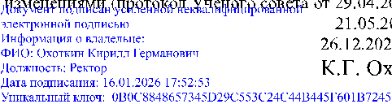

УТВЕРЖДЕНО

решением Ученого совета КНИТУ-КАИ 

Протокол № 12 от 23.12.2024 

с изменениями (протокол Ученого совета от 29.04.2025 № 5 

21.05.2025 № 6 

26.12.2025 № 15) 

К.Г. Охоткин 

Правила приема на обучение по образовательным программам высшего  образования – программам бакалавриата, программам специалитета,  программам магистратуры в КНИТУ-КАИ 

# 1. Назначение и область применения  

Настоящие Правила приема на обучение по образовательным программам  высшего  образования – программам  бакалавриата,  программам  специалитета,  программам  магистратуры  (далее  –  Правила  приема)  регламентируют  прием  граждан Российской Федерации, иностранных граждан и лиц без гражданства  (далее – поступающие) на обучение по образовательным программам высшего  образования  –  программам  бакалавриата,  программам  специалитета  и  программам  магистратуры  (далее  соответственно  -  программы  бакалавриата,  программы специалитета, программы магистратуры, вместе - образовательные  программы)  в  федеральное  государственное  бюджетное  образовательное  учреждение высшего образования «Казанский национальный исследовательский  технический  университет  им.  А.Н.  Туполева-КАИ»  (далее  –  КНИТУ-КАИ,  университет). 

# 2. Нормативные ссылки 

В  Правилах  приема  использованы  нормативные  ссылки  на  следующие  документы: 

- Федеральный закон от 24.05.1999 № 99-ФЗ «О государственной политике  Российской Федерации в отношении соотечественников за рубежом»; 

- Федеральный  закон  от  25.07.2002  № 115-ФЗ  «О  правовом  положении  иностранных граждан в Российской Федерации»; 

- Федеральный закон от 27.07.2006 № 152-ФЗ «О персональных данных»; 

-  Федеральный  закон  от  29.12.2012  №  273-ФЗ  «Об  образовании  в  Российской  Федерации»  (далее  –  Федеральный  закон  №  273-ФЗ,  Закон  об  образовании);  

- Федеральный закон от 29.07.2017 № 216-ФЗ «Об инновационных научнотехнологических центрах и о внесении изменений в отдельные законодательные  акты Российской Федерации»; 

- Федеральный закон от 17.02.2023 № 19-ФЗ «Об особенностях правового  регулирования отношений в сферах образования и науки в связи с принятием в  Российскую Федерацию Донецкой Народной Республики, Луганской Народной  Республики,  Запорожской  области,  Херсонской  области  и  образованием  в  составе  Российской  Федерации  новых  субъектов  -  Донецкой  Народной  Республики,  Луганской  Народной  Республики,  Запорожской  области,  Херсонской области и о внесении изменений в отдельные законодательные акты  Российской Федерации»; 

-  Указ  Президента  Российской  Федерации  от  09.05.2022  №  268  «О  дополнительных  мерах  поддержки  семей  военнослужащих  и  сотрудников  некоторых федеральных государственных органов» (далее – Указ № 268); 

-  Постановление  Правительства  Российской  Федерации  от  27.04.2024  № 555  «О  целевом  обучении  по  образовательным  программам  среднего  профессионального и высшего образования»; 

- Приказ Министерства просвещения Российской Федерации от 27.09.2019  № 520 «Об утверждении Порядка формирования сборных команд Российской  Федерации для участия в международных олимпиадах по общеобразовательным  предметам» (далее – Приказ Минпросвещения России № 520); 

-  Приказ  Министерства  науки  и  высшего  образования  Российской  Федерации от 03.11.2020 № 1378 «Об утверждении Порядка отбора иностранных  граждан  и  лиц  без  гражданства  на  обучение  в  пределах  установленной 

Правительством  Российской  Федерации  квоты  на  образование  иностранных  граждан и лиц без гражданства в Российской Федерации, а также предъявляемых  к ним требований»; 

-  Приказ  Министерства  науки  и  высшего  образования  Российской  Федерации от 22.06.2022 № 566 «Об утверждении Порядка проведения олимпиад  школьников» (далее – Приказ Минобрнауки России № 566); 

-  Приказ  Министерства  науки  и  высшего  образования  Российской  Федерации  от  01.03.2023  №  231  «Об  утверждении  особенностей  приема  на  обучение  в  организации,  осуществляющие  образовательную  деятельность,  по  программам  бакалавриата,  программам  специалитета,  программам  магистратуры  и  программам  подготовки  научно-педагогических  кадров  в  аспирантуре  (адъюнктуре),  предусмотренных  частями  7  и  8  статьи  5  Федерального закона от 17 февраля 2023 г. № 19-03 «Об особенностях правового  регулирования отношений в сферах образования и науки в связи с принятием в  Российскую Федерацию Донецкой Народной Республики, Луганской Народной  Республики,  Запорожской  области,  Херсонской  области  и  образованием  в  составе  Российской  Федерации  новых  субъектов  —  Донецкой  Народной  Республики,  Луганской  Народной  Республики,  Запорожской  области,  Херсонской области и о внесении изменений в отдельные законодательные акты  Российской Федерации»; 

-  Приказ  Министерства  науки  и  высшего  образования  Российской  Федерации  от  27.11.2024  №  820  «Об  утверждении  перечня  вступительных  испытаний при приеме на обучение по образовательным программам высшего  образования - программам бакалавриата и программам специалитета» (далее –  Приказ Минобрнауки России № 820); 

-  Приказ  Министерства  науки  и  высшего  образования  Российской  Федерации от 27.11.2024 № 821 «Об утверждении Порядка приема на обучение  по  образовательным  программам  высшего  образования  –  программам  бакалавриата, программам специалитета, программам магистратуры»  (далее –  Приказ Минобрнауки России № 821);  

- Приказ Министерства просвещения Российской Федерации от 17.02.2025  №  107  «Об  утверждении  перечня  образовательных  организаций,  на  лиц,  обучающихся в которых по образовательным программам основного общего и  среднего  общего  образования,  в  2025  году  распространяются  особенности  проведения  государственной  итоговой  аттестации  и  приема  на  обучение  в  организации,  осуществляющие  образовательную  деятельность,  предусмотренные статьей 5 Федерального закона от 17 февраля 2023 г. № 19-ФЗ  «Об особенностях правового регулирования отношений в сферах образования и  науки  в  связи  с  принятием  в  Российскую  Федерацию  Донецкой  Народной  Республики,  Луганской  Народной  Республики,  Запорожской  области,  Херсонской  области  и  образованием  в  составе  Российской  Федерации  новых  субъектов - Донецкой Народной Республики, Луганской Народной Республики,  Запорожской  области,  Херсонской  области  и  о  внесении изменений  в  отдельные законодательные акты Российской Федерации». 

(п.2 дополнен абзацем 16 на основании решения Ученого совета (протокол № 6 от 21.05.2025))

- Договор между РФ и Республикой Беларусь от 08.12.1999 «О создании  Союзного государства»; 

- Договор  между  РФ  и  Республикой  Беларусь  от  25.12.1998  «О  равных  правах граждан»; 

-  ГОСТ 7.32-2017 Межгосударственный стандарт. Система стандартов по  информации,  библиотечному  и  издательскому  делу.  Отчет  о  научноисследовательской работе. Структура и правила оформления; 

- ГОСТ Р ИСО 9000-2015 Национальный стандарт Российской Федерации.  Системы менеджмента качества. Основные положения и словарь; 

- ГОСТ Р ИСО 9001-2015 Национальный стандарт Российской Федерации.  Системы менеджмента качества. Требования; 

-  Устав КНИТУ-КАИ; 

- локальные нормативные акты КНИТУ-КАИ. 

# 3. Термины, определения и сокращения 

Иностранный гражданин – физическое лицо, не являющееся гражданином  Российской Федерации и имеющее документы, подтверждающие гражданство  (подданство) иностранного государства. 

Лицо без гражданства – физическое лицо, не являющееся гражданином  Российской  Федерации  и  не  имеющее  документы,  подтверждающие  гражданство (подданство) иностранного государства. 

Поступающий – лицо, поступающее на обучение. 

# 4. Правила приема в КНИТУ-КАИ 

# 4.1. Общие положения 

- 4.1.1. Университет  объявляет  прием  на  обучение  по  образовательным  программам  при  наличии  лицензии  на  осуществление  образовательной  деятельности по соответствующим образовательным программам, если иное не  установлено федеральными законами. 
- 4.1.2. Прием на обучение осуществляется на первый курс. 
- 4.1.3. Прием на обучение осуществляется: 

а) по программам бакалавриата и программам специалитета - при наличии  у поступающих среднего общего образования, или среднего профессионального  образования, или высшего образования; 

б) по программам магистратуры - при наличии у поступающих высшего  образования. 

Наличие образования подтверждается документами об образовании или об  образовании  и  о  квалификации,  выдаваемыми  лицам,  успешно  прошедшим  государственную  итоговую  аттестацию  либо  итоговую  аттестацию  (далее  -  документы об образовании). 

4.1.4. Поступающим необходимо иметь: 

1)  для  поступления  на  обучение  по  образовательным  программам,  имеющим государственную  аккредитацию,  -  образование,  подтвержденное  документами  об  образовании,  выданными  лицам,  успешно  прошедшим 

государственную итоговую аттестацию: 

-  документом  об  образовании  образца,  устанавливаемого  федеральным  органом  исполнительной  власти,  осуществляющим  функции  по  выработке  государственной  политики  и  нормативно-правовому  регулированию  в  сфере  общего  образования,  или  федеральным  органом  исполнительной  власти,  осуществляющим  функции  по  выработке  государственной  политики  и  нормативно-правовому  регулированию  в  сфере  высшего  образования,  или  федеральным  органом  исполнительной  власти,  осуществляющим  функции  по  выработке государственной политики и нормативно-правовому регулированию  в  сфере  здравоохранения,  или  федеральным  органом  исполнительной  власти,  осуществляющим  функции  по  выработке  государственной  политики  и  нормативно-правовому регулированию в сфере культуры; 

-  документом  государственного  образца  об  уровне  образования  или  об  уровне  образования  и  о  квалификации,  полученным  до  1  января  2014  г.  (документ  о  начальном  профессиональном  образовании,  подтверждающий  получение  среднего  (полного)  общего  образования,  и  документ  о  начальном  профессиональном образовании, полученном на базе среднего (полного) общего  образования,  приравниваются  к  документу  о  среднем  профессиональном  образовании и о квалификации); 

-  документом  об  образовании  образца,  устанавливаемого  федеральным  государственным  бюджетным  образовательным  учреждением  высшего  образования  «Московский  государственный  университет  имени  М.В.  Ломоносова»,  федеральным  государственным  бюджетным  образовательным  учреждением  высшего  образования  «Санкт-Петербургский  государственный  университет»,  документом  об  образовании  и  о  квалификации  образца,  устанавливаемого по решению коллегиального органа управления организации,  если указанный документ выдан лицу, успешно прошедшему государственную  итоговую аттестацию; 

-  документом  об  образовании,  выданным  частной  организацией,  осуществляющей образовательную деятельность на территории инновационного 

центра  «Сколково»,  или  организацией,  осуществляющей  образовательную  деятельность на территории инновационного научно-технологического центра; 

- документом (документами) об образовании, полученным (полученными)  в  иностранном  государстве,  если  указанное  в  нем  образование  признается  в  Российской  Федерации  на  уровне  соответствующего  образования  (далее  -  документ иностранного государства об образовании); 

2)  для  поступления  на  обучение  по  образовательным  программам,  не  имеющим  государственной  аккредитации,  -  образование,  подтвержденное  документами об образовании, указанными в подпункте 1 настоящего пункта, или  документами  об  образовании  образца,  устанавливаемого  организацией,  выданными лицам, успешно прошедшим итоговую аттестацию. 

4.1.5. Прием на обучение проводится: 

1) на места в рамках контрольных цифр приема граждан на обучение за  счет  бюджетных  ассигнований  федерального  бюджета,  бюджетов  субъектов  Российской Федерации, местных бюджетов (далее соответственно - контрольные  цифры приема, бюджетные ассигнования): 

а) на места в пределах следующих квот: 

- квота приема на целевое обучение (далее - целевая квота). Целевая квота  за  счет  бюджетных  ассигнований  федерального  бюджета  устанавливается  с  указанием сведений, предусмотренных пунктом 35 Правил установления квоты  приема  на  целевое  обучение  по  образовательным  программам  высшего  образования  за  счет  бюджетных  ассигнований  федерального  бюджета,  утвержденных  постановление  Правительства  Российской  федерации  от  27  апреля 2024 г. № 555 «О целевом обучении по образовательным программам  среднего  профессионального  и  высшего  образования»  (действует  до  1  мая  2030 г.); 

(абзац 4 п.4.1.5 изменен на основании решения Ученого совета (протокол № 15 от 26.12.2025)) 

-  квота  приема  для  получения  высшего  образования  по  программам  бакалавриата  и  программам  специалитета  за  счет  бюджетных  ассигнований  федерального бюджета, бюджетов субъектов Российской Федерации и местных 

бюджетов, которая устанавливается приказом ректора или уполномоченного им  лица КНИТУ-КАИ в размере не менее 10% от объема контрольных цифр приема  по каждой специальности или направлению подготовки (далее - особая квота)  (по программам бакалавриата и программам специалитета); 

-  отдельная  квота  приема  для  получения  высшего  образования  по  программам  бакалавриата  и  программам  специалитета  за  счет  бюджетных  ассигнований  федерального  бюджета,  бюджетов  субъектов  Российской  Федерации  и  местных  бюджетов,  указанная  в  части  5.1  статьи  71  Закона  об  образовании, которая устанавливается приказом ректора или уполномоченного  им лица в размере не менее 10% от объема контрольных цифр приема по каждой  специальности  или  направлению  подготовки  (далее  -  отдельная  квота)  (по  программам бакалавриата и программам специалитета); 

б) на места в рамках контрольных цифр приема за вычетом квот (далее -  основные бюджетные места); 

2) на места для обучения по договорам об образовании, заключаемым при  приеме на обучение за счет средств физических и (или) юридических лиц, и за  счет собственных средств КНИТУ-КАИ (далее соответственно - платные места,  договоры об образовании). 

4.1.6.  При  приеме  на  обучение  на  места  в  рамках  контрольных  цифр  приема  на  обучение  по  программам  бакалавриата,  программам  специалитета  выделение квот осуществляется в следующей последовательности: 

- выделяется отдельная квота; 

- выделяется особая квота в пределах оставшегося количества мест (при  наличии); 

- выделяется целевая квота в пределах оставшегося количества мест (при  наличии) (за исключением дополнительного приема на обучение). 

4.1.7.  В  случае  если  особая  квота  не  выделена,  приказом  ректора  или  уполномоченного им лица объявляется прием на обучение на места в пределах  особой квоты с указанием количества мест, равного нулю. В случае если после  выделения квот основные бюджетные места отсутствуют, приказом ректора или 

уполномоченного  им  лица  объявляется  прием  на  обучение  на  основные  бюджетные места с указанием количества мест, равного нулю. 

4.1.8.  В  рамках  подготовки  к  проведению  и  проведения  приема  на  обучение приемная комиссия: 

- размещает  информацию  о  приеме  на  обучение  на  официальном  сайте  университета  в  информационно-телекоммуникационной  сети  «Интернет»  на  официальном сайте https://kai.ru в разделе «Абитуриенту» (далее - официальный  сайт); 

-  проводит  прием  от  поступающих  заявлений  о  приеме  на  обучение  и  документов,  необходимых  для  поступления  и  прилагаемых  к  заявлению  о  приеме  на  обучение  (далее  соответственно  -  прием  заявлений  и  документов,  заявление о приеме, документы, необходимые для поступления); 

-  самостоятельно  проводит  вступительные  испытания  по  программам  бакалавриата  и  программам  специалитета  в  случаях,  установленных  пунктом  4.3.17  Правил  приема,  по  программам  магистратуры  (далее  -  внутренние  вступительные испытания); 

- проводит зачисление на обучение (далее - зачисление). 

4.1.9.  Прием  на  обучение  проводится  на  конкурсной  основе.  Для  проведения приема на обучение университет устанавливает: 

-  перечень  вступительных  испытаний,  утвержденный  приказом  ректора  или иным уполномоченным лицом; 

-  по  каждому  вступительному  испытанию:  максимальное  количество  баллов  и  минимальное  количество  баллов,  подтверждающее  успешное  прохождение  вступительного  испытания  (далее  -  минимальное  количество  баллов), утвержденное приказом ректора или иным уполномоченным лицом; 

-  перечень  индивидуальных  достижений  поступающих  (далее  -  индивидуальные достижения) и порядок их учета; 

- порядок предоставления особых прав, предусмотренных частями 4 и 12  статьи  71  Закона  об  образовании,  и  особого  преимущества  в  соответствии  с  пунктами 4.5.1-4.5.6 Правил приема (по программам бакалавриата, программам 

специалитета). 

Сумма  конкурсных  баллов  исчисляется  как  сумма  баллов  за  вступительные испытания и за индивидуальные достижения. 

4.1.10.  КНИТУ-КАИ  проводит  отдельный  конкурс  по  каждой  совокупности  условий  поступления  на  обучение  (далее  соответственно  -  конкурсная группа, условия поступления): 

1) по университету и ее филиалам - следующим способом: 

- по университету, включая все ее филиалы; 

2) по формам обучения: 

- по очной форме обучения; 

- по очно-заочной форме обучения; 

- по заочной форме обучения; 

3)  по  направленности  (профилю)  образовательных  программ  (далее  -  конкурсный профиль) - следующим способом: 

- однопрофильный  конкурс  в  пределах  специальности  или  направления  подготовки (далее - однопрофильный конкурс): 

- по специальности или направлению подготовки в целом; 

-  по  одной  или  нескольким  образовательным  программам  в  рамках  специальности или направления подготовки. 

4) по источникам финансирования мест: 

а)  на  места  в  рамках  контрольных  цифр  приема  раздельно  по  видам  бюджетов бюджетной системы Российской Федерации: 

- за счет бюджетных ассигнований федерального бюджета; 

-  за  счет  бюджетных  ассигнований  бюджетов  субъектов  Российской  Федерации; 

- за счет бюджетных ассигнований местных бюджетов 

б) на платные места; 

5) по видам мест в рамках контрольных цифр приема: 

- на места в пределах особой квоты; 

- на места в пределах отдельной квоты; 

- на места в пределах целевой квоты (в случае детализации целевой квоты  – раздельно по каждой детализированной целевой квоте); 

- на основные бюджетные места. 

(п.4.1.10 изменен на основании решения Ученого совета (протокол № 15 от 26.12.2025)) 

4.1.11. По одним и тем же специальностям или направлениям подготовки  университет  может  проводить  различные  однопрофильные  конкурсы  по  различным конкурсным группам. 

4.1.12. Университет может проводить отдельный конкурс при приеме на  обучение  на  платные  места  по  программам  бакалавриата,  программам  специалитета  для  лиц,  имеющих  профессиональное  образование  (далее  -  отдельный конкурс на базе профессионального образования): 

- для лиц, имеющих среднее профессиональное образование; 

- для лиц, имеющих высшее образование.  

4.1.13.  Для  конкурсов,  имеющих  одинаковый  конкурсный  профиль  (за  исключением  отдельного  конкурса  на  базе  профессионального  образования),  университет устанавливает одинаковые: 

- перечень вступительных испытаний; 

- минимальное количество баллов; 

- максимальное количество баллов; 

-  перечень  общих  индивидуальных  достижений  и  порядок  их  учета  (в  соответствии с разделом 4.4 Правил приема); 

- порядок предоставления особых прав, предусмотренных частями 4 и 12  статьи  71  Закона  об  образовании,  и  особого  преимущества  в  соответствии  с  пунктами 4.5.1-4.5.5 Правил приема (по программам бакалавриата, программам  специалитета). 

Приказом  ректора  или  уполномоченного  им  лица  устанавливается  одинаковое  минимальное  количество  баллов  для  конкурсов,  имеющих  одинаковый конкурсный профиль:  

- по КНИТУ-КАИ и по филиалам; 

- на места в рамках контрольных цифр приема и платные места. 

(п.4.1.13 изменен на основании решения Ученого совета (протокол № 15 от 26.12.2025)) 

4.1.13.1  Приказом  ректора  или  уполномоченного  им  лица  может  быть  увеличено  минимальное  количество  баллов,  утвержденных  Минобрнауки  России, для всех или отдельных конкурсов с учетом требований, указанных в  пункте 4.1.13 Правил приема. 

(п.4.1.13.1 добавлен на основании решения Ученого совета (протокол № 15 от 26.12.2025))

4.1.14 Университет по каждой конкурсной группе формирует: 

-  списки  лиц,  подавших  заявление  о  приеме  (далее - списки  подавших  заявление); 

- ранжированные списки лиц, подавших заявление о приеме и документы,  необходимые для поступления, и имеющих необходимые результаты единого  государственного  экзамена  (далее  –  ЕГЭ)  и  (или)  вступительных  испытаний  (далее - конкурсные списки). 

(п.4.1.14 изменен на основании решения Ученого совета (протокол № 15 от 26.12.2025)) 

4.1.15.  При  наличии  незаполненных  мест  после  завершения  зачисления  университет проводит дополнительный прием на обучение на указанные места в  соответствии с разделом 4.14 Правил приема. 

4.2.  Количество  организаций,  специальностей  и  (или)  направлений  подготовки  для  одновременного  поступления  на  обучение  по  программам  бакалавриата и программам специалитета 

4.2.1.  Предельное  количество  организаций,  в  которые  поступающий  вправе  одновременно  поступать  на  обучение  по  программам  бакалавриата  и  программам специалитета, составляет 5. 

4.2.2.  Предельное  количество  специальностей  и  (или)  направлений  подготовки,  по  которым  поступающий  вправе  одновременно  участвовать  в  конкурсе по программам бакалавриата и программам специалитета в КНИТУКАИ составляет 5.

4.2.3.  Поступающий  может  одновременно  поступать  на  обучение  по  различным  конкурсным  группам  в  рамках  каждой  специальности,  каждого  направления подготовки. 

4.3. Вступительные испытания 

4.3.1. Прием на обучение проводится: 

1) по программам бакалавриата и программам специалитета: 

-  по  результатам  ЕГЭ,  оцениваемым  по  стобалльной  шкале,  которые  признаются  в  качестве  результатов  вступительных  испытаний,  и  (или)  по  результатам внутренних вступительных испытаний; 

(п.4.3.1 изменен на основании решения Ученого совета (протокол № 15 от 26.12.2025)) 

- без вступительных испытаний в соответствии с частями 4 и 12 статьи 71  Закона об образовании - на места в пределах целевой квоты, на места в пределах  особой квоты, на основные бюджетные места, на платные места (в соответствии  с пунктами 4.5.1-4.5.5 Правил приема); 

- без проведения вступительных испытаний на места в пределах отдельной  квоты (в соответствии с пунктом 4.5.7 Правил приема); 

2)  по  программам  магистратуры  -  по  результатам  внутренних  вступительных испытаний. 

4.3.2. Приказом ректора или уполномоченного им лица устанавливается  перечень  вступительных  испытаний  и  их  приоритетность  для  ранжирования  конкурсных  списков  (далее  -  приоритетность  испытания  при  ранжировании,  приоритетность испытаний при ранжировании). 

(п.4.3.2 изменен на основании решения Ученого совета (протокол № 15 от 26.12.2025)) 

4.3.3. Приказом ректора или уполномоченного им лица устанавливается  перечень  вступительных  испытаний  при  приеме  на  обучение  по  программам  бакалавриата и программам специалитета: 

- для лиц, поступающих на обучение на базе среднего общего образования  (далее - поступающие на базе среднего общего образования); 

- для лиц, поступающих на обучение на базе среднего профессионального  образования  соответствующего  профиля или  высшего  образования  (далее  соответственно - поступающие на базе среднего профессионального образования  соответствующего профиля, поступающие на базе высшего образования, вместе  - поступающие на базе профессионального образования). 

(п.4.3.3 изменен на основании решения Ученого совета (протокол № 15 от 26.12.2025) 

4.3.4. Для поступающих на базе среднего общего образования приказом  ректора  или  уполномоченного  им  лица  устанавливаются  вступительные  испытания по общеобразовательным предметам, по которым проводится ЕГЭ  (далее  соответственно  -  общеобразовательные  вступительные  испытания,  предметы). 

4.3.5. Общеобразовательные  вступительные испытания  устанавливаются  приказом  ректора  или  уполномоченного  им  лица  в  соответствии  с  перечнем  вступительных  испытаний  при  приеме  на  обучение  по  образовательным  программам  высшего  образования - программам  бакалавриата  и  программам  специалитета,  утверждаемым  Министерством  науки  и  высшего  образования  Российской  Федерации  (далее  -  федеральный  перечень  вступительных  испытаний). 

Приказом ректора или иным уполномоченным лицом устанавливается: 

а) вступительное испытание по русскому языку в соответствии с разделом  1  федерального  перечня  вступительных  испытаний  (далее  -  вступительное  испытание-1); 

б)  два  вступительных  испытания  в  соответствии  с  разделом  2  федерального  перечня  вступительных  испытаний  (далее  -  вступительное  испытание-2,  вступительное  испытание-3,  вместе  -  профильные  общеобразовательные испытания). 

4.3.6.  Профильные  общеобразовательные  испытания  устанавливаются  следующим образом: 

а) вступительное испытание-2 - по одному предмету из числа указанных в  подразделе  «вступительное  испытание-2»  раздела  2  федерального  перечня  вступительных испытаний; 

б)  вступительное  испытание-3  -  по  нескольким  предметам  из  числа  указанных  в  подразделе  «вступительное  испытание-3,  вступительное  испытание-4»  или  подразделе  «вступительное  испытание-3»  раздела  2  федерального перечня вступительных испытаний. 

4.3.7.  Предмет,  по  которому  КНИТУ-КАИ  установил  вступительное 

испытание-2, не используется университетом для установления вступительного  испытания-3. 

4.3.8.  Если  университетом  вступительное  испытание-3  установлено  по  нескольким  предметам,  эти  предметы  являются  предметами  по  выбору  для  поступающих (далее - предметы по выбору). 

Поступающие: 

- используют результаты ЕГЭ (при наличии) по одному или нескольким  предметам; 

-  выбирают  один  или  несколько  предметов  для  сдачи  внутреннего  вступительного испытания (при наличии соответствующего права). 

4.3.9. При определении иностранного языка в качестве одного предмета  или  предмета  по  выбору  по  профильному  общеобразовательному  испытанию  университет устанавливает: 

-  несколько  иностранных  языков,  по  которым  поступающие  могут  использовать  результаты  ЕГЭ.  В  качестве  результатов  ЕГЭ  по  иностранному  языку КНИТУ-КАИ учитывает английский язык, немецкий язык, французский  язык; 

-  один  иностранных  языков,  по  которому  университет  проводит  внутреннее  вступительное  испытание  (из  числа  языков,  по  которым  поступающие  могут  использовать  результаты  ЕГЭ).  В  качестве  внутреннего  вступительного  испытания  по  иностранному  языку  КНИТУ-КАИ  проводит  английский язык. 

В КНИТУ-КАИ поступающие используют результаты ЕГЭ и (или) сдают  внутреннее вступительное испытание (при наличии соответствующего права) по  любым языкам (языку) из числа установленных настоящим пунктом. 

4.3.10.  Для  поступающих  на  базе  профессионального  образования  соответствующего  профиля,  для  поступающих  на  базе  высшего  образования  приказом ректора или уполномоченного им лица определяется форма и перечень  вступительных испытаний, при этом устанавливает вступительные испытания на 

базе  профессионального  образования  в  количестве,  равном  количеству  общеобразовательных вступительных испытаний. 

Для  поступающих  на  базе  среднего  профессионального  образования  соответствующего профиля приказом ректора или уполномоченного им лица: 

-  определяется  соответствие  направленности  (профиля)  программ  бакалавриата,  программ  специалитета  направленности  (профилю)  среднего  профессионального  образования  и  содержание  вступительных  испытаний  на  базе  профессионального  образования  в  соответствии  с  направленностью  (профилем)  программ  бакалавриата,  программ  специалитета,  за  исключением  вступительного испытания по русскому языку; 

-  включается  в  перечень  вступительных  испытаний  на  базе  профессионального образования вступительное испытание по русскому языку.  В  качестве  указанного  испытания  проводится  общеобразовательное  вступительное испытание по русскому языку. 

Для  поступающих  на  базе  высшего  образования  университет  самостоятельно определяет содержание внутренних вступительных испытаний  и проводит их. 

(п.4.3.10 изменен на основании решения Ученого совета (протокол № 15 от 26.12.2025)) 

4.3.11. В  случае  проведения  при  приеме  на  обучение  на  платные  места  отдельного конкурса на базе профессионального образования приказом ректора  или  уполномоченного  им  лица  устанавливает  не  более  4  вступительных  испытания для поступающих на базе среднего профессионального образования  соответствующего профиля или высшего образования, определяет содержание и  формы  указанных  вступительных  испытаний  (внутренние  вступительные  испытания и (или) результаты ЕГЭ). 

(п.4.3.11 изменен на основании решения Ученого совета (протокол № 15 от 26.12.2025)) 

4.3.12.  Университет  может  проводить  несколько  различных  по  содержанию  вариантов  внутреннего  вступительного  испытания  на  базе  профессионального образования. Поступающий выбирает и сдает один вариант  вступительного испытания на базе профессионального образования. 

4.3.13.  При  приеме  на  обучение  по  программам  бакалавриата  и  программам  специалитета  поступающие  (в  том  числе  поступающие  на  базе  профессионального образования) из числа лиц, указанных в настоящем пункте,  имеют  право  сдавать  внутренние  вступительные  испытания  по  общеобразовательным  предметам  (далее  -  внутренние  общеобразовательные  вступительные испытания): 

1) на места в пределах отдельной квоты - лица, имеющие право на прием  на места в пределах отдельной квоты по результатам ЕГЭ или вступительных  испытаний в соответствии с частью 5.2 статьи 71 Закона об образовании (вне  зависимости от того, участвовали ли они в сдаче ЕГЭ, и от результата сдачи  ЕГЭ); 

2)  на  места  в  пределах  особой  квоты,  целевой  квоты,  на  основные  бюджетные места, на платные места: 

-  инвалиды  (в  том  числе  дети-инвалиды)  (вне  зависимости  от  того,  участвовали ли они в сдаче ЕГЭ, и от результата сдачи ЕГЭ): 

-  лица,  указанные  в  части  5.1  статьи  71  Закона  об  образовании  (вне  зависимости от того, поступают ли они на места в пределах отдельной квоты, вне  зависимости от того, участвовали ли они в сдаче ЕГЭ, и от результата сдачи  ЕГЭ); 

- иностранные  граждане  (по  тем  предметам,  по  которым  они не  имеют  результатов ЕГЭ, полученных в году приема на обучение (далее – год приема) и  (или)  в  течение  4  лет  до  года  приема,  за  исключением  результатов  ЕГЭ  по  математике базового уровня); 

- граждане Российской Федерации, которые имеют документ о среднем  общем образовании, полученный в иностранной организации (по тем предметам,  по которым поступающий не сдавал ЕГЭ в текущем календарном году). 

(п.4.3.13 изменен на основании решения Ученого совета (протокол № 15 от 26.12.2025)) 

4.3.14.  При  приеме  на  обучение  по  программам  бакалавриата  и  программам  специалитета  граждане  Республики  Беларусь  и  граждане  Российской  Федерации  вправе  использовать  результаты  проводимого  в 

Республике  Беларусь  централизованного  тестирования  и  (или)  централизованного  экзамена  (далее  -  централизованное  тестирование  или  экзамен),  пройденных  поступающими  в  текущем  или  предшествующем  календарном  году,  если  поступающий  не  сдавал  ЕГЭ  по  соответствующему  общеобразовательному предмету в году, в котором пройдены централизованное  тестирование или экзамен (статья 18 Договора между Российской Федерацией и  Республикой Беларусь от 8 декабря 1999 г. «О создании Союзного государства»,  ратифицированного  Федеральным  законом  от  2  января  2000  г.  №  25-ФЗ  «О  ратификации Договора о создании Союзного государства», статья 4 Договора  между Российской Федерацией и Республикой Беларусь от 25 декабря 1998 г. «О  равных правах граждан», ратифицированного Федеральным законом от 1 мая  1999 г. № 89-ФЗ «О ратификации Договора между Российской Федерацией и  Республикой  Беларусь  о  равных  правах  граждан»).  Результаты  централизованного  тестирования  или  экзамена  признаются  университетом  в  качестве  результатов  внутренних  общеобразовательных  вступительных  испытаний.  

(п.4.3.14 изменен на основании решения Ученого совета (протокол № 15 от 26.12.2025)) 

4.3.14.1. Порядок признания результатов централизованного тестирования  или экзамена в университете. 

Определенный  по  стобалльной  шкале  результат  централизованного  тестирования  (экзамена)  засчитывается  в  качестве  результата  вступительного  испытания  с  установлением  идентичной  стобалльной  шкалы.  Минимальные  баллы соответствуют. 

Результаты  централизованного  тестирования  (экзамена)  соответствуют  результатам внутренних общеобразовательных вступительных испытаний. 

Соответствие  внутренних  общеобразовательных  вступительных  испытаний и общеобразовательных предметов централизованного тестирования  (экзамена) представлены в таблице 1. 

Таблица  1 - Соответствие  общеобразовательных  вступительных  испытаний  и  общеобразовательных предметов централизованного тестирования (экзамена) 

|Общеобразовательное вступительное  испытание |Общеобразовательный предмет  централизованного тестирования  (экзамена) |
|---|---|
|русский язык |русский язык |
|математика |математика |
|физика |физика |
|химия |химия |
|иностранный язык |английский язык  |
|иностранный язык |немецкий язык |
|иностранный язык |французский язык |
|обществознание |обществоведение |

4.3.15.  При  приеме  на  обучение  по  программам  бакалавриата  и  программам специалитета поступающий, имеющий право сдавать внутренние  вступительные  испытания,  может  использовать  результаты  указанных  вступительных  испытаний  и  (или)  результаты  ЕГЭ.  В  качестве  результата  вступительного испытания засчитывается наиболее высокий из результатов ЕГЭ  и  (или)  внутренних  вступительных  испытаний  (включая  результаты  централизованного  тестирования  или  экзамена),  которые  имеются  у  поступающего и составляют не менее минимального количества баллов. 

4.3.16.  Максимальное  количество  баллов  для  каждого  вступительного  испытания по программам бакалавриата и программам специалитета составляет  100 баллов. 

Минимальное количество баллов для внутреннего общеобразовательного  вступительного  испытания  соответствует  минимальному  количеству  баллов  ЕГЭ, установленному Минобрнауки России в соответствии с частью 3 статьи 70  Закона об образовании.  

Максимальное количество баллов и минимальное количество баллов для  вступительного  испытания  по  программам  магистратуры  100  и  30  соответственно. 

4.3.17.  Университет  проводит  следующие  внутренние  вступительные  испытания: 

-  внутренние  общеобразовательные  вступительные  испытания  (по 

программам бакалавриата и программам специалитета); 

- вступительные испытания на базе профессионального образования (по  программам бакалавриата и программам специалитета); 

- вступительные испытания по программам магистратуры. 

4.3.18. КНИТУ-КАИ проводит внутренние вступительные испытания очно  и  (или)  с  использованием  дистанционных  технологий  (при  условии  идентификации поступающих при сдаче ими вступительных испытаний). 

4.3.19. Результаты внутренних вступительных испытаний действительны  при приеме на обучение на учебный год, на который осуществляется прием на  обучение. 

4.3.20. Поступающий сдает каждое внутреннее вступительное испытание  однократно. В случае если по профильному общеобразовательному испытанию  (по  программам  бакалавриата  и  программам  специалитета)  установлены  предметы по выбору, поступающий сдает внутреннее вступительное испытание  однократно по каждому выбранному предмету. 

4.3.21.  Внутренние  вступительные  испытания  проводятся  на  русском  языке. 

При  приеме  на  обучение  по  программам  магистратуры  с  иностранным  языком  образования  внутреннее  вступительное  испытание  (испытания)  проводится на русском языке и на иностранном языке. 

4.3.22.  Одно  внутреннее  вступительное  испытание  проводится  одновременно для всех поступающих либо в различные сроки для различных  групп поступающих (в том числе по мере формирования указанных групп из  числа лиц, подавших заявление о приеме). 

Для каждого поступающего проводится одно внутреннее вступительное  испытание в день. По желанию поступающего ему может быть предоставлена  возможность сдавать несколько внутренних вступительных испытаний в день. 

4.3.23.  Лица,  не  прошедшие  внутреннее  вступительное  испытание  по  уважительной  причине  (болезнь  или  иные  обстоятельства,  подтвержденные  документально), допускаются к его сдаче в другой группе или в резервный день. 

4.3.24.  Приемная  комиссия  устанавливает  расписание  внутренних  вступительных испытаний, в том числе один или несколько резервных дней для  сдачи  вступительных  испытаний  лицами,  не  прошедшими  внутреннее  вступительное испытание (испытания) по уважительной причине. 

4.3.25. При нарушении поступающим во время проведения внутреннего  вступительного  испытания  Правил  приема  работники  приемной  комиссии  составляют акт о нарушении и о непрохождении поступающим вступительного  испытания без уважительной причины, а при очном проведении вступительного  испытания  также  удаляют  поступающего  с  места  проведения  вступительного  испытания. 

4.3.26.  Результаты  внутреннего  вступительного  испытания  объявляются  приемной комиссией на официальном сайте в течение трех рабочих дней после  дня проведения вступительного испытания, но не позднее чем за один день до  публикации  конкурсных  списков.  Помимо  официального  сайта  приемная  комиссия  может  объявлять  указанные  результаты  в  Личном  кабинете  абитуриента на официальном сайте. 

4.3.27.  Поступающий  имеет  право  в  день  объявления  результатов  внутреннего вступительного испытания или в течение следующего рабочего дня  ознакомиться с результатами проверки и оценивания его работы, выполненной  при прохождении вступительного испытания. 

4.3.28.  По  результатам  внутреннего  вступительного  испытания  поступающий имеет право подать в университет апелляцию о нарушении, по  мнению  поступающего,  установленного  порядка  проведения  вступительного  испытания  и  (или)  о  несогласии  с  полученной  оценкой  результатов  вступительного испытания. 

КНИТУ-КАИ  проводит  рассмотрение  апелляций,  поданных  поступающими.  Правила  подачи  и  рассмотрения  апелляций  устанавливаются  Положением  об  апелляции  по  результатам  вступительных  (аттестационных)  испытаний в КНИТУ-КАИ. 

4.3.29.  Лица,  которые  завершили  освоение  образовательных  программ  среднего общего образования в образовательных организациях, расположенных  на  приграничных  территориях  в  соответствии  с  Приказом  Министерства  просвещения  Российской  Федерации  от  17.02.2025  №  107  «Об  утверждении  перечня  образовательных  организаций,  на  лиц,  обучающихся  в  которых  по  образовательным  программам  основного  общего  и  среднего  общего  образования,  в  2025  году  распространяются  особенности  проведения  государственной  итоговой  аттестации  и  приема  на  обучение  в  организации,  осуществляющие  образовательную  деятельность,  предусмотренные  статьей  5  Федерального закона от 17 февраля 2023 г. № 19-ФЗ "Об особенностях правового  регулирования отношений в сферах образования и науки в связи с принятием в  Российскую Федерацию Донецкой Народной Республики, Луганской Народной  Республики,  Запорожской  области,  Херсонской  области  и  образованием  в  составе  Российской  Федерации  новых  субъектов  -  Донецкой  Народной  Республики,  Луганской  Народной  Республики,  Запорожской  области,  Херсонской области и о внесении изменений в отдельные законодательные акты  Российской Федерации"»: 

- вправе сдавать вступительные испытания в форме единого собеседования  в очной или дистанционной форме по выбору абитуриента, и (или) использовать  действительные результаты ЕГЭ по выбору абитуриента. 

По каждому вступительному испытанию, включенному в состав единого  собеседования, выставляется оценка по стобалльной шкале. 

(п.4.3.29 дополнен на основании решения Ученого совета (протокол № 6 от 21.05.2025))

4.4. Учет индивидуальных достижений поступающих 

4.4.1.  Учет  индивидуальных  достижений  поступающих  осуществляется  следующими способами: 

1) университет начисляет поступающему баллы, которые включаются  в  сумму конкурсных баллов: 

-  баллы  за  общие  индивидуальные  достижения,  перечень  которых  установлен университетом в соответствии с настоящим разделом (по решению  КНИТУ-КАИ).  При  приеме  на  обучение  по  программам  бакалавриата,  программам  специалитета  количество  баллов  за  общие  индивидуальные  достижения составляет не более 10; 

(п.4.4.1 изменен на основании решения Ученого совета (протокол № 15 от 26.12.2025)) 

-  баллы  за  целевые  индивидуальные  достижения,  в  качестве  которых  рассматривается  участие  в  проводимых  заказчиком  целевого  обучения  мероприятиях по профессиональной ориентации (далее - профориентационные  мероприятия), которые  учитываются в соответствии с пунктом 4.13.9 Правил  приема при приеме на обучение на места в пределах целевой квоты в дополнение  к баллам за общие индивидуальные достижения. Количество баллов за целевые  индивидуальные достижения составляет 5; 

2)  университет  учитывает  индивидуальные  достижения  при  равенстве  поступающих по иным критериям ранжирования в конкурсных списках. 

4.4.2. При приеме на обучение по программам бакалавриата, программам  специалитета  поступающему  начисляются  баллы  за  следующие  общие  индивидуальные достижения: 

1)  наличие  полученных  в  образовательных  организациях  Российской  Федерации документов об образовании или об образовании и о квалификации с  отличием  (аттестата  о  среднем  общем  образовании  с  отличием,  аттестата  о  среднем (полном) общем образовании с отличием, аттестата о среднем (полном)  общем образовании для награжденных золотой (серебряной) медалью, диплома  о  среднем  профессиональном  образовании  с  отличием,  диплома  о  начальном  профессиональном  образовании  с  отличием,  диплома  о  начальном  профессиональном  образовании  для  награжденных  золотой  (серебряной)  медалью) (далее - документы об образовании с отличием); 

2) участие и (или) результаты участия: 

-  в  олимпиадах  школьников,  проводимых  в  порядке,  устанавливаемом  федеральным  органом  исполнительной  власти,  осуществляющим  функции  по 

выработке  и  реализации  государственной  политики  и  нормативно-правовому  регулированию в сфере высшего образования, по согласованию с федеральным  органом  исполнительной  власти,  осуществляющим  функции  по  выработке  и  реализации государственной политики и нормативно-правовому регулированию  в сфере общего образования (далее - олимпиады школьников) (если результаты  участия в олимпиадах школьников не используются для получения особых прав  и  (или)  особого  преимущества  при  поступлении  на  обучение  по  конкретным  конкурсным группам); 

- в иных интеллектуальных и (или) творческих конкурсах, физкультурных  мероприятиях  и  спортивных  мероприятиях,  проводимых  в  соответствии  с  частью 2 статьи 77 Закона об образовании в целях выявления и поддержки лиц,  проявивших выдающиеся способности; 

3)  прохождение  военной  службы  по  призыву,  военной  службы  по  контракту, военной службы по мобилизации в Вооруженных Силах Российской  Федерации; 

4)  пребывание  в  добровольческих  формированиях  в  соответствии  с  контрактом о добровольном содействии в выполнении задач, возложенных на  Вооруженные  Силы  Российской  Федерации,  в  ходе  специальной  военной  операции на территориях Украины, Донецкой Народной Республики, Луганской  Народной Республики, Запорожской области и Херсонской области; 

5)  наличие  золотого,  серебряного  или  бронзового  знака  отличия  Всероссийского  физкультурно-спортивного  комплекса  «Готов  к  труду  и  обороне»  (ГТО)  (далее  -  знак  ГТО),  которым  поступающий  награжден  в  соответствии  с  Порядком  награждения  лиц,  выполнивших  нормативы  испытаний  (тестов)  Всероссийского  физкультурно-спортивного  комплекса  «Готов  к  труду  и  обороне»  (ГТО),  соответствующими  знаками  отличия  Всероссийского  физкультурно-спортивного  комплекса  «Готов  к  труду  и  обороне» (ГТО); 

6)  иные  спортивные  достижения,  перечень  которых  определяется  Порядком  учета  результатов  индивидуальных  достижений  поступающих  в 

КНИТУ-КАИ; 

7)  волонтерская  (добровольческая)  деятельность,  содержание  и  сроки  осуществления  которой  соответствуют  критериям,  установленным  Порядком  учета результатов индивидуальных достижений поступающих в КНИТУ-КАИ; 

8)  наличие  статуса  победителя  (призера)  национального  и  (или)  международного  чемпионата  по  профессиональному  мастерству  среди  инвалидов и лиц с ограниченными возможностями здоровья «Абилимпикс». 

4.4.3. При приеме на обучение по программам бакалавриата, программам  специалитета: 

-  в  случае  начисления  баллов  за  наличие  аттестата  о  среднем  общем  образовании с отличием университет может учитывать наличие полученной в  образовательной организации Российской Федерации медали «За особые успехи  в учении» I или II степени; 

- начисление баллов за наличие знака ГТО осуществляется по решению  университета,  если  поступающий  в  текущем  и  (или)  предшествующем  году  относится (относился) к возрастной группе, в которой получен знак ГТО; 

-  наличие  знака  ГТО  подтверждается  удостоверением  к  нему,  или  сведениями,  размещенными  на  официальном  сайте  Министерства  спорта  Российской  Федерации  или  на  официальном  сайте  Всероссийского  физкультурно-спортивного  комплекса  «Готов  к  труду  и  обороне»  (ГТО)  в  информационно-телекоммуникационной  сети  «Интернет»,  или  копией  распорядительного  акта  (выпиской  из  распорядительного  акта)  Министерства  спорта  Российской  Федерации  о  награждении  золотым  знаком  ГТО,  копией  распорядительного  акта  (выпиской  из  распорядительного  акта)  органа  исполнительной  власти  субъекта  Российской  Федерации  о  награждении  серебряным  или  бронзовым  знаком  ГТО.  Копия  распорядительного  акта  (выписка из распорядительного акта) должна быть заверена должностным лицом  Министерства спорта Российской Федерации или органа исполнительной власти  субъекта Российской Федерации; 

- начисление баллов за наличие знака ГТО осуществляется однократно. 

(п.4.4.3 изменен на основании решения Ученого совета (протокол № 15 от 26.12.2025)) 

4.4.4.  Перечень  общих  индивидуальных  достижений,  за  которые  начисляются  баллы  при  приеме  на  обучение  по  программам  магистратуры,  устанавливается  Порядком  учета  результатов  индивидуальных  достижений  поступающих в КНИТУ-КАИ. 

4.4.5.  Порядок  учета  общих  индивидуальных  достижений,  в  том  числе  количество  баллов,  начисляемых  за  общие  индивидуальные  достижения,  устанавливается  Порядком  учета  результатов  индивидуальных  достижений  поступающих в КНИТУ-КАИ. 

4.4.6.  В  качестве  индивидуальных  достижений,  учитываемых  при  равенстве  поступающих  по  иным  критериям  ранжирования  в  конкурсных  списках, университет устанавливает средний балл документа об образовании. В  случае  равенства  поступающих  по  указанным  достижениям  перечень  таких  достижений может быть дополнен в период проведения приема на обучение.  Порядок  учета  индивидуальных  достижений,  учитываемых  при  равенстве  поступающих  по  иным  критериям  ранжирования  в  конкурсных  списках,  устанавливается  Порядком  учета  результатов  индивидуальных  достижений  поступающих в КНИТУ-КАИ. 

4.5. Особые права при приеме на обучение по программам бакалавриата и  программам специалитета 

4.5.1.  Поступающим  на  обучение  по  программам  бакалавриата  и  программам специалитета предоставляются следующие особые права: 

1) лицам, указанным в части 4 статьи 71 Закон об образовании, - право на  прием  без  вступительных  испытаний.  Лицам,  указанным  в  пункте  2  части  4  статьи  71  Закона  об  образовании,  указанное  право  предоставляется  по  специальностям  и  (или)  направлениям  подготовки  в  области  физической  культуры и спорта; 

2) лицам, указанным в части 12 статьи 71 Закона об образовании: 

- право на прием без вступительных испытаний; 

-  право  быть  приравненными  к  лицам,  набравшим  максимальное  количество баллов ЕГЭ по предмету, соответствующему профилю олимпиады  школьников, предусмотренные частями 7 и 8 статьи 70 Закона об образовании.  При  предоставлении  указанного  права  поступающему  устанавливается  наивысший  результат  вступительного  испытания  (испытаний)  -  100  баллов  (далее - право на 100 баллов). 

Особые  права,  указанные  в  настоящем  пункте,  могут  предоставляться  одним и тем же поступающим. 

4.5.2. Лицам, имеющим право на прием без вступительных испытаний в  соответствии  с  частью  4  статьи  71  Закона  об  образовании,  в  течение  срока  предоставления указанного права, установленного частью 4 статьи 71 Закона об  образовании,  предоставляется  преимущество  посредством  приравнивания  к  лицам,  имеющим  100  баллов  по  общеобразовательному  вступительному  испытанию (далее - особое преимущество). 

4.5.3.  При  приеме  на  обучение  в  рамках  контрольных  цифр  приема  поступающий,  имеющий  право  на  прием  без  вступительных  испытаний  в  соответствии с частью 4 и (или) частью 12 статьи 71 Закона об образовании,  использует  указанное  право  как  единое  право  на  прием  без  вступительных  испытаний. Указанное право используется поступающим для подачи заявления  о  приеме  на  обучение  только  в  одну  организацию  только  на  одну  образовательную  программу  по  выбору  поступающего  (вне  зависимости  от  количества оснований, дающих указанное право). В рамках одной организации  и одной образовательной программы поступающий может использовать право  на прием без вступительных испытаний по различным конкурсным группам. В  случае  если  конкурсный  профиль  установлен  по  специальности  (нескольким  специальностям),  направлению  (нескольким  направлениям)  подготовки,  нескольким  образовательным  программам,  указанное  право  используется  поступающим по конкурсному профилю в целом. 

4.5.4.  Для  приема  на  обучение  лиц,  имеющих  право  на  прием  без  вступительных  испытаний  в  соответствии  с  частью  4  статьи  71  Закона  об 

образовании, приказом ректора или иным уполномоченным им лицом: 

- устанавливается соответствие конкурсных профилей (образовательных  программ,  специальностей,  направлений  подготовки,  совокупностей  специальностей,  направлений  подготовки)  профилям  заключительного  этапа  всероссийской олимпиады школьников, международных олимпиад, указанных в  пункте  1  части  4  статьи  71  Закона  об  образовании  (далее  -  международные  олимпиады школьников), спортивным достижениям, указанным в пункте 2 части  4  статьи  71  Закона  об  образовании  (далее  -  спортивные  достижения),  для  предоставления права на прием без вступительных испытаний либо принимается  решение  об  отсутствии  конкурсных  профилей,  соответствующих  профилям  заключительного этапа всероссийской олимпиады школьников, международных  олимпиад школьников, спортивным достижениям; 

-  устанавливается  особое  преимущество  по  установленным  для  общеобразовательных  вступительных  испытаний  предметам,  которые  совпадают  с  профилями  заключительного  этапа  всероссийской  олимпиады  школьников, международных олимпиад школьников; 

- может установиться особое преимущество по иным предметам, которые  соответствуют  профилям  заключительного  этапа  всероссийской  олимпиады  школьников, международных олимпиад школьников, спортивным достижениям. 

4.5.5. Для предоставления особых прав в соответствии с частью 12 статьи  71  Закона  об образовании, приказом ректора  или иным уполномоченным им  лицом: 

1)  устанавливается  перечень  олимпиад  школьников,  по  результатам  которых  предоставляются  особые  права,  из  числа  олимпиад,  включенных  в  перечни  олимпиад  школьников,  утверждаемые  федеральным  органом  исполнительной  власти,  осуществляющим  функции  по  выработке  государственной  политики  и  нормативно-правовому  регулированию  в  сфере  высшего образования, по согласованию с федеральным органом исполнительной  власти, осуществляющим функции по выработке и реализации государственной  политики и нормативно-правовому регулированию в сфере общего образования 

(далее  -  установленный  организацией  перечень  олимпиад  школьников),  либо  принимается решение об отсутствии таких олимпиад школьников; 

2)  по  каждой  олимпиаде  школьников,  включенной  в  установленный  приказом  ректора  или  уполномоченного  им  лица  перечень  олимпиад  школьников: 

а)  устанавливает  соответствие  конкурсных  профилей  (образовательных  программ,  специальностей,  направлений  подготовки,  совокупностей  специальностей,  направлений  подготовки)  одному  или  нескольким  профилям  олимпиады для предоставления права на прием без вступительных испытаний  либо  принимается  решение  о  непредоставлении  права  на  прием  без  вступительных испытаний по результатам олимпиады; 

б)  устанавливается  одно  или  несколько  общеобразовательных  вступительных испытаний, соответствующих одному или нескольким профилям  олимпиады для предоставления права на 100 баллов, либо принимается решение  об  отсутствии  вступительных  испытаний,  соответствующих  профилям  олимпиады; 

в) для предоставления каждого особого права устанавливается: 

-  предоставляется  ли  особое  право  победителям  либо  победителям  и  призерам олимпиады; 

- за какие классы должны быть получены результаты победителя (призера)  олимпиады школьников; 

- один или несколько предметов, по которым поступающим необходимы  результаты  ЕГЭ  или  внутренних  общеобразовательных  вступительных  испытаний  для  подтверждения  особого  права  (за  исключением  творческих  олимпиад, олимпиад в области физической культуры и спорта), и количество  баллов ЕГЭ или внутреннего общеобразовательного вступительного испытания  по этим предметам, которое подтверждает особое право. Указанное количество  баллов  составляет  не  менее  75  баллов.  Поступающему  необходимо  иметь  указанное  количество  баллов  ЕГЭ  или  внутреннего  общеобразовательного  вступительного испытания по одному предмету (по выбору поступающего) из 

числа предметов, установленных КНИТУ-КАИ. 

4.5.6.  По  одному  основанию,  дающему  право  на  100  баллов  (особое  преимущество), поступающий получает 100 баллов в рамках одного конкурса по  одному  общеобразовательному  вступительному  испытанию  (в  случае  установления  университетом  нескольких  вступительных  испытаний,  соответствующих  олимпиаде  (профилю  олимпиады)  -  по  выбору  поступающего). 

Поступающий  может  одновременно  использовать  несколько  оснований  для получения права на 100 баллов (особого преимущества), в том числе в рамках  одного конкурса. 

При участии в нескольких конкурсах поступающий может использовать  одно  и  то  же  основание  для  получения  права  на  100  баллов  (особого  преимущества) по одному и тому же вступительному испытанию (предмету) или  по различным вступительным испытаниям (предметам). 

4.5.7. Поступающим предоставляются особые права: 

а)  право  на  прием  на  обучение  на  места  в  пределах  особой  квоты  в  соответствии с частью 5 статьи 71 Закона об образовании: право на прием на  обучение  по  программам  бакалавриата  и  программам  специалитета  за  счет  бюджетных  ассигнований  федерального  бюджета,  бюджетов  субъектов  Российской Федерации и местных бюджетов в пределах установленной квоты  имеют дети-сироты и дети, оставшиеся без попечения родителей, а также лица  из  числа  детей-сирот  и  детей,  оставшихся  без  попечения  родителей;  детиинвалиды,  инвалиды  I  и  II  групп; инвалиды  с  детства,  инвалиды  вследствие  военной травмы или заболевания, полученных в период прохождения военной  службы; ветераны боевых действий из числа лиц, указанных в подпунктах 1-4  пункта  1  статьи  3  Федерального  закона  от  12  января 1995  года № 5-ФЗ  «О  ветеранах»; 

б) право на прием на обучение на места в пределах отдельной квоты в  соответствии с частями 5.1 и 5.2 статьи 71 Закона об образовании: 

- право на прием на обучение по программам бакалавриата и программам 

специалитета  за  счет  бюджетных  ассигнований  федерального  бюджета,  бюджетов субъектов Российской Федерации и местных бюджетов в пределах  отдельной  квоты  имеют  Герои  Российской  Федерации,  лица,  награжденные  тремя  орденами  Мужества;  граждане,  проходящие  (проходившие)  военную  службу в Вооруженных Силах Российской Федерации, граждане, проходящие  (проходившие)  военную  службу  (службу)  в  войсках  национальной  гвардии  Российской  Федерации,  в  воинских  формированиях  и  органах,  указанных  в  пункте  6  статьи  1  Федерального  закона  от  31  мая  1996  года  №  61-ФЗ  «Об  обороне»,  при  условии  их  участия  в  специальной  военной  операции  на  территориях Украины, Донецкой Народной Республики, Луганской  Народной  Республики, Запорожской области и Херсонской области и (или) выполнения  ими задач по отражению вооруженного вторжения на территорию Российской  Федерации,  в  ходе  вооруженной  провокации  на  Государственной  границе  Российской  Федерации  и  приграничных  территориях  субъектов  Российской  Федерации, прилегающих к районам проведения специальной военной операции  на территориях Украины, Донецкой Народной Республики, Луганской Народной  Республики,  Запорожской  области  и  Херсонской  области,  находящиеся  (находившиеся)  на  указанных  территориях  служащие  (работники)  правоохранительных органов Российской Федерации, граждане, выполняющие  (выполнявшие)  служебные  и  иные  аналогичные  функции  на  указанных  территориях;  граждане,  призванные  на  военную  службу  по  мобилизации  в  Вооруженные Силы Российской Федерации, граждане, заключившие контракт о  добровольном содействии в выполнении задач, возложенных на Вооруженные  Силы  Российской  Федерации  или  войска  национальной  гвардии  Российской  Федерации,  при  условии  их  участия  в  специальной  военной  операции  на  территориях Украины, Донецкой Народной Республики, Луганской  Народной  Республики, Запорожской области и Херсонской области и (или) выполнения  ими задач по отражению вооруженного вторжения на территорию Российской  Федерации,  в  ходе  вооруженной  провокации  на  Государственной  границе  Российской  Федерации  и  приграничных  территориях  субъектов  Российской 

Федерации, прилегающих к районам проведения специальной военной операции  на территориях Украины, Донецкой Народной Республики, Луганской Народной  Республики,  Запорожской  области  и  Херсонской  области,  граждане,  заключившие  контракт  (имевшие  иные  правоотношения)  с  организацией,  содействующей  выполнению  задач,  возложенных  на  Вооруженные  Силы  Российской  Федерации,  при  условии  их  участия  в  специальной  военной  операции  на  указанных  территориях;  лица,  принимавшие  в  соответствии  с  решениями органов государственной власти Донецкой Народной Республики,  Луганской  Народной  Республики  участие  в  боевых  действиях  в  составе  Вооруженных  Сил  Донецкой  Народной  Республики,  Народной  милиции  Луганской Народной Республики, воинских формирований и органов Донецкой  Народной Республики и Луганской Народной Республики начиная с 11 мая 2014  года;  дети  лиц,  указанных  в  пунктах  2  -  4  части  5.1  статьи  71  Закона  об  образовании;  дети  военнослужащих,  сотрудников  федеральных  органов  исполнительной  власти  и  федеральных  государственных  органов,  в  которых  федеральным  законом  предусмотрена  военная  служба,  сотрудников  органов  внутренних дел Российской Федерации, сотрудников уголовно-исполнительной  системы Российской Федерации, направленных в другие государства органами  государственной  власти  Российской  Федерации  и  принимавших  участие  в  боевых действиях при исполнении служебных обязанностей в этих государствах; 

-  прием  на  обучение  по  программам  бакалавриата  и  программам  специалитета  за  счет  бюджетных  ассигнований  федерального  бюджета,  бюджетов субъектов Российской Федерации и местных бюджетов в пределах  отдельной квоты осуществляется без проведения вступительных испытаний в  отношении  лиц,  указанных  в  пунктах  1  части  5.1  статьи  71  Закона  об  образовании, а также детей лиц, указанных в пунктах 2 - 4 части 5.1 статьи 71  Закона  об  образовании,  детей  военнослужащих  и  сотрудников,  указанных  в  пункте 6 части 5.1 статьи 71 Закона об образовании, погибших или получивших  увечье  (ранение,  травму,  контузию)  либо  заболевание  при  исполнении  обязанностей военной службы (служебных обязанностей) в ходе специальной 

военной операции (боевых действий на территориях иностранных государств)  либо удостоенных звания Героя Российской Федерации или награжденных тремя  орденами Мужества. Иные лица, указанные в пунктах 1-6 части 5.1 статьи 71  Закона  об  образовании,  принимаются  на  обучение  по  результатам  единого  государственного  экзамена  или  по  результатам  вступительных  испытаний,  проводимых КНИТУ-КАИ самостоятельно, по выбору указанных лиц. 

в) преимущественное право зачисления в соответствии с частью 9 статьи  71  Закона  об  образовании:  преимущественное  право  зачисления  в  образовательную  организацию  на  обучение  по  программам  бакалавриата  и  программам специалитета при условии успешного прохождения вступительных  испытаний и при прочих равных условиях предоставляется лицам, указанным в  части 7 статьи 71 Федерального закона № 273-ФЗ. 

4.6. Прием заявлений и документов 

4.6.1.  Поступающий  на  обучение  по  программам  бакалавриата,  программам специалитета подает: 

- одно заявление о приеме в университет на места в рамках контрольных  цифр приема (если он хочет поступать на указанные места); 

- одно заявление о приеме в университет на платные места (если он хочет  поступать на указанные места); 

- документы, необходимые для поступления. 

4.6.2. Поступающий на обучение по программам магистратуры подает: 

- одно заявление о приеме на места в рамках контрольных цифр приема  (если он хочет поступать на указанные места); 

- одно заявление о приеме на платные места (если он хочет поступать на  указанные места); 

- документы, необходимые для поступления. 

4.6.3.  Поступающий  подает  заявления  о  приеме  и  документы,  необходимые для поступления, следующими способами: 

а) представляет в КНИТУ-КАИ лично; 

б)  направляет  в  КНИТУ-КАИ  через  оператора  почтовой  связи  общего  пользования (далее - оператор почтовой связи) по адресам:  

- 420111, г. Казань, улица Карла Маркса, д. 10; 

- 420015, г. Казань, улица Большая Красная, д. 55, каб. 105; 

- 423457, г. Альметьевск, проспект Строителей, д. 9-Б; 

- 423252, г. Лениногорск, проспект Ленина, д. 22; 

- 423814, г. Набережные Челны, ул. Академика Королева, д. 1; 

- 422981, г. Чистополь, ул. Энгельса, д. 127А/помещение Н-1; 

в)  представляет  посредством  федеральной  государственной  информационной системы «Единый портал государственных и муниципальных  услуг (функций)» (далее - ЕПГУ). 

Университет  обеспечивается  возможность  представления  (направления)  заявлений  и  документов,  необходимых  для  поступления,  всеми  указанными  способами.  

Приемная  комиссия  осуществляет  прием  документов,  представляемых  лично поступающими в сроки, установленные разделом 4.11 Правил приема по  следующим адресам: 

а) г. Казань, ул. Большая Красная, д. 55; 

б) г. Альметьевск, проспект Строителей, д. 9-Б; 

в) г. Лениногорск, проспект Ленина, д. 22; 

г) г. Набережные Челны, ул. Академика Королева, д. 1; 

д) г. Чистополь, ул. Энгельса, д. 127А/помещение Н-1. 

В  случае  если  заявление  о  приеме  и  документы,  необходимые  для  поступления,  представляются  в  КНИТУ-КАИ  лично  поступающим,  поступающему выдается расписка в приеме заявлений и документов. 

(п.4.6.3 изменен на основании решения Ученого совета (протокол № 15 от 26.12.2025)) 

4.6.4. При приеме на обучение по программам бакалавриата и программам  специалитета  КНИТУ-КАИ  устанавливает  в  соответствии  с  разделом  4.11  Правил приема: 

-  день  завершения  приема  заявлений  и  документов  от  поступающих, 

которым  необходимо  сдавать  внутренние  вступительные  испытания  (далее  -  день завершения приема документов со сдачей вступительных испытаний); 

-  день  завершения  приема  заявлений  и  документов  от  поступающих,  которым  не  требуется  сдавать  внутренние  вступительные  испытания,  в  том  числе при приеме без вступительных испытаний в соответствии с частью 4 и  (или) 12 статьи 71 Закона об образовании и при приеме на обучение на места в  пределах  отдельной  квоты  без  проведения  вступительных  испытаний  в  соответствии  с  частью  5.2  статьи  71  Закона  об  образовании  (далее  -  день  завершения приема документов без сдачи вступительных испытаний). 

4.6.5. В заявлении о приеме поступающий указывает конкурсные группы,  по которым он хочет быть зачисленным в университет, и приоритеты зачисления  по каждой конкурсной группе (далее - приоритеты зачисления). 

Поступающий указывает следующие приоритеты зачисления: 

1) для поступления на места в рамках контрольных цифр приема: 

-  приоритет  зачисления  на  места  в  пределах  целевой  квоты  (далее  –  приоритет целевой квоты); 

- единый приоритет зачисления на основные бюджетные места, и (или) на  места в пределах отдельной квоты, и (или) на места в пределах особой квоты  (далее – приоритет иных мест); 

2) для поступления на платные места - приоритет зачисления на платные  места. 

4.6.6.  Приоритеты  зачисления  обозначаются  порядковыми  номерами  (целыми  числами,  начиная  с  единицы).  Высота  приоритетов  зачисления  (приоритетность зачисления) уменьшается с возрастанием указанных номеров. 

Поступающий  указывает  отдельную  последовательность  приоритетов  зачисления  на  места  в  рамках  контрольных  цифр  приема  и  отдельную  последовательность приоритетов зачисления на платные места. 

4.6.7.  В  заявлении  о  приеме  поступающий  заверяет  личной  подписью  следующие  факты  (при  подаче  заявления  о  приеме  посредством  ЕПГУ 

подтверждение  указанных  фактов  осуществляется  посредством  внесения  в  заявление о приеме отметки): 

(абзац 1 п.4.6.7 изменен на основании решения Ученого совета (протокол № 15 от 26.12.2025)) 

1) ознакомление поступающего с информацией о необходимости указания  в  заявлении  о  приеме  достоверных  сведений  и  представления  подлинных  документов; 

2)  ознакомление  поступающего  с  Правилами  приема,  а  также  с  документами  и  информацией,  указанными  в  части  2  статьи  55  Закона  об  образовании; 

3)  при  поступлении  на  обучение  на  места  в  рамках  контрольных  цифр  приема  -  получение  соответствующего  высшего  образования  впервые  (при  поступлении  на  обучение  по  программам  бакалавриата,  программам  специалитета  -  отсутствие  у  поступающего  диплома  бакалавра,  диплома  специалиста,  диплома  магистра,  а  также  документа  об  образовании  и  о  квалификации  по  программам  базового  высшего  образования,  программам  магистратуры  специализированного  высшего  образования,  предусмотренным  постановлением  №1302;  при  поступлении  на  обучение  по  программам  магистратуры  -  отсутствие  у  поступающего  диплома  специалиста,  диплома  магистра, а также документа об образовании и о квалификации по программам  базового высшего образования, программам магистратуры специализированного  высшего  образования,  предусмотренным  постановлением  №1302),  за  исключением установленных законодательством Российской Федерации случаев  получения высшего образования за счет бюджетных ассигнований при наличии  у лица соответствующего высшего образования; 

4)  при  поступлении  на  обучение  по  программам  бакалавриата  и  программам специалитета - подтверждение одновременной подачи заявлений о  приеме: 

- не более чем в 5 организаций, включая КНИТУ-КАИ; 

- не более чем по 5 специальностям и (или) направлениям подготовки; 

5)  при  поступлении  на  обучение  по  программам  бакалавриата  и 

программам  специалитета  на  места  в  рамках  контрольных  цифр  приема  на  основании  права  на  прием  без  вступительных  испытаний  в  соответствии  с  частью 4 и (или) частью 12 статьи 71 Закона об образовании - подтверждение  подачи заявления о приеме на основании указанного права только в КНИТУКАИ. 

4.6.8.  В  заявлении  о  приеме  указывается  необходимость  (отсутствие  необходимости)  создания  для  поступающего  специальных  условий  при  проведении внутренних вступительных испытаний в связи с его инвалидностью  или ограниченными возможностями здоровья. 

4.6.9. Заявление о приеме представляется на русском языке. 

4.6.10. Поступающий может после подачи заявления о приеме внести в  него  изменения,  включая  изменение  в  конкурсные  группы  (в  том  числе  дополнение,  исключение  конкурсных  групп),  изменение  приоритетов  зачисления  и  иных  сведений,  представить  и  (или)  отозвать  документы,  прилагаемые  к  заявлению  о  приеме  (за  исключением  отзыва  документов,  представленных в электронном виде). 

Действия, указанные в абзаце первом настоящего пункта, осуществляются  не  позднее  дня  завершения  приема  заявлений  и  документов  (по  программам  бакалавриата и программам специалитета - не позднее дня завершения приема  документов без сдачи вступительных испытаний, при этом после дня завершения  приема документов со сдачей вступительных испытаний поступающий не может  дополнить  в  заявление  о  приеме  конкурсные  группы,  для  участия  в  которых  требуется сдача внутренних вступительных испытаний, помимо вступительных  испытаний по конкурсным группам, которые ранее были указаны в заявлении о  приеме). 

(п.4.6.10 изменен на основании решения Ученого совета (протокол № 15 от 26.12.2025)) 

4.6.11.  Поступающий  представляет  документы,  необходимые  для  поступления: 

1) документ (документы), удостоверяющий личность, гражданство (в том  числе  может  представить  паспорт  гражданина  Российской  Федерации, 

удостоверяющий  личность  гражданина  Российской  Федерации  за  пределами  территории Российской Федерации) (представляется одновременно с заявлением  о приеме); 

2) документ об образовании (представляется не позднее дня завершения  приема документов (по программам бакалавриата и программам специалитета -  не  позднее  дня  завершения  приема  документов  без  сдачи  вступительных  испытаний). 

Поступающий  может  представить  один  или  несколько  документов  об  образовании. 

Документ  иностранного  государства  об  образовании  представляется  со  свидетельством  о  признании  иностранного  образования,  за  исключением  случаев, в которых в соответствии с законодательством Российской Федерации  и  (или)  международным  договором  не  требуется  признание  иностранного  образования.  Свидетельство  о  признании  иностранного  образования  представляется  не  позднее  срока  завершения  представления  согласия  на  зачисление (на места в рамках контрольных цифр приема) или не позднее дня  завершения заключения договоров (на платные места) согласно пунктам 4.8.3 и  4.8.4 Правил приема; 

3) документ, подтверждающий регистрацию в системе индивидуального  (персонифицированного)  учета  (представляется одновременно  с  заявлением  о  приеме, при наличии); 

4)  заявление  о  согласии  на  обработку  персональных  данных  (представляется одновременно с заявлением о приеме); 

5) для сдачи внутренних общеобразовательных вступительных испытаний  в  связи  с  инвалидностью  (по  программам  бакалавриата  и  программам  специалитета)  -  документ,  подтверждающий  инвалидность  на  день  его  представления  (далее  -  документ  об  инвалидности)  (представляется  одновременно с заявлением о приеме или в более поздний срок, но не позднее  дня  завершения  приема  документов  без  сдачи  вступительных  испытаний).  В  случае  если  поступающий  представил  документ  об  инвалидности  в  более 

поздний  срок,  чем  подал  заявление  о  приеме,  он  допускается  к  сдаче  вступительных испытаний, которые проводятся после представления документа  об инвалидности; 

6)  при  необходимости  создания  специальных  условий  для  сдачи  внутренних  вступительных  испытаний  -  документ,  подтверждающий  инвалидность  или  ограниченные  возможности  здоровья  на  день  его  представления  (далее  -  документ  об  ОВЗ)  (представляется  одновременно  с  заявлением о приеме или в более поздний срок, но не позднее дня завершения  приема документов). В случае если поступающий представил документ об ОВЗ  в  более  поздний  срок,  чем  подал  заявление  о  приеме,  организация  создает  специальные условия для сдачи вступительных испытаний, которые проводятся  после представления документа об ОВЗ; 

7)  для  использования  результатов  централизованного  тестирования  или  экзамена (по программам бакалавриата и программам специалитета) - документ,  подтверждающий прохождение централизованного тестирования или экзамена  (представляется  не  позднее  дня  завершения  приема  документов  без  сдачи  вступительных испытаний); 

8) для использования особых прав, предусмотренных частями 4 и 12 статьи  71  Закона  об  образовании  (по  программам  бакалавриата  и  программам  специалитета),  -  документ,  подтверждающий,  что  поступающий  относится  к  лицам,  которым  предоставляется  соответствующее  особое  право  (представляется  не  позднее  дня  завершения  приема  документов  без  сдачи  вступительных испытаний). Указанный документ используется с учетом сроков  предоставления особых прав, установленных частями 4 и 12 статьи 71 Закона об  образовании; 

9) для использования особых прав, установленных частью 5, пунктами 1-6  части 5.1, частями 5.2 и 9  статьи  71 Закона  об  образовании (по  программам  бакалавриата и программам специалитета), - документ, подтверждающий, что  поступающий  относится  к  лицам,  которым  предоставляется  соответствующее  особое право (представляется не позднее дня завершения приема документов без 

сдачи вступительных испытаний). В случае если действие документа ограничено  определенным  периодом,  документ  должен  подтверждать  соответствующее  особое право на день завершения приема документов без сдачи вступительных  испытаний; 

10) документы, подтверждающие индивидуальные достижения, которые  учитываются  при  приеме  на  обучение  (представляются  по  усмотрению  поступающего не позднее дня завершения приема документов (по программам  бакалавриата и программам специалитета - не позднее дня завершения приема  документов без сдачи вступительных испытаний); 

11)  документы,  указанные  в  пунктах  4.15.3-4.15.5  Правил  приема  (представляются не позднее дня завершения приема документов (по программам  бакалавриата и программам специалитета - не позднее дня завершения приема  документов без сдачи вступительных испытаний); 

12)  иные  документы  (представляются  по  усмотрению  поступающего  не  позднее  дня  завершения  приема  документов  (по  программам  бакалавриата  и  программам специалитета - не позднее дня завершения приема документов без  сдачи вступительных испытаний); 

(п.4.6.11 изменен на основании решения Ученого совета (протокол № 15 от 26.12.2025)) 

4.6.11.1  При  приеме  на  обучение  по  программам  бакалавриата  и  программам  специалитета  по  каждому  документу,  подтверждающему  особое  право,  предусмотренное  частями  4  или  12  статьи  71  Закона  об  образовании,  университет  определяет,  что  документ  будет  использоваться  для  получения  особого права или баллов за индивидуальное достижение, с учетом начисления  поступающему наибольшего количества баллов. 

(п.4.6.11.1 добавлен на основании решения Ученого совета (протокол № 15 от 26.12.2025)) 

4.6.12. Документы, необходимые для поступления, представляются в виде  оригиналов  или  копий  (электронных  образов)  без  представления  оригиналов.  Заверение указанных копий (электронных образов) не требуется. 

При подаче заявления о приеме: 

- документ, необходимый для поступления, считается представленным в 

копии, если информация о таком документе (о праве, подтверждаемом таким  документом)  подтверждена  сведениями,  имеющимися  на  ЕПГУ  или  в  иных  государственных  информационных  системах,  в  том  числе  в  федеральной  информационной  системе  «Федеральный  реестр  сведений  о  документах  об  образовании и (или) о квалификации, документах об обучении». Представление  оригинала  или  копии  (электронного  образа)  такого  документа  при  подаче  заявления о приеме не требуется. Поступающий может по своему усмотрению  представить оригинал или копию (электронный образ) такого документа; 

- в случае если информация о таком документе (о праве, подтверждаемом  таким документом) не подтверждена сведениями, имеющимися на ЕПГУ или в  иных государственных информационных системах, поступающий представляет  электронный образ документа посредством ЕПГУ или представляет оригинал  или  копию  документа  в  организацию,  за  исключением  документа,  подтверждающего особое право, установленное пунктами 1-6 части 5.1 и частью  5.2 статьи 71 Закона об образовании (по программам бакалавриата и программам  специалитета); 

- в случае если информация об особом праве, установленном пунктами 1-6  части  5.1  и  частью  5.2  статьи  71  Закона  об  образовании  (по  программам  бакалавриата  и  программам  специалитета),  не  подтверждена  сведениями,  имеющимися на ЕПГУ или в иных государственных информационных системах,  поступающий представляет оригинал или копию документа, подтверждающего  указанное особое право, лично или через оператора почтовой связи. 

Статус  лиц,  указанных  в  части  5.1  статьи  71  Закона  об  образовании  подтверждается  справкой,  выданной  (в  том  числе  посредством  ЕПГУ)  в  соответствии  с  постановлением  Правительства  Российской  Федерации  от  9  октября  2024  г.  №  1354  «О  порядке  установления  факта  участия  граждан  Российской  Федерации  в  специальной  военной  операции  на  территориях  Украины, Донецкой  Народной  Республики, Луганской  Народной  Республики,  Запорожской области и Херсонской области» (далее соответственно - справка  участника  специальной  военной  операции,  постановление  №  1354),  или 

сведениями, предоставляемыми в соответствии с постановлением № 1354 (далее  -  сведения  об  участии  в  специальной  военной  операции),  и  (или)  справкой,  выданной  федеральным  государственным  органом  или  иной  организацией,  которые направили данное лицо для участия в специальной военной операции  или боевых действиях, и  (или) иным документом. В случае, если лицо, указанное  в пунктах 5-7 части 5.1 статьи 71 Закона об образовании не указано в справке или  сведениях  об  участии  в  специальной  военной  операции,  статус  такого  лица  подтверждается при условии представления документа,  который удостоверяет  факт рождения или усыновления (удочерения) и в котором в качестве родителя  указано  лицо,  указанное  в  справке  или  сведениях  об  участии  в  специальной  военной операции.    

(п.4.6.12 изменен на основании решения Ученого совета (протокол № 15 от 26.12.2025)) 

4.6.13. Документы, выполненные на иностранном языке, представляются с  переводом на русский язык, заверенным нотариально (в том числе консульским  должностным лицом), если иное не предусмотрено международным договором  Российской Федерации. 

4.6.14. Документы, полученные в иностранном государстве, должны быть  легализованы,  если  иное  не  предусмотрено  международным  договором  Российской Федерации или законодательством Российской Федерации. 

4.6.15.  Приемная  комиссия  осуществляет  проверку  достоверности  сведений,  указанных  в  заявлении  о  приеме,  и  подлинности  документов,  необходимых для поступления, в том числе путем обращения в государственные  информационные  системы,  государственные  (муниципальные)  органы  и  организации. 

4.6.15.1 Поступающий получает уникальный код (далее – уникальный код  поступающего)  на  ЕПГУ  (в  случае  подачи  заявления  о  приеме  посредством  ЕПГУ)  или  от  университета  (в  случае  подачи  заявления  о  приеме  иными  способами). 

(п.4.6.15.1 добавлен на основании решения Ученого совета (протокол № 15 от 26.12.2025)) 

4.6.16. Личное дело поступающего формируется приемной комиссией в 

электронной  и  (или)  бумажной  форме  на  основании  информации  и  (или)  документов,  полученных  университетом  с  ЕПГУ  и  (или)  представленных  поступающим иными способами. 

4.6.17.  По  результатам  приема  заявлений  и  документов  и  проведения  внутренних вступительных испытаний приемная комиссия принимает решение  по вопросу о допуске поступающих к участию в конкурсе. 

(п.4.6.18 исключен на основании решения Ученого совета (протокол № 15 от 26.12.2025)) 

4.7. Списки подавших заявление и конкурсные списки 

4.7.1.  Списки  подавших  заявление  формируются  в  период  приема  заявлений и документов и проведения внутренних вступительных испытаний и  со дня начала приема заявлений и документов публикуются на официальном  сайте,  и  на  ЕПГУ.  Указанные  списки  обновляются  при  наличии  изменений  ежедневно до момента публикации конкурсных списков. 

(п.4.7.1 изменен на основании решения Ученого совета (протокол № 15 от 26.12.2025)) 

4.7.2. Конкурсные списки формируются по результатам приема заявлений  и документов и проведения внутренних вступительных испытаний (в случае их  проведения)  и  публикуются  на  официальном  сайте  и  на  ЕПГУ.  Конкурсные  списки обновляются при наличии изменений ежедневно до дня издания приказа  (приказов) о зачислении по соответствующему конкурсу включительно не менее  5 раз в сутки. 

4.7.3. В конкурсный список включаются: 

1)  по  программам  бакалавриата,  программам  специалитета,  за  исключением конкурсного списка на места в пределах отдельной квоты: 

- поступающие без вступительных испытаний в соответствии с частями 4  и (или) 12 статьи 71 Закона об образовании; 

- поступающие  по  результатам  ЕГЭ  и  (или)  внутренних  вступительных  испытаний, которые имеют не менее минимального количества баллов ЕГЭ и 

(или) не менее минимального количества баллов за внутренние вступительные  испытания; 

2)  по  программам  бакалавриата,  программам  специалитета  на  места  в  пределах отдельной квоты: 

- поступающие без проведения вступительных испытаний; 

- поступающие  по  результатам  ЕГЭ  и  (или)  внутренних  вступительных  испытаний, которые имеют не менее минимального количества баллов ЕГЭ и  (или) не менее минимального количества баллов за внутренние вступительные  испытания; 

3) по программам магистратуры - поступающие, которые имеют не менее  минимального количества баллов за вступительные испытания. 

В  конкурсном  списке  по  программам  бакалавриата,  программам  специалитета  поступающие  по  результатам  ЕГЭ  и  (или)  внутренних  вступительных испытаний размещаются после поступающих без вступительных  испытаний  в  соответствии  с  частями  4  и  (или)  12  статьи  71  Закона  об  образовании либо поступающих без проведения вступительных испытаний. 

4.7.4. В конкурсном списке указываются следующие сведения: 

1) уникальный код поступающего; 

2)  по  каждому  поступающему  без  вступительных  испытаний  в  соответствии  с  частью  4  и  (или)  12  статьи  71  Закона  об  образовании  (по  программам бакалавриата, программам специалитета): 

- основание приема без вступительных испытаний; 

- количество баллов за общие индивидуальные достижения; 

- количество баллов за целевые индивидуальные достижения (при приеме  на обучение на места в пределах целевой квоты); 

- наличие преимущественного права зачисления в соответствии с частью 9  статьи 71 Закона об образовании; 

- индивидуальные достижения, учитываемые при равенстве поступающих  по иным критериям ранжирования; 

3) по каждому поступающему на места в пределах отдельной квоты без  проведения  вступительных  испытаний  (по  программам  бакалавриата,  программам специалитета): 

- количество баллов за общие индивидуальные достижения; 

- индивидуальные достижения, учитываемые при равенстве поступающих  по иным критериям ранжирования; 

4)  по  каждому  поступающему  по  результатам  ЕГЭ  и  (или)  внутренних  вступительных испытаний: 

- сумма конкурсных баллов; 

- сумма баллов за вступительные испытания; 

- количество баллов за каждое вступительное испытание; 

- количество баллов за общие индивидуальные достижения; 

- количество баллов за целевые индивидуальные достижения (при приеме  на обучение на места в пределах целевой квоты); 

- наличие преимущественного права зачисления в соответствии с частью 9  статьи  71  Закона  об  образовании (по  программам  бакалавриата,  программам  специалитета); 

- индивидуальные достижения, учитываемые при равенстве поступающих  по иным критериям ранжирования; 

5) при приеме на обучение на места в рамках контрольных цифр приема -  наличие согласия на зачисление, указанного в пункте 4.8.2 Правил приема; 

6)  при  приеме  на  обучение  на  платные  места  -  наличие  заключенного  договора об образовании; 

7) приоритет зачисления, указанный поступающим по данной конкурсной  группе; 

8)  высшие  приоритеты  поступающего,  определяемые  в  соответствии  с  пунктом 4.8.5 Правил приема (далее - высшие приоритеты): 

- основной высший приоритет; 

- высший проходной приоритет. 

(п.4.7.4 изменен на основании решения Ученого совета (протокол № 15 от 26.12.2025)) 

4.7.5. В списке подавших заявление указываются: 

-  сведения,  указанные  в  пункте  4.7.4  Правил  приема  (за  исключением  индивидуальных  достижений,  учитываемых  при  равенстве  поступающих  по  иным критериям ранжирования, и высших приоритетов); 

- информация о рассмотрении заявления о приеме, в том числе о допуске к  участию в конкурсе. 

Сведения,  отсутствующие  на  момент  подачи  заявления  о  приеме,  указываются  в  списке  подавших  заявление  после  получения  университетом  таких сведений. 

4.7.6.  Поступающие,  включенные  в  список  подавших  заявление,  упорядочиваются  по  убыванию  суммы  конкурсных  баллов  (при  наличии  баллов),  при  равенстве  суммы  конкурсных  баллов  -  по  уникальному  коду  поступающего. 

4.7.7.  Поступающие,  включенные  в  конкурсный  список,  ранжируются  последовательно по следующим основаниям: 

1) поступающие на обучение по программам бакалавриата, программам  специалитета  без  вступительных  испытаний  в  соответствии  с  частями  4  и  12  статьи 71 Закона об образовании: 

а) по статусу лиц, имеющих право на прием без вступительных испытаний,  в следующем порядке: 

- члены сборных команд, участвовавших в международных олимпиадах  школьников; 

-  победители  заключительного  этапа  всероссийской  олимпиады  школьников; 

- призеры заключительного этапа всероссийской олимпиады школьников; 

- лица, указанные в пункте 2 части 4 статьи 71 Закона об образовании; 

- победители олимпиад школьников; 

- призеры олимпиад школьников. 

б) по убыванию количества баллов за индивидуальные достижения (при  приеме на обучение на места в пределах целевой квоты количество баллов за 

индивидуальные достижения исчисляется как сумма количества баллов за общие  индивидуальные достижения и количества баллов за целевые индивидуальные  достижения); 

в) по наличию преимущественного права, указанного в части 9 статьи 71  Закона  об  образовании (более  высокое  место  в  конкурсном  списке  занимают  поступающие, имеющие преимущественное право); 

г)  по  индивидуальным  достижениям,  учитываемым  при  равенстве  поступающих по иным критериям ранжирования; 

2)  поступающие  обучение  по  программам  бакалавриата,  программам  специалитета  на  места  в  пределах  отдельной  квоты  без  проведения  вступительных испытаний:  

- по убыванию количества баллов за общие индивидуальные достижения; 

-  по  индивидуальным  достижениям,  учитываемым  при  равенстве  поступающих по иным критериям ранжирования; 

3) поступающие на обучение по программам бакалавриата, программам  специалитета  по  результатам  ЕГЭ  и  (или)  внутренних  вступительных  испытаний: 

- по убыванию суммы конкурсных баллов; 

-  по  убыванию  суммы  баллов  ЕГЭ  и  (или)  баллов  за  вступительные  испытания; 

- по убыванию количества баллов за отдельные вступительные испытания  в соответствии с приоритетностью испытаний при ранжировании; 

- по  убыванию  количества  баллов  за  индивидуальные  достижения  (при  приеме на обучение на места в пределах целевой квоты количество баллов за  индивидуальные достижения исчисляется как сумма количества баллов за общие  индивидуальные достижения и количества баллов за целевые индивидуальные  достижения); 

- по наличию преимущественного права, указанного в части 9 статьи 71  Закона  об  образовании (более  высокое  место  в  конкурсном  списке  занимают  поступающие, имеющие преимущественное право); 

-  по  индивидуальным  достижениям,  учитываемым  при  равенстве  поступающих по иным критериям ранжирования; 

4) поступающие на обучение по программам магистратуры: 

- по убыванию суммы конкурсных баллов; 

- по убыванию суммы баллов за вступительные испытания; 

- по  убыванию  количества  баллов  за  индивидуальные  достижения  (при  приеме на обучение на места в пределах целевой квоты количество баллов за  индивидуальные достижения исчисляется как сумма количества баллов за общие  индивидуальные достижения и количества баллов за целевые индивидуальные  достижения); 

-  по  индивидуальным  достижениям,  учитываемым  при  равенстве  поступающих по иным критериям ранжирования. 

4.8.  Зачисление,  подача  и  отзыв  согласия  на  зачисление,  заключение  договора об образовании, отзыв документов, отказ от зачисления 

4.8.1.  Зачисление  проводится  согласно  конкурсным  спискам  в  соответствии с приоритетами зачисления, указанными в заявлении о приеме, до  заполнения установленного количества мест. 

4.8.2.  Для  зачисления  на  места  в  рамках  контрольных  цифр  приема  поступающий представляет согласие на зачисление в университет. Согласие на  зачисление  представляется  в  электронном  виде  посредством  проставления  на  ЕПГУ электронной отметки о согласии на зачисление или на бумажном носителе  посредством подачи в КНИТУ-КАИ заявления о согласии на зачисление (лично  или через оператора почтовой связи). Представление согласия на зачисление в  электронном виде осуществляется не чаще чем один раз в 2 часа. 

4.8.3. День завершения представления согласия на зачисление на места в  рамках  контрольных  цифр  приема  установлен  в  соответствии  со  сроками,  указанными  в  разделе  4.11  Правил  приема.  Представление  согласия  на  зачисление осуществляется, начиная со дня начала приема заявлений о приеме 

до  установленного  времени  в  день  завершения  представления  согласия  на  зачисление (далее - срок завершения представления согласия на зачисление). 

Согласие  на  зачисление  применяется  ко  всем  конкурсным  группам  на  места  в  рамках  контрольных  цифр  приема  в  университете  по  программам  бакалавриата и программам специалитета либо по программам магистратуры. 

В  случае  если  поступающий,  подавший  согласие  на  зачисление,  хочет  подать  согласие  на  зачисление  в  другую  организацию,  то  ему  необходимо  отозвать поданное согласие на зачисление из КНИТУ-КАИ. 

4.8.4. Для зачисления на платные места поступающий заключает договор  об  образовании,  а  также  информирует  университет  о  необходимости  его  зачисления в соответствии с договором об образовании путем предоставления  или  направления  на  адрес  электронной  почты  chek.pk@kai.ru документа,  подтверждающего  оплату  за  обучение  в  соответствии  с  договором  об  образовании. День завершения заключения договоров об образовании (далее -  день  завершения  заключения  договоров)  устанавливается  в  соответствии  со  сроками, указанными в разделе 4.11 Правил приема. Заключение договора об  образовании осуществляется, начиная со дня начала приема заявлений о приеме  до дня завершения заключения договоров включительно.

4.8.5. Для зачисления университет определяет высшие приоритеты: 

- основной высший приоритет - наиболее высокий приоритет зачисления,  по  которому  поступающий  проходит  по  конкурсу,  определяемый  для  поступающих, включенных в конкурсный список, вне зависимости от наличия  согласия  на  зачисление.  Основной  высший  приоритет  определяется  на  основании  всех  конкурсных  списков,  в  которых  поступающий  проходит  по  конкурсу, и указывается в конкретном конкурсном списке; 

- высший проходной приоритет - наиболее высокий приоритет зачисления,  по  которому  поступающий  проходит  по  конкурсу,  определяемый  для  поступающих,  представивших  согласие  на  зачисление.  Высший  проходной  приоритет  определяется  на  основании  всех  конкурсных  списков,  в  которых 

поступающий проходит по конкурсу, и указывается в конкретном конкурсном  списке. 

4.8.6. Поступающий подлежит зачислению на места в рамках контрольных  цифр  приема  в  соответствии  с  высшим  проходным  приоритетом,  если  он  проходит  по  конкурсу  в  пределах  установленного  количества  мест  и  в  срок  завершения  представления  согласия  на  зачисление  в  университете  имеется  согласие на зачисление, при условии, что до дня издания приказа о зачислении  включительно поступающий не отозвал согласие на зачисление. 

4.8.7.  Поступающий  подлежит  зачислению  на  платные  места,  если  он  проходит  по  конкурсу  в  пределах  установленного  количества  мест  и  в  день  завершения  заключения  договоров  в  КНИТУ-КАИ  имеется  заключенный  договор  об  образовании,  при  условии,  что  поступающий  проинформировал  университет  о  необходимости  его  зачисления  в  соответствии  с  договором  об  образовании  путем  предоставления  или  направления  на  адрес  электронной  почты  chek.pk@kai.ru документа,  подтверждающего  оплату  за  обучение  в  соответствии  с  договором  об  образовании.  Поступающий  на  платные  места  зачисляется в соответствии с одним или несколькими приоритетами зачисления.  Зачисление на платные места осуществляется вне зависимости от зачисления на  места в рамках контрольных цифр приема. 

4.8.8. В случае если поступающий подал заявление о приеме посредством  ЕПГУ, он может представить согласие на зачисление посредством ЕПГУ, или  лично, или через оператора почтовой связи. В случае если поступающий подал  заявление  о  приеме  лично  или  через  оператора  почтовой  связи,  он  может  представить согласие на зачисление лично, или через оператора почтовой связи,  или посредством ЕПГУ (если при подаче заявления о приеме он представил в  университет страховой номер индивидуального лицевого счета и дал согласие на  передачу сведений на ЕПГУ). 

(п.4.8.8 изменен на основании решения Ученого совета (протокол № 15 от 26.12.2025)) 

4.8.9. При представлении поступающим согласия на зачисление КНИТУКАИ вносит в конкурсный список (до публикации конкурсного списка - в список  подавших заявление) сведения о представлении согласия на зачисление. 

В день завершения представления согласия на зачисление университет не  позднее  14  часов  по  московскому  времени  обеспечивает  учет  в  конкурсном  списке согласий на зачисление, представленных в КНИТУ-КАИ. 

(п.4.8.9 изменен на основании решения Ученого совета (протокол № 15 от 26.12.2025)) 

4.8.10. Поступающий  имеет  право  на  любом  этапе  приема  на  обучение  отозвать  согласие  на зачисление  на  ЕПГУ  либо  путем  подачи  в  университет  заявления  об  отзыве  согласия  на  зачисление  (лично  или  через  оператора  почтовой связи) (далее - отзыв согласия на зачисление). 

При отзыве поступающим согласия на зачисление университет вносит в  конкурсный список (до публикации конкурсного списка - в список подавших  заявление) сведения об отзыве согласия на зачисление. 

4.8.11. Поступающий  имеет  право  на  любом  этапе  приема  на  обучение  отозвать  заявление  о  приеме  на  ЕПГУ  либо  путем  подачи  в  университет  заявления об отзыве заявления о приеме (лично или через оператора почтовой  связи) (далее - отзыв заявления о приеме). 

При отзыве заявления о приеме КНИТУ-КАИ исключает поступающего из  списков, подавших заявление, из конкурсных списков и из числа зачисленных. 

4.8.12. Поступающий, зачисленный на обучение, имеет право отказаться от  зачисления  без  отзыва  согласия  на  зачисление.  Отказ  от  зачисления  осуществляется на ЕПГУ либо путем подачи в КНИТУ-КАИ заявления об отказе  от зачисления (лично или через оператора почтовой связи). 

При отказе от зачисления университет исключает поступающего из числа  зачисленных и вносит необходимые изменения в конкурсные списки. 

4.8.13. В случае если поступающий, который зачислен на места в рамках  контрольных  цифр  приема,  хочет  отозвать  согласие  на  зачисление,  ему  необходимо  отказаться  от  зачисления  одновременно  с  отзывом  согласия  на  зачисление. 

4.8.14.  До  истечения  срока  приема  на  обучение  на  места  в  рамках  контрольных  цифр  приема  (включая  дополнительный  прием  на  обучение)  по  конкретным конкурсным группам университет вносит изменения в конкурсные  списки,  списки  подавших  заявления,  исключает  поступающего  из  числа  зачисленных в соответствии с пунктами 4.8.9-4.8.12 Правил приема: 

- в случае получения сведений с ЕПГУ или заявления, представленного в  университет лично поступающим, не менее чем за 2 часа до конца рабочего дня  - в течение 2 часов после получения сведений с ЕПГУ или заявления; 

- в случае получения сведений с ЕПГУ или заявления, представленного в  университет лично поступающим, менее чем за 2 часа до конца рабочего дня - в  течение первых двух часов следующего рабочего дня; 

-  в  случае  получения  заявления  через  оператора  почтовой  связи  -  не  позднее следующего рабочего дня. 

Действия,  указанные  в  пунктах  4.8.9-4.8.12  Правил  приема,  не  осуществляются в день издания приказа о зачислении;  

- при приеме на места в рамках контрольных цифр приема по программам  магистратуры,  при  приеме  на  платные  места  по  программам  бакалавриата,  программам специалитета, программам магистратуры – в день издания приказов  о зачислении. 

(п.4.8.14 изменен на основании решения Ученого совета (протокол № 15 от 26.12.2025)) 

4.8.15.  После  завершения  приема  на  обучение  на  места  в  рамках  контрольных  цифр  приема  (включая  дополнительный  прием  на  обучение)  по  конкретным конкурсным группам, поданные документы в части их оригиналов  (при  наличии)  возвращаются  поступающему  в  течение  одного  рабочего  дня  после дня поступления в университет заявления об отзыве заявления о приеме.  В  случае  невозможности  возврата  указанных  оригиналов  они  остаются  на  хранении в КНИТУ-КАИ. 

4.8.16. Зачисление оформляется приказом (приказами) ректора КНИТУКАИ  или  иного  уполномоченного  им  лица  о  зачислении  на  каждом  этапе  зачисления. Приказы о зачислении не публикуются на официальном сайте. 

(п.4.8.16 изменен на основании решения Ученого совета (протокол № 15 от 26.12.2025)) 

4.8.17.  По  результатам  зачисления  приемная  комиссия  формирует  сведения  о  зачислении  по  каждому  конкурсу  с  указанием  уникального  кода  поступающего, суммы конкурсных баллов, количества баллов за вступительные  испытания  и  за  индивидуальные  достижения,  основания  для  приема  без  вступительных испытаний. Указанные сведения размещаются на официальном  сайте  в  день  издания  приказов  о  зачислении  и  должны  быть  доступны  пользователям официального сайта в течение 6 месяцев со дня их издания. 

4.9. Зачисление на места в рамках контрольных цифр приема 

4.9.1. Зачисление на места в рамках контрольных цифр приема проводится: 

- по  программам  бакалавриата  и  программам  специалитета  - в  3  этапа:  приоритетный  этап  зачисления,  основной  этап  зачисления  и  дополнительный  этап зачисления; 

- по программам магистратуры - в 2 этапа: основной этап зачисления и  дополнительный этап зачисления. 

4.9.2.  На  каждом  этапе  зачисления  университет  определяет  основной  высший приоритет и высший проходной приоритет. 

4.9.3.  На  приоритетном  этапе  зачисления  на  обучение  по  программам  бакалавриата и программам специалитета: 

1) проводится зачисление: 

а)  на  основные  бюджетные  места  без  вступительных  испытаний  в  соответствии с частью 4 и (или) частью 12 статьи 71 Закона об образовании; 

б) на места в пределах особой квоты: 

- без вступительных испытаний в соответствии с частью 4 и (или) частью  12 статьи 71 Закона об образовании; 

- по результатам ЕГЭ и (или) внутренних вступительных испытаний; 

в) на места в пределах целевой квоты: 

- без вступительных испытаний в соответствии с частью 4 и (или) частью  12 статьи 71 Федеральный закон № 273-ФЗ; 

- по результатам ЕГЭ и (или) внутренних вступительных испытаний; 

г) на места в пределах отдельной квоты: 

- без проведения вступительных испытаний; 

- по результатам ЕГЭ и (или) внутренних вступительных испытаний; 

2)  в  случае если  высший  проходной  приоритет  является  приоритетом  целевой квоты, поступающий зачисляется на места в пределах целевой квоты; 

3) в случае если высший проходной приоритет является приоритетом иных  мест: 

- поступающий, который проходит по конкурсу на основные бюджетные  места без вступительных испытаний, зачисляется на указанные места; 

-  поступающий,  который  не  участвует  в  конкурсе  (не  проходит  по  конкурсу)  на  основные  бюджетные  места  без  вступительных  испытаний  и  проходит  по  конкурсу  на  места  в  пределах  отдельной  квоты,  зачисляется  на  места в пределах отдельной квоты; 

-  поступающий,  который  не  участвует  в  конкурсе  (не  проходит  по  конкурсу) на основные бюджетные места без вступительных  испытаний и на  места в пределах отдельной квоты и проходит по конкурсу на места в пределах  особой квоты, зачисляется на места в пределах особой квоты. 

4.9.4.  На  основном  этапе  зачисления  на  обучение  по  программам  бакалавриата и программам специалитета проводится зачисление на основные  бюджетные  места  по  результатам  ЕГЭ  и  (или)  внутренних  вступительных  испытаний в соответствии с приоритетом иных мест. 

4.9.5. На дополнительном этапе зачисления на обучение по программам  бакалавриата  и  программам  специалитета  проводится  зачисление  на  незаполненные  основные  бюджетные  места  по  результатам  ЕГЭ  и  (или)  внутренних вступительных испытаний в соответствии с приоритетом иных мест. 

4.9.6. При приеме на обучение по программам бакалавриата и программам  специалитета места в пределах особой квоты, отдельной квоты, целевой квоты,  которые являются незаполненными и (или) освобождаются после завершения  приоритетного этапа зачисления, добавляются к основным бюджетным местам. 

4.9.7. Лица, зачисленные на места в пределах особой квоты и отдельной  квоты, исключаются из конкурсных списков на основные бюджетные места по  тем  условиям  поступления,  по  которым  они  зачислены  на  места  в  пределах  указанных квот. 

4.9.8. В случае если поступающий, зачисленный на приоритетном этапе  зачисления  на  обучение  по  программам  бакалавриата  и  программам  специалитета, хочет участвовать в основном этапе зачисления в КНИТУ-КАИ,  он  отказывается  от  зачисления,  проведенного  на  приоритетном  этапе  зачисления. Лица, которые зачислены на приоритетном этапе зачисления и до  срока  завершения  представления  согласия  на  зачисление  на  основном  этапе  зачисления  отказались  от  зачисления,  рассматриваются  при  проведении  зачисления  на  основном  этапе  зачисления.  Лица,  которые  зачислены  на  приоритетном этапе зачисления и до срока завершения представления согласия  на зачисление на основном этапе зачисления не отказались от зачисления, не  подлежат зачислению на основном этапе зачисления. 

4.9.9. В случае если поступающий, зачисленный на приоритетном этапе  зачисления  на  обучение  по  программам  бакалавриата  и  программам  специалитета,  хочет  участвовать  в  основном  этапе  зачисления  в  иную  организацию, он до срока завершения представления согласия на зачисление на  основном  этапе  зачисления  отказывается  от  зачисления,  проведенного  на  приоритетном этапе зачисления, и отзывает согласие на зачисление. 

4.9.10. В случае если поступающий, зачисленный на приоритетном этапе  зачисления  или  основном  этапе  зачисления  на  обучение  по  программам  бакалавриата и программам специалитета, хочет участвовать в дополнительном  этапе зачисления в КНИТУ-КАИ, он отказывается от зачисления, проведенного  на  приоритетном  этапе  зачисления  или  основном  этапе  зачисления.  Лица,  которые  зачислены  на  приоритетном  этапе  зачисления  или  основном  этапе  зачисления  и  до  срока  завершения  представления  согласия  на  зачисление  на  дополнительном этапе зачисления отказались от зачисления, рассматриваются  при проведении зачисления на дополнительном этапе зачисления. Лица, которые 

зачислены на приоритетном этапе зачисления или основном этапе зачисления и  до срока завершения представления согласия на зачисление на дополнительном  этапе  зачисления  не  отказались  от  зачисления,  не  подлежат  зачислению  на  дополнительном этапе зачисления. 

4.9.11. В случае если поступающий, зачисленный на приоритетном этапе  зачисления  или  основном  этапе  зачисления  на  обучение  по  программам  бакалавриата и программам специалитета, хочет участвовать в дополнительном  этапе зачисления в иную организацию, он до срока завершения представления  согласия на зачисление на дополнительном этапе зачисления отказывается от  зачисления,  проведенного  на  приоритетном  этапе  зачисления  или  основном  этапе зачисления, и отзывает согласие на зачисление. 

4.9.12.  На  основном  этапе  зачисления  на  обучение  по  программам  магистратуры: 

1) проводится зачисление: 

- на места в пределах целевой квоты; 

- на основные бюджетные места; 

2)  в  случае  если  высший  проходной  приоритет  является  приоритетом  целевой квоты, поступающий зачисляется на места в пределах целевой квоты; 

3) в случае если высший проходной приоритет является приоритетом иных  мест, поступающий зачисляется на основные бюджетные места. 

4.9.13. На дополнительном этапе зачисления на обучение по программам  магистратуры проводится зачисление на незаполненные основные бюджетные  места в соответствии с приоритетом иных мест. 

4.9.14.  При  приеме  на  обучение  по  программам  магистратуры  места  в  пределах  целевой  квоты,  которые  являются  незаполненными,  добавляются  к  основным бюджетным местам. 

4.9.15.  В  случае  если  поступающий,  зачисленный  на  основном  этапе  зачисления  на  обучение  по  программам  магистратуры,  хочет  участвовать  в  дополнительном  этапе  зачисления  в  КНИТУ-КАИ,  он  отказывается  от  зачисления,  проведенного  на  основном  этапе  зачисления.  Лица,  которые 

зачислены на основном этапе зачисления и отказались от зачисления до срока  завершения  представления  согласия  на  зачисление  на  дополнительном  этапе  зачисления,  рассматриваются  при  проведении  зачисления  на  дополнительном  этапе зачисления. Лица, которые зачислены на основном этапе зачисления и не  отказались  от  зачисления  до  срока  завершения  представления  согласия  на  зачисление на дополнительном этапе зачисления, не подлежат зачислению на  дополнительном этапе зачисления. 

4.9.16.  В  случае  если  поступающий,  зачисленный  на  основном  этапе  зачисления  на  обучение  по  программам  магистратуры,  хочет  участвовать  в  дополнительном этапе зачисления в иную организацию, он до срока завершения  представления  согласия  на  зачисление  на  дополнительном  этапе  зачисления  отказывается  от  зачисления,  проведенного  на  основном  этапе  зачисления,  и  отзывает согласие на зачисление. 

4.10. Информирование о приеме на обучение 

4.10.1  Работники  приемной  комиссии  ознакамливают  поступающего  и  (или) его родителей (законных представителей) с документами и информацией,  указанными в части 2 статьи 55 Закона об образовании. 

4.10.2. В целях информирования о приеме на обучение на официальном  сайте размещается следующая информация о приеме на обучение: 

1) не позднее 20 января года приема: 

а) перечень специальностей и (или) направлений подготовки, на которые  проводится прием на обучение в данном календарном году за счет бюджетных  ассигнований федерального бюджета, и количество мест для приема на обучение  в рамках контрольных цифр приема за счет указанных бюджетных ассигнований  по различным условиям поступления (без указания квот); 

б) правила приема на обучение, утвержденные университетом; 

в) сроки проведения приема на обучение; 

г)  перечень  вступительных  испытаний  с  указанием  по  каждому  вступительному испытанию следующих сведений: 

- наименование вступительного испытания; 

- максимальное количество баллов; 

- минимальное количество баллов; 

- приоритетность испытания при ранжировании; 

- для внутреннего вступительного испытания - форма проведения, языки,  на которых осуществляется проведение вступительного испытания, программа  вступительного испытания; 

-  информация  о  проведении  вступительного  испытания  очно  и  (или)  с  использованием дистанционных технологий; 

- особенности проведения вступительного испытания для инвалидов и лиц  с ограниченными возможностями здоровья; 

д) порядок учета индивидуальных достижений; 

е) перечень общих индивидуальных достижений, учитываемых при приеме  на обучение; 

ж) информация о предоставлении особых прав и особого преимущества (по  программам бакалавриата и программам специалитета); 

з)  информация  о  необходимости  (отсутствии  необходимости)  прохождения  поступающими  обязательного  предварительного  медицинского  осмотра (обследования); 

и)  информация  о  местах  приема  документов,  почтовых  адресах  для  направления документов, необходимых для поступления, электронных адресах  для взаимодействия с поступающими; 

к) информация о наличии общежития(ий) для обучающихся; 

2) не позднее 15 апреля года приема: 

- количество мест для приема на обучение в рамках контрольных цифр  приема по различным условиям поступления, в том числе на места в пределах  особой  квоты,  отдельной  квоты,  целевой  квоты  (при  необходимости  –  с  указанием детализированных целевых квот); 

- количество платных мест. Указанное количество не может быть изменено  после 15 апреля; 

- образец договора об образовании;

(п.4.10.2 изменен на основании решения Ученого совета (протокол № 15 от 26.12.2025)) 

(пп.3 п.4.10.2 исключен на основании решения Ученого совета (протокол № 15 от 26.12.2025)) 

4) не позднее 1 июня года приема: 

- информация о количестве мест в общежитиях для обучающихся; 

- расписание вступительных испытаний. 

4.10.3. Университет обеспечивает доступность информации о приеме на  обучение для пользователей официального сайта в период с даты ее размещения  до  дня  завершения  приема  на  обучение  включительно.  КНИТУ-КАИ  обеспечивает  функционирование  телефонных  линий  и  раздела  официального  сайта для ответов на обращения, связанные с приемом. Номера телефонов для  обращений  по  вопросам,  связанным  поступлением:  +7 (843) 231-00-90, +7 (927) 457-73-53. 

4.10.4.  Информация  о  поступающих,  размещаемая  университетом  на  официальном сайте, информация, размещаемая на ЕПГУ (в том числе списки  подавших  заявление,  сведения  о  результатах  вступительных  испытаний,  конкурсные списки, сведения о зачислении, приказы о зачислении), формируется  без указания фамилии, имени, отчества поступающих, с указанием уникального  кода поступающего. 

4.11. Сроки приема на обучение 

4.11.1.  Университет  устанавливает  сроки  приема  на  обучение  в  соответствии с настоящим разделом. 

4.11.2.  При  приеме  на  обучение  на  места  в  рамках  контрольных  цифр  приема  по  программам  бакалавриата  и  программам  специалитета  по  всем  формам обучения: 

1) прием заявлений и документов: 

- начало - 20 июня года приема; 

- день завершения приема документов со сдачей вступительных испытаний  - 20 июля года приема; 

- день завершения приема документов без сдачи вступительных испытаний  - 25 июля года приема (в указанный день представление заявлений о приеме и  документов,  необходимых  для  поступления,  осуществляется  до  17:00  по  московскому  времени;  представление  заявлений  о  приеме  и  документов,  необходимых  для  поступления,  в  филиалы  КНИТУ-КАИ  осуществляется  до  17:00 по московскому времени); 

2) проведение вступительных испытаний: 

- начало - не ранее 21 июня года приема; 

- завершение - 25 июля года приема; 

3) зачисление: 

а) публикация конкурсных списков - 27 июля года приема; 

б) приоритетный этап зачисления: 

- день завершения представления согласия на зачисление - 1 августа года  приема  (представление  согласия  на  зачисление  осуществляется  до  12:00  по  московскому времени); 

- издание приказов о зачислении - 3 августа года приема; 

в) основной этап зачисления: 

- день завершения представления согласия на зачисление - 5 августа года  приема  (представление  согласия  на  зачисление  осуществляется  до  12:00  по  московскому времени); 

- издание приказов о зачислении - 7 августа года приема; 

г) дополнительный этап зачисления: 

- день завершения представления согласия на зачисление - 9 августа года  приема  (представление  согласия  на  зачисление  осуществляется  до  12:00  по  московскому времени); 

- издание приказов о зачислении - 11 августа года приема; 

4)  установление  университетом  количества  мест  для  дополнительного  приема на обучение - не позднее 12 августа года приема. 

(п.4.11.2 изменен на основании решения Ученого совета (протокол № 15 от 26.12.2025)) 

4.11.3.  При  дополнительном  приеме  на  обучение  на  места  в  рамках  контрольных  цифр  приема  по  программам  бакалавриата  и  программам  специалитета по всем формам обучения: 

1) прием заявлений и документов: 

- начало - 12 августа года приема; 

- день завершения приема документов со сдачей вступительных испытаний  - 20 августа года приема; 

- день завершения приема документов без сдачи вступительных испытаний  - 21 августа года приема (в указанный день представление заявлений о приеме и  документов,  необходимых  для  поступления,  осуществляется  до  17:00  по  московскому  времени;  представление  заявлений  о  приеме  и  документов,  необходимых  для  поступления,  в  филиалы  КНИТУ-КАИ  осуществляется  до  17:00 по московскому времени); 

2) проведение вступительных испытаний: 

- начало - не ранее 13 августа года приема; 

- завершение - 21 августа года приема; 

3) зачисление на места в рамках контрольных цифр приема: 

а) публикация конкурсных списков - 22 августа года приема; 

б) приоритетный этап зачисления: 

- день завершения представления согласия на зачисление - 25 августа года  приема  (представление  согласия  на  зачисление  осуществляется  до  12:00  по  московскому времени); 

- издание приказов о зачислении - 26 августа года приема; 

в) основной этап зачисления: 

- день завершения представления согласия на зачисление - 28 августа года  приема  (представление  согласия  на  зачисление  осуществляется  до  12:00  по  московскому времени); 

- издание приказов о зачислении - 29 августа года приема. 

(п.4.11.3 изменен на основании решения Ученого совета (протокол № 15 от 26.12.2025)) 

4.11.4.  При  приеме  на  обучение  на  платные  места  по  программам  бакалавриата и программам специалитета по всем формам обучения: 

1) прием заявлений и документов: 

- начало - 20 июня года приема; 

- завершение приема документов со сдачей вступительных испытаний - 18  августа года приема; 

- завершение приема документов без сдачи вступительных испытаний - 22  августа года приема;  

2) завершение вступительных испытаний - 22 августа года приема; 

3) завершение заключения договоров об образовании:  

- 25 августа года приема; 

4) завершение зачисления - не позднее 30 сентября года приема. 

В случае если после завершения зачисления по указанному в абзаце втором  пункта 4.15.7 Правил приема отдельному конкурсу для иностранных граждан и  лиц  без  гражданства  имеются  незаполненные  платные  места,  университет  проводит  дополнительное  зачисление  на  указанные  места  в  сроки,  установленные подпунктом 4 настоящего пункта. 

(п.4.11.4 изменен на основании решения Ученого совета (протокол № 15 от 26.12.2025)) 

4.11.5.  При  приеме  на  обучение  на  места  в  рамках  контрольных  цифр  приема по программам магистратуры по всем формам обучения: 

1) прием заявлений и документов:  

- начало - 20 июня года приема; 

- завершение - 20 августа года приема; 

2) зачисление: 

а) основной этап: 

-  день  завершения  представления  согласия  на  зачисление  на  основном  этапе  зачисления  -  24  августа  года  приема  (представление  согласия  на  зачисление осуществляется до 12:00 по московскому времени); 

- издание приказов о зачислении – 25 августа года приема; 

б) дополнительный этап зачисления: 

-  день  завершения  представления  согласия  на  зачисление  на  дополнительном  этапе  зачисления  -  26  августа  года  приема  (представление  согласия на зачисление осуществляется до 12:00 по московскому времени); 

- издание приказов о зачислении – 27 августа года приема; 

3) установление количества мест для дополнительного приема на обучение  - не позднее 30 августа года приема. 

(п.4.11.5 изменен на основании решения Ученого совета (протокол № 15 от 26.12.2025)) 

4.11.6.  При  дополнительном  приеме  на  обучение  на  места  в  рамках  контрольных  цифр  приема  по  программам  магистратуры  по  всем  формам  обучения: 

1) прием заявлений и документов: 

- начало - 31 августа года приема; 

- завершение - 10 сентября года приема; 

2) день завершения представления согласия на зачисление - 15 сентября  года приема (представление согласия на зачисление осуществляется до 12:00 по  московскому времени); 

3) завершение зачисления - не позднее 20 сентября года приема. 

4.11.7.  При  приеме  на  обучение  на  платные  места  по  программам  магистратуры по всем формам обучения: 

- начало приема заявлений и документов – 20 июня года приема; 

- завершение приема документов - 28 августа года приема; 

-  завершения  заключения  договоров  об  образовании  -  31  августа  года  приема до 12:00 по московскому времени; 

- завершение зачисления - не позднее 30 сентября года приема. 

(п.4.11.7 изменен на основании решения Ученого совета (протокол № 15 от 26.12.2025)) 

4.11.8.  Университет  проводит  дополнительный  прием  на  обучение  на  платные  места  по  программам  бакалавриата,  программам  специалитета,  программам  магистратуры  по  всем  формам  обучения  только  для  лиц,  поступающих на обучение на основании документа иностранного государства об  образовании.  Указанный  дополнительный  прием  на  обучение  проводится 

однократно и завершается по очной форме обучения не позднее 30 ноября года  приема. 

4.11.9 Зачисление на платные места проводится: 

-  в  одинаковые  сроки  по  всем  условиям  поступления  по  программам  бакалавриата, программам специалитета; 

-  в  одинаковые  сроки  по  всем  условиям  поступления  по  программам  магистратуры. 

(п.4.11.9 добавлен на основании решения Ученого совета (протокол № 15 от 26.12.2025)) 

4.12. Особенности проведения внутренних вступительных испытаний для  инвалидов и лиц с ограниченными возможностями здоровья 

4.12.1.  При  проведении  внутренних  вступительных  испытаний  для  поступающих  из  числа  инвалидов  и  лиц  с  ограниченными  возможностями  здоровья  (далее  -  поступающие  с  ограниченными  возможностями  здоровья)  университет  обеспечивает  создание  условий  с  учетом  особенностей  психофизического развития поступающих, их индивидуальных возможностей и  состояния  здоровья  (далее  -  индивидуальные  особенности).  Поступающим  с  ограниченными возможностями здоровья предоставляется в доступной для них  форме  информация  о  порядке  проведения  внутренних  вступительных  испытаний. 

4.12.2.  Продолжительность  внутреннего  вступительного  испытания  для  поступающих  с  ограниченными  возможностями  здоровья  увеличивается  и  составляет 1 час 30 минут. 

4.12.3.  При  очном  проведении  внутренних  вступительных  испытаний  в  университете  обеспечен  беспрепятственный  доступ  поступающих  с  ограниченными  возможностями  здоровья  в  аудитории,  туалетные  и  другие  помещения, а также условия для их пребывания в указанных помещениях (в том  числе  наличие  пандусов,  подъемников,  поручней,  расширенных  дверных  проемов, лифтов; при отсутствии лифтов аудитория должна располагаться на  первом этаже здания). 

Очные  внутренние  вступительные  испытания  для  поступающих  с  ограниченными возможностями здоровья проводятся в отдельной аудитории. 

Число поступающих с ограниченными возможностями здоровья в одной  аудитории не должно превышать: 

- при сдаче внутреннего вступительного испытания в письменной форме -  12 человек; 

- при сдаче внутреннего вступительного испытания в  устной форме - 6  человек. 

Допускается  присутствие  в  аудитории  во  время  сдачи  внутреннего  вступительного  испытания  большего  числа  поступающих  с  ограниченными  возможностями  здоровья,  а  также  проведение  внутреннего  вступительного  испытания для поступающих с ограниченными возможностями здоровья в одной  аудитории совместно с иными поступающими, если это не создает трудностей  для поступающих при сдаче внутреннего вступительного испытания. 

Допускается  присутствие  в  аудитории  во  время  сдачи  внутреннего  вступительного испытания ассистента из числа работников КНИТУ-КАИ или  привлеченных  лиц,  оказывающего  поступающим  с  ограниченными  возможностями  здоровья  необходимую  техническую  помощь  с  учетом  их  индивидуальных особенностей (занять рабочее место, передвигаться, прочитать  и  оформить  задание,  общаться  с  лицами,  проводящими  вступительное  испытание). 

4.12.4. Поступающие с ограниченными возможностями здоровья могут в  процессе  сдачи  внутреннего  вступительного  испытания  пользоваться  техническими  средствами,  необходимыми  им  в  связи  с  их  индивидуальными  особенностями. 

4.12.5.  При  проведении  внутренних  вступительных  испытаний  обеспечивается  выполнение  следующих  дополнительных  требований  в  зависимости от индивидуальных особенностей поступающих с ограниченными  возможностями здоровья: 

1) для слепых: 

-  задания  для  выполнения  на  вступительном  испытании  оформляются  рельефно-точечным  шрифтом  Брайля  или  в  виде  электронного  документа,  доступного  с  помощью  компьютера  со  специализированным  программным  обеспечением для слепых, либо зачитываются ассистентом; 

-  письменные  задания  выполняются  на  бумаге  рельефно-точечным  шрифтом  Брайля  или  на  компьютере  со  специализированным  программным  обеспечением для слепых либо надиктовываются ассистенту; 

-  поступающим  для  выполнения  задания  при  необходимости  предоставляется комплект письменных принадлежностей и бумага для письма  рельефно-точечным  шрифтом  Брайля,  компьютер  со  специализированным  программным обеспечением для слепых (при очном проведении вступительных  испытаний); 

2) для слабовидящих: 

- обеспечивается индивидуальное равномерное освещение не менее 300  люкс (при очном проведении вступительных испытаний); 

-  поступающим  для  выполнения  задания  при  необходимости  предоставляется  увеличивающее  устройство,  возможно  также  использование  собственных увеличивающих устройств (при очном проведении вступительных  испытаний); 

-  задания  для  выполнения,  а  также  инструкция  по  порядку  проведения  вступительных испытаний оформляются увеличенным шрифтом; 

3) для глухих и слабослышащих: 

- обеспечивается наличие звукоусиливающей аппаратуры коллективного  пользования,  при  необходимости  поступающим  предоставляется  звукоусиливающая  аппаратура  индивидуального  пользования  (при  очном  проведении вступительных испытаний); 

- предоставляются услуги сурдопереводчика; 

4)  для  слепоглухих  предоставляются  услуги  тифлосурдопереводчика  (помимо требований, выполняемых соответственно для слепых и глухих); 

5)  для  лиц  с  тяжелыми  нарушениями  речи,  глухих,  слабослышащих  вступительные  испытания,  проводимые  в  устной  форме,  проводятся  в  письменной форме; 

6) для лиц с нарушениями опорно-двигательного аппарата, нарушениями  двигательных  функций  верхних  конечностей  или  отсутствием  верхних  конечностей: 

-  письменные  задания  выполняются  на  компьютере  со  специализированным  программным  обеспечением  или  надиктовываются  ассистенту; 

- вступительные испытания, проводимые в письменной форме, проводятся  в устной форме. 

4.13. Особенности приема на целевое обучение 

4.13.1.  Прием  на  обучение  на  места  в  пределах  целевой  квоты  осуществляется  в  соответствии  с  положением  о  целевом  обучении,  утвержденными  Правительством  Российской  Федерации от  27  апреля  2024  г.  № 555  «О  целевом  обучении  по  образовательным  программам  среднего  профессионального и высшего образования». 

(п.4.13.1 изменен на основании решения Ученого совета (протокол № 15 от 26.12.2025))

4.13.2.  КНИТУ-КАИ проводит  прием  на  обучение  на  места  в  пределах  целевой квоты на основании заявок на заключение договора о целевом обучении,  поданных  поступающими  в  соответствии  с  предложениями  о  заключении  договоров  о  целевом  обучении,  сформированными  федеральными  государственными  органами,  органами  государственной  власти  субъектов  Российской  Федерации,  органами  местного  самоуправления,  юридическими  лицами,  указанными  в  части  1  статьи  71.1  Закона  об  образовании  (далее  соответственно - заявки, предложения, заказчики), и размещенными на Единой  цифровой  платформе  в  сфере  занятости  и  трудовых  отношений  «Работа  в  России» (далее - цифровая платформа «Работа в России») или представленными 

заказчиками в КНИТУ-КАИ (в случае неразмещения предложений на цифровой  платформе «Работа в России»). 

Университет  присваивает  заказчикам,  представившим  в  КНИТУ-КАИ  предложения  (в  случае  неразмещения  предложений  на  цифровой  платформе  «Работа в России»), уникальные идентификационные номера. 

4.13.3. При приеме на обучение на места в пределах целевой квоты: 

1)  поступающий  подает  заявление  о  приеме  в  соответствии  с  предложением; 

2) поступающий указывает в заявлении о приеме: 

а) если предложение, в соответствии с которым поступающий поступает  на указанные места, размещено на цифровой платформе «Работа в России»: 

-  признак  размещения  предложения  на  цифровой  платформе  «Работа  в  России»; 

- номер предложения, сформированный на цифровой платформе «Работа в  России»; 

б) если предложение, в соответствии с которым поступающий поступает  на указанные места, не размещено на цифровой платформе «Работа в России»: 

- признак неразмещения предложения на цифровой платформе «Работа в  России»; 

- номер предложения, сформированный заказчиком; 

3)  если  поступающий  подает  новую  заявку,  то  предыдущая  заявка  считается отозванной. 

4.13.4. Приемная комиссия проводит проверку заявления о приеме и заявки  (в случае если заявка подана в бумажной форме). 

Университет отказывает поступающему в приеме на обучение на места в  пределах целевой квоты в случае, если: 

- при подаче заявления о приеме в бумажной форме отсутствует заявка;  

- указанное в заявлении о приеме и (или) в заявке предложение отсутствует  на  цифровой  платформе  «Работа  в  России»  и  не  представлено  заказчиком  в 

университет либо не соответствует конкурсной группе, указанной в заявлении о  приеме; 

- заявка, поданная в бумажной форме, не соответствует типовой форме  заявки, утвержденной постановлением Правительства Российской Федерации от  27 апреля 2024 г. № 555 «О целевом обучении по образовательным программам  среднего профессионального и высшего образования»; 

- заявка содержит сведения о несоответствии поступающего требованиям  к гражданам, заключающим договор о целевом обучении; 

-  от  заказчика  получены  сведения  о  несоответствии  поступающего  требованиям  к  гражданам,  заключающим  договор  о  целевом  обучении,  в  случаях,  установленных  положением  о  целевом  обучении,  утвержденным  постановлением  Правительства  Российской  Федерации  от  27  апреля  2024  г.  № 555  «О  целевом  обучении  по  образовательным  программам  среднего  профессионального и высшего образования». 

(п.4.13.4 изменен на основании решения Ученого совета (протокол № 15 от 26.12.2025)) 

4.13.5. В списках подавших заявление и в конкурсных списках на места в  пределах  целевой  квоты  указывается  признак  размещения  (неразмещения)  предложения на цифровой платформе «Работа в России», номер предложения, а  также  идентификационный  номер  заказчика  (в  случае  неразмещения  предложения на цифровой платформе «Работа в России»). 

4.13.6.  Приказом  ректора  или  уполномоченного  им  лица  выделяется  целевая  квота  по  специальности,  направлению  подготовки  в  соответствии  с  квотой приема на целевое обучение, которая устанавливается согласно порядку  установления  квоты  приема  на  целевое  обучения,  утверждаемому  Правительством  Российской  Федерации,  органом  государственной  власти  субъекта  Российской  Федерации,  органом  местного  самоуправления  (далее  -  порядок установления квоты). 

4.13.7. (п.4.13.7  исключен  на  основании  решения  Ученого  совета  (протокол  №  15  от  26.12.2025))

4.13.8.  (п.4.13.8  исключен  на  основании  решения  Ученого  совета  (протокол  №  15  от  26.12.2025)) 

4.13.9. При приеме на обучение на места в пределах целевой квоты: 

-  поступающий,  который  участвовал  в  профориентационных  мероприятиях (далее - участник профориентационных мероприятий), указывает  в  заявлении  о  приеме,  что  он  является  участником  профориентационных  мероприятий; 

-  университет включает  в  сумму  конкурсных  баллов баллы  за  целевые  индивидуальные достижения при наличии поступающего в списке участников  профориентационных мероприятий, представленном заказчиком в КНИТУ-КАИ  до  дня  начала  приема  заявлений  о  приеме  с  указанием  страхового  номера  индивидуального лицевого счета за подписью уполномоченного должностного  лица на бумажном носителе или в электронном виде. 

4.13.10. Университет зачисляет поступающих на места в пределах целевой  квоты  в  количестве,  не  превышающем  количества  договоров,  указанного  заказчиками в предложениях (по каждому предложению). 

4.13.11. При  приеме  на  обучение  на  места  в  пределах  целевой  квоты  в  интересах безопасности государства: 

-  прием  на  обучение  осуществляется  при  наличии  в  университет  информации  о  поступающих,  полученной  от  заказчиков,  сформировавших  предложения в интересах безопасности государства; 

- сведения о поступающих не указываются в информации, размещаемой  КНИТУ-КАИ  на  официальном  сайте,  размещаемой  на  ЕПГУ  (в  том  числе  в  списках  подавших  заявление,  сведениях  о  результатах  вступительных  испытаний, конкурсных списках, сведениях о зачислении); 

- зачисление оформляется отдельным приказом (приказами). 

4.14. Особенности проведения дополнительного приема на обучение 

4.14.1. Дополнительный прием на обучение проводится: 

- однократно на места в рамках контрольных цифр приема (в случае если  количество  незаполненных  мест  в  рамках  контрольных  цифр  приема  по 

конкретному  конкурсному  профилю  и  конкретной  форме  обучения  в  университете или филиале менее 10, - по решению приемной комиссии); 

- однократно на платные места - для лиц, поступающих на обучение на  основании документа иностранного государства об образовании. 

Дополнительный  прием  на  обучение  по  программам  бакалавриата,  программам специалитета проводится независимо от дополнительного приема  на обучение по программам магистратуры. 

В ходе проведения дополнительного приема на обучение не проводится  дополнительное зачисление. 

4.14.2. При дополнительном приеме на обучение КНИТУ-КАИ проводит  прием  заявлений  и  документов,  внутренние  вступительные  испытания  и  зачисление.  При  дополнительном  приеме  на  обучение  КНИТУ-КАИ  осуществляется  учет  результатов  внутренних  вступительных  испытаний,  сданных  поступающими  в  КНИТУ-КАИ  в  период  основного  приема  на  обучение. 

4.14.3. Дополнительный прием на обучение на места в рамках контрольных  цифр приема проводится: 

-  на  места  в  пределах  особой  квоты  (по  программам  бакалавриата  и  программам специалитета); 

- на места в пределах отдельной квоты (по программам бакалавриата и  программам специалитета); 

- на основные бюджетные места. 

При проведении дополнительного приема на обучение на места в рамках  контрольных цифр приема КНИТУ-КАИ может до начала приема заявлений и  документов  перераспределить  места  в  рамках  контрольных  цифр  приема  в  пределах укрупненной группы. Указанное перераспределение проводится: 

-  только  между  специальностями,  направлениями  подготовки,  образовательными программами (профилями), по которым был объявлен прием  на обучение на места в рамках контрольных цифр приема; 

- без переноса мест между формами обучения, между КНИТУ-КАИ (без  учета филиалов) и филиалами. 

4.14.4.  При  проведении  дополнительного  приема  на  обучение  по  программам бакалавриата и программам специалитета: 

1) в рамках контрольных цифр приема: 

- особая квота и отдельная квота выделяются от объема контрольных цифр  приема, объявленного для дополнительного приема на обучение: особая квота -  в размере не менее 10%, отдельная квота - в размере не менее 10%; 

- поступающий, имеющий право на прием без вступительных испытаний в  соответствии с частью 4 и (или) частью 12 статьи 71 Закона об образовании (по  программам бакалавриата и программам специалитета), использует  указанное  право при участии в дополнительном приеме на обучение вне зависимости от  использования этого права при участии в основном приеме на обучение; 

2)  в  количество  организаций  для  одновременного  поступления  включаются организации, в которых поступающий участвует в дополнительном  приеме на обучение, и организации, в  которых он в этот период  участвует в  основном приеме на обучение на платные места; 

3)  в  количество  специальностей  и  (или)  направлений  подготовки  для  одновременного поступления включаются специальности и (или) направления  подготовки, по которым поступающий участвует в дополнительном приеме на  обучение, и специальности и (или) направления, по которым он в этот период  участвует в основном приеме на обучение на платные места. 

4.15. Особенности приема на обучение иностранных граждан и лиц без  гражданства 

4.15.1.  Иностранные  граждане  и  лица  без  гражданства  имеют  право  на  получение  высшего  образования  за  счет  бюджетных  ассигнований  в  соответствии  с  международными  договорами  Российской  Федерации,  федеральными  законами  или  устанавливаемой  Правительством  Российской  Федерации квотой на образование иностранных граждан и лиц без гражданства 

(далее - квота на образование иностранных граждан), а также за счет средств  физических  лиц  и  юридических  лиц  в  соответствии  с  договорами  об  образовании. 

4.15.2. Прием на обучение в пределах квоты на образование иностранных  граждан осуществляется в соответствии с направлениями федерального органа  исполнительной  власти,  осуществляющего  функции  по  выработке  государственной  политики  и  нормативно-правовому  регулированию  в  сфере  высшего  образования.  Зачисление  в  пределах  квоты  на  образование  иностранных граждан оформляется отдельным приказом (приказами) КНИТУКАИ. 

4.15.3.  Иностранные  граждане,  которые  поступают  на  обучение  на  основании  международных  договоров,  представляют  помимо  документов,  указанных  в  пункте  4.6.11  Правил  приема,  документы,  подтверждающие  их  отнесение  к  числу  лиц,  указанных  в  соответствующих  международных  договорах. 

4.15.4.  Иностранные  граждане  и  лица  без  гражданства,  являющиеся  соотечественниками,  проживающими  за  рубежом  (далее  -  соотечественники),  представляют помимо документов, указанных в пункте 4.6.11 Правил приема,  оригиналы или копии документов, предусмотренных статьей 17 Федерального  закона  от  24.05.1999  №  99-ФЗ  «О  государственной  политике  Российской  Федерации в отношении соотечественников за рубежом». 

На  соотечественников,  не  являющихся  гражданами  Российской  Федерации,  не  распространяются  особые  права  при  приеме  на  обучение  по  имеющим  государственную  аккредитацию  программам  бакалавриата  и  программам  специалитета,  предоставляемые  отдельным  категориям  граждан  Российской  Федерации  в  соответствии  с  Законом  об  образовании,  за  исключением  особого  права  при  приеме  на  обучение,  предусмотренного  пунктом 1 части 4 статьи 71 Закона об образовании, если иное не предусмотрено  международным договором Российской Федерации. 

(абзац 1 п.4.15.4 изменен на основании решения Ученого совета (протокол № 5 от 29.04.2025)) 

4.15.5.  При  подаче  документов  иностранный  гражданин  или  лицо  без  гражданства представляет в соответствии с подпунктом 1 пункта 4.6.10 Правил  приема  оригинал  или  копию  документа,  удостоверяющего  личность,  гражданство,  либо  документа,  удостоверяющего  личность  иностранного  гражданина  в  Российской  Федерации  или  личность  лица  без  гражданства  в  Российской Федерации  в соответствии  со статьей 10 Федерального закона от  25.07.2002  №  115-ФЗ  «О  правовом  положении  иностранных  граждан  в  Российской Федерации». 

4.15.6. Прием иностранных граждан и лиц без гражданства на обучение по  образовательным  программам,  содержащим  сведения,  составляющие  государственную  тайну,  осуществляется  в  пределах  квоты  на  образование  иностранных  граждан  с  соблюдением  требований,  предусмотренных  законодательством Российской Федерации о государственной тайне. 

4.15.7.  При  приеме  на  обучение  на  платные  места  по  программам  бакалавриата и программам специалитета перечень вступительных испытаний  для  иностранных  граждан  и  лиц  без  гражданства  (далее  -  вступительные  испытания  для  иностранных  граждан)  и  минимальное  количество баллов  для  указанных  вступительных  испытаний  устанавливается  приказом  ректора  или  иным уполномоченным лицом. 

В  случае  если  количество  вступительных  испытаний  для  иностранных  граждан отличается от количества вступительных испытаний, установленных в  соответствии с пунктами 4.3.3, 4.3.10 и 4.3.11 Правил приема, университет может  определить  количество  мест  для  приема  на  обучение  по  результатам  вступительных испытаний для иностранных граждан и сформировать отдельную  конкурсную группу для иностранных граждан и лиц без гражданства (далее -  конкурсная группа для иностранных граждан). 

Иностранные граждане и лица без гражданства могут по своему выбору  поступать  на  обучение  по  результатам  вступительных  испытаний  для  иностранных  граждан  или  по  результатам  вступительных  испытаний,  установленных в соответствии с пунктами 4.3.3, 4.3.10 и 4.3.11 Правил приема. 

В  случае  если  программы  бакалавриата,  программы  специалитета  реализуются  на  русском  языке  с  первого  курса  обучения,  перечень  вступительных  испытаний  для  иностранных  граждан  включает  в  себя  вступительное испытание по русскому языку для иностранных граждан. 

КНИТУ-КАИ  не  учитывает  в  качестве  результата  вступительного  испытания  по  русскому  языку  для  иностранных  граждан  сертификат  о  прохождении  государственного  тестирования  по  русскому  языку  как  иностранному языку, выданный в соответствии с Порядком выдачи сертификата  о  прохождении  государственного  тестирования  по  русскому  языку  как  иностранному языку и подтверждающий владение русским языком в объеме не  ниже  первого  уровня  владения  русским  языком  как  иностранным  языком,  утвержденного  приказами  Минобрнауки  России  от  25.04.2014  №  412  и  от  01.04.2014 № 255 соответственно. 

4.16 Перераспределение мест в рамках контрольных цифр приема 

4.16.1  В  случае  если  предложения  заказчиков  на  места  в  рамках  контрольных  цифр  приема даны на меньшее  количество  мест,  чем  величина  целевой  квоты,  университет может  не  ранее  15  июня  и  не  позднее  19  июня  перенести места целевой квоты в пределах количества мест, соответствующего  признакам, указанным в подпунктах 1-3 и подпункте «а» подпункта 4 пункта  4.1.10 Правил приема: 

-  по  программам  бакалавриата,  программа  специалитета – в  отдельную  квоту; 

- по программам магистратуры – в основные бюджетные места. 

4.16.2 Для переноса мест в пределах количества мест, соответствующего  признакам, указанным в подпунктах 1-3 и подпункте «а» подпункта 4 пункта  4.1.10 Правил приема университет осуществляет следующие действия: 

1)  на  приоритетном  этапе  зачисления  по  программам  бакалавриата,  программам  специалитета  не  ранее  завершения  представления  согласия  на  зачисление и не позднее издания приказов о зачислении: 

а) переносит избыточные места особой квоты и (или) целевой квоты (если  число поступающих, представивших согласие на зачисление на места особой  квоты и (или) целевой квоты, меньше количества указанных мест) в отдельную  квоту; 

б)  переносит  избыточные  места  отдельной  квоты  (если  после  переноса  мест в соответствии с подпунктом «а» настоящего подпункта или при отсутствии  такого переноса число поступающих, представивших согласие на зачисление на  места отдельной квоты, меньше количества указанных мест): 

- при недостатке мест особой квоты - в особую квоту; 

- при отсутствии недостатка мест особой квоты - в основные бюджетные  места; 

2) на основном этапе зачисления по программам магистратуры не ранее  завершения  представления  согласия  на  зачисление  и  не  позднее  издания  приказов о зачислении переносит избыточные места целевой квоты (если число  поступающих, представивших согласие на зачисление на места целевой квоты,  меньше количества указанных мест) в основные бюджетные места. 

5. Заключительные положения 

Настоящие  Правила  приема,  а  также  изменения  и  дополнения  к  ним  утверждаются решением Ученого совета.

# Лист ознакомления 

|№   п/п |Фамилия, Имя,   Отчество |Должность |Дата   ознакомления |Подпись |
|---|---|---|---|---|
| | | | | |
| | | | | |
| | | | | |
| | | | | |
| | | | | |
| | | | | |
| | | | | |
| | | | | |
| | | | | |
| | | | | |
| | | | | |
| | | | | |
| | | | | |
| | | | | |
| | | | | |
| | | | | |
| | | | | |
| | | | | |
| | | | | |

Лист согласования 

|ФИО |Должность |Виза |Дата визирования |
|---|---|---|---|
|Шакирзянов Ринат  Михайлович |Начальник  управления |Разработал |04.12.2025 11:30:00 |
|Козлова Алсу  Талгатовна |Директор центра |Согласовано |08.12.2025 10:51:18 |
|Мухаметгалиева  Динара Рустамовна |Начальник  юридического  управления |Согласовано |16.12.2025 10:34:37 |
|Хамматова Венера  Василовна |И.о. проректора по  образовательной  деятельности и  молодежной политике |Согласовано |16.12.2025 13:25:51 |

