Правила приема на обучение по образовательным программам  высшего образования – программам подготовки научных и научнопедагогических кадров в аспирантуре в КНИТУ-КАИ  

# 1 Назначение и область применения 

Настоящие  Правила  регламентируют  прием  граждан  Российской  Федерации, иностранных граждан и лиц без гражданства (далее - поступающие)  на  обучение  по  образовательным  программам  высшего  образования  -  программам  подготовки  научных  и  научно-педагогических  кадров  в  аспирантуре (далее - программы аспирантуры) в федеральное государственное  бюджетное  образовательное  учреждения  высшего  образования  «Казанский  национальный исследовательский технический университет им. А.Н. ТуполеваКАИ»  (далее  –  КНИТУ-КАИ,  университет),  а  также  порядок  приема  документов,  проведения  вступительных  испытаний  и  зачисления  в  КНИТУКАИ в  рамках  контрольных  цифр  приема  при  обучении  за  счет  бюджетных  ассигнований  федерального  бюджета,  по  договорам  об  образовании,  заключаемым  при  приеме  на  обучение  за  счет  средств  физического  и  (или)  юридического  лица  (далее - договоры об  оказании  платных образовательных  услуг), особенности проведения вступительных испытаний для инвалидов. 

# 2 Нормативные ссылки 

В настоящих Правилах использованы ссылки на следующие документы:  

-  Федеральный  закон  от  24.05.1999  №  99-ФЗ  «О  государственной  политике Российской Федерации в отношении соотечественников за рубежом»;  

- Федеральный закон от 25.07.2002 № 115-ФЗ «О правовом положении  иностранных граждан в Российской Федерации»; 

- Федеральный закон от 27.07.2006 № 152-ФЗ «О персональных данных»; 

-  Федеральный  закон  от  29.12.2012  №  273-Ф3  «Об  образовании  в  Российской Федерации»; 

- Федеральный закон от 05.05.2014 № 84-ФЗ «Об особенностях правового  регулирования  отношений  в  сфере  образования  в  связи  с  принятием  в  Российскую  Федерацию  Республики  Крым  и  образованием  в  составе  Российской  Федерации  новых  субъектов  -  Республики  Крым  и  города  федерального  значения  Севастополя  и о  внесении изменений  в  Федеральный  закон «Об образовании в Российской Федерации»; 

-  Постановление  Правительства  Российской  Федерации  от  18.12.2020  № 2150 «Об установлении квоты на образование иностранных граждан и лиц  без гражданства в Российской Федерации»; 

-  Постановление  Правительства  Российской  Федерации  от  27.04.2024  № 555  «О  целевом  обучении  по  образовательным  программам  среднего  профессионального и высшего образования»; 

-  Приказ  Министерства  науки  и  высшего  образования  Российской  Федерации от 18.04.2025 № 366 «Об утверждении Порядка приема на обучение  по  образовательным  программам  высшего  образования  -  программам  подготовки научных и научно-педагогических кадров в аспирантуре»; 

 -  ГОСТ  Р  ИСО  9000-2015  Национальный  стандарт  Российской  Федерации. Системы менеджмента качества. Основные положения и словарь; 

-  ГОСТ  Р  ИСО  9001-2015  Национальный  стандарт  Российской  Федерации. Системы менеджмента качества. Требования; 

- Устав КНИТУ-КАИ. 

# 3 Термины, определения и сокращения 

Поступающий – лицо, поступающее на обучение. 

Целевая  квота  –  доля  мест  для  приема  на  целевое  обучение  в  общем  количестве бюджетных мест (процентов). 

ЕПГУ - федеральная государственная информационная система «Единый  портал государственных и муниципальных услуг (функций)».  

СНИЛС – страховой номер индивидуального лицевого счета. 

# 4 Правила приема на обучение по образовательным программам высшего  образования  –  программам  подготовки  научных  и  научно-педагогических  кадров в аспирантуре 

# 4.1 Общие положения 

4.1.1 Прием на обучение осуществляется на первый курс. 

4.1.2  К  освоению  программ  аспирантуры  допускаются  лица,  имеющие  образование не ниже высшего (специалитет или магистратура). 

Наличие  указанного  образования  подтверждается  документами  об  образовании  и  о  квалификации,  выдаваемыми  лицам,  успешно  прошедшим  государственную итоговую либо итоговую аттестацию (далее - документы об  образовании): 

-  документом  об  образовании  образца,  устанавливаемого  федеральным  органом  исполнительной  власти,  осуществляющим  функции  по  выработке  государственной  политики  и  нормативно-правовому  регулированию  в  сфере  высшего  образования,  или  федеральным  органом  исполнительной  власти,  осуществляющим  функции  по  выработке  государственной  политики  и  нормативно-правовому  регулированию  в  сфере  здравоохранения,  или  федеральным органом  исполнительной  власти,  осуществляющим  функции по  выработке государственной политики и нормативно-правовому регулированию  в сфере культуры; 

-  документом  государственного  образца  об  уровне  образования  и  о  квалификации, полученный до 01 января 2014 г.; 

-  документом  об  образовании  образца,  устанавливаемого  федеральным  государственным  бюджетным  образовательным  учреждением  высшего  образования  «Московский  государственный  университет  имени  М.В.  Ломоносова»,  федеральным  государственным  бюджетным  образовательным  учреждением  высшего  образования  «Санкт-Петербургский  государственный  университет»,  документом  об  образовании  и  о  квалификации  образца,  установленного по решению коллегиального органа  управления организации,  если указанный документ выдан лицу, успешно прошедшему государственную  итоговую аттестацию; 

-  документом  об  образовании,  выданным  частной  организацией,  осуществляющей  образовательную  деятельность  на  территории  инновационного  центра  «Сколково»,  или  организацией,  осуществляющей  образовательную  деятельность  на  территории  инновационного  научнотехнологического центра; 

- свидетельством об окончании аспирантуры (адъюнктуры); 

- документом (документами) об образовании, полученным (полученными)  в иностранном государстве, если  указанное  в  нем  образование  признается  в  Российской  Федерации  на  уровне  соответствующего  образования  (далее  -  документ иностранного государства об образовании). 

4.1.3 Прием на обучение проводится: 

4.1.3.1 на места в рамках контрольных цифр приема граждан на обучение  за счет бюджетных ассигнований федерального бюджета, бюджетов субъектов  Российской  Федерации,  местных  бюджетов  (далее  соответственно  -  контрольные цифры, бюджетные ассигнования): 

- на места в пределах квоты приема на целевое обучение (далее - целевая  квота); 

- на места в рамках контрольных цифр приема за вычетом целевой квоты  (далее – основные бюджетные места). 

4.1.3.2 на места для обучения по договорам об образовании, заключаемым  при приеме на обучение за счет средств физических и (или) юридических лиц, и  за  счет  собственных  средств  КНИТУ-КАИ (далее  соответственно  – платные  места, договоры об образовании).  

4.1.4 В случае если после выделения целевой квоты основные бюджетные  места  отсутствуют,  КНИТУ-КАИ  объявляет  прием  на  обучение  на  основные  бюджетные места с указанием количества мест, равного нулю. 

4.1.5  В  рамках  подготовки  к  проведению  и  проведения  приема  на  обучение КНИТУ-КАИ: 

- размещает информацию о приеме на обучение на официальном сайте  Приемной комиссии (https://abiturientu.kai.ru);

-  проводит  прием  от  поступающих  заявлений  о  приеме  на  обучение  и  документов,  необходимых  для  поступления  и  прилагаемых  к  заявлению  о  приеме  на  обучение  (далее  соответственно  –  прием  заявлений  документов,  заявление о приеме, документы, необходимые для поступления); 

- проводит вступительные испытания; 

- проводит зачисление на обучение (далее – зачисление). 

4.1.6  Прием  на  обучение  проводится  на  конкурсной  основе.  Для  проведения приема на обучение КНИТУ-КАИ устанавливает: 

- перечень вступительных испытаний; 

-  по  каждому  вступительному  испытанию  –  максимальное  количество  баллов  и  минимальное  количество  баллов,  подтверждающее  успешное  прохождение  вступительного  испытания  (далее  –  минимальное  количество  баллов); 

-  перечень  индивидуальных  достижений  поступающих  (далее  -  индивидуальные достижения) и порядок их учета. 

Сумма  конкурсных  баллов  исчисляется  как  сумма  баллов  за  вступительные испытания и за индивидуальные достижения. 

4.1.7 КНИТУ-КАИ проводит отдельный конкурс по каждой совокупности  условий поступления на обучение (далее соответственно – конкурсная группа,  условия поступления):  

4.1.7.1  по  направленности  (профилю)  программ  аспирантуры  (далее  конкурсный профиль) – следующими способами: 

а) однопрофильный конкурс в пределах научной специальности (далее –  однопрофильный конкурс): 

- по научной специальности в целом; 

б) многопрофильный конкурс по нескольким научным специальностям в  пределах  группы  научных  специальностей  (далее  соответственно  –  многопрофильный конкурс; научные специальности, включенные в конкурс). 

В случае если контрольные цифры приема установлены по конкретным  научным специальностям, КНИТУ-КАИ проводит однопрофильные конкурсы  (конкурс) по этим научным специальностям. 

В  случае  если  контрольные  цифры  приема  установлены  по  группе  научных  специальностей,  КНИТУ-КАИ  проводит  однопрофильные  конкурсы  (конкурс)  и  (или)  многопрофильные  конкурсы  (конкурс)  по  научным  специальностям, входящим в группу научных специальностей. 

В случае если по научным специальностям отсутствуют места в рамках  контрольных  цифр  приема,  при  приеме  на  платные  места  по  этим  научным  специальностям КНИТУ-КАИ проводит однопрофильные конкурсы (конкурс) и  (или) многопрофильные конкурсы (конкурс); 

4.1.7.2 по источникам финансирования мест: 

- на места в рамках контрольных цифр приема; 

- на платные места; 

4.1.7.3 по видам мест в рамках контрольных цифр приема: 

- на места в пределах целевой квоты; 

- на основные бюджетные места. 

4.1.8 По одним и тем же научным специальностям КНИТУ-КАИ может  проводить различные однопрофильные и (или) многопрофильные конкурсы. 

4.1.9  Для  конкурсов,  имеющих  одинаковый  конкурсный  профиль,  КНИТУ-КАИ устанавливает одинаковые: 

- перечень вступительных испытаний; 

- минимальное количество баллов (за исключением случая, указанного в  п.4.1.10 настоящих Правил); 

- максимальное количество баллов; 

-  перечень  общих  индивидуальных  достижений  и  порядок  их  учета  (в  соответствии с пунктами 4.8.1 - 4.8.9 настоящих Правил). 

4.1.10  КНИТУ-КАИ  может  установить  различное  минимальное  количество баллов для конкурсов, имеющих одинаковый конкурсный профиль,  по источникам финансирования мест. 

4.1.11 КНИТУ-КАИ формирует по каждой конкурсной группе: 

-  списки  лиц,  подавших  заявление  о  приеме  (далее - списки  подавших  заявление); 

- ранжированные списки лиц, подавших заявление о приеме и документы,  необходимые  для  поступления,  и  имеющих  необходимые  результаты  вступительных испытаний (далее - конкурсные списки). 

4.1.12  При  наличии  незаполненных  мест  после  завершения  зачисления  КНИТУ-КАИ  проводит  дополнительный  прием  на  обучение  на  указанные  места в соответствии с п.4.13 настоящих Правил. 

4.1.13  Организационное  обеспечение  проведения  приема  на  обучение в  КНИТУ-КАИ  осуществляется  приемной  комиссией  КНИТУ-КАИ  (далее  –  Приемная комиссия). 

# 4.2 Информирование о приеме на обучение  

4.2.1  КНИТУ-КАИ  знакомит  поступающего  и  (или)  его  родителей  (законных  представителей)  с  Уставом  КНИТУ-КАИ,  со  сведениями  о  дате  предоставления  и  регистрационном  номере  лицензии  на  осуществление  образовательной  деятельности,  сведениями  о  дате  предоставления  и  регистрационном  номере  государственной  аккредитации  образовательной  деятельности  по  реализуемым  образовательным  программам,  с  образовательными программами и другими документами, регламентирующими  организацию  и  осуществление  образовательной  деятельности,  права  и  обязанности  обучающихся,  путем  публикации  информации  на  официальном  сайте  КНИТУ-КАИ  (https://kai.ru)  в  информационно-телекоммуникационной  сети «Интернет» (далее - официальный сайт). 

При проведении приема на конкурсной основе поступающему КНИТУКАИ  предоставляет  информацию  о  проводимом  конкурсе  и  об  итогах  его  проведения, путем  публикации  информации на  официальном сайте КНИТУКАИ. 

4.2.2  В  целях  информирования  о  приеме  на  обучение  КНИТУ-КАИ  размещает на официальном сайте Приемной комиссии (https://abiturientu.kai.ru)  следующую информацию: 

4.2.2.1  Не  позднее  20  января  года  приема  на  обучение  (далее  -  год  приема): 

а)  перечень  научных  специальностей,  на  которые  проводится  прием  на  обучение в данном календарном году; 

б) Правила приема на обучение по программам аспирантуры в КНИТУКАИ; 

в) сроки проведения приема на обучение; 

г)  перечень  вступительных  испытаний  с  указанием  по  каждому  вступительному испытанию следующих сведений: 

- наименование вступительного испытания; 

- максимальное количество баллов; 

- минимальное количество баллов; 

- приоритетность испытания при ранжировании; 

-  форма  проведения,  языки,  на  которых  осуществляется  проведение  вступительного испытания, программа вступительного испытания; 

-  информация  о  проведении  вступительного  испытания  очно  и  (или) с  использованием дистанционных технологий; 

-  особенности  проведения  вступительного  испытания  для  инвалидов  и  лиц с ограниченными возможностями здоровья; 

д) порядок учета индивидуальных достижений; 

е)  перечень  общих  индивидуальных  достижений,  учитываемых  при  приеме на обучение; 

ж)  информация  о  необходимости  (отсутствии  необходимости)  прохождения  поступающими  обязательного  предварительного  медицинского  осмотра (обследования); 

з)  информация  о  местах  приема  документов,  почтовых  адресах  для  направления документов, необходимых для поступления, электронных адресах  для взаимодействия с поступающими; 

и) информация о наличии общежития(ий) для обучающихся; 

к)  количество  мест  для  приема  на  обучение  по  различным  условиям  поступления в рамках контрольных цифр приема (без указания целевой квоты); 

4.2.2.2 не позднее 10 апреля года приема - количество мест для приема на  обучение  в  рамках  контрольных  цифр  приема  по  различным  конкурсным  группам, в том числе на места в пределах целевой квоты; 

4.2.2.3 не позднее чем за 2 месяца до начала зачисления на платные места: 

- количество платных мест; 

- образец договора об образовании; 

4.2.2.4 не позднее 1 июня года приема - информация о количестве мест в  общежитиях для обучающихся; 

4.2.2.5 не позднее чем за 14 календарных дней до начала вступительных  испытаний - расписание вступительных испытаний. 

4.2.3  КНИТУ-КАИ обеспечивает  доступность  информации  о  приеме  на  обучение  для  пользователей  официального  сайта  в  период  с  даты  ее  размещения до дня завершения приема на обучение включительно. 

КНИТУ-КАИ  обеспечивает  функционирование  телефонных  линий  и  раздела официального сайта для ответов на обращения, связанные с приемом на  обучение. 

4.2.4  Информация  о  поступающих,  размещаемая  КНИТУ-КАИ  на  официальном  сайте  и  (или)  публикуемая  иными  способами,  информация,  размещаемая  на  ЕПГУ  (в  том  числе  списки  подавших  заявление, сведения о  результатах  вступительных  испытаний,  конкурсные  списки,  сведения  зачислении, приказы о зачислении), формируется без указания фамилии, имени,  отчества поступающих, с указанием уникального кода поступающего. 

# 4.3 Прием заявлений и документов  

4.3.1 Для поступления на обучение поступающий подает: 

- одно заявление о приеме на обучение на места в рамках контрольных  цифр приема (если он хочет поступать на указанные места) (Приложение А); 

- одно заявление о приеме на платные места (если он хочет поступать на  указанные места) (Приложение А); 

- документы необходимые для поступления. 

Поступающий может  внести  изменения в  заявление  о  приеме,  включая  изменение  конкурсных  групп  (в  том  числе  дополнение,  исключение  конкурсных групп), изменение приоритетов зачисления. 

Изменение  приоритетов  зачисления  на  ЕПГУ  осуществляется  не  чаще  чем  один  раз  в  2  часа.  Указанные  изменения  вносятся  не  позднее  дня  завершения приема заявлений и документов. 

Внесение  изменений  в  заявление  о  приеме  осуществляется  путем  предоставления  (направления)  исправленной  формы  заявления  о  приеме  способом, указанным в п. 4.3.11 настоящих Правил. 

4.3.2  Поступающий  представляет  документы,  необходимые  для  поступления: 

1) документ (документы), удостоверяющий личность, гражданство (в том  числе  может  представить  паспорт  гражданина  Российской  Федерации,  удостоверяющий  личность  гражданина  Российской  Федерации  за  пределами  территории  Российской  Федерации)  (представляется  одновременно  с  заявлением о приеме); 

2) документ об образовании (представляется не позднее дня завершения  приема заявлений о согласии на зачисление). 

Поступающий  может  представить  один  или  несколько  документов  об  образовании. 

Документ  иностранного  государства  об  образовании  представляется  со  свидетельством  о  признании  иностранного  образования,  за  исключением  случаев, в которых в соответствии с законодательством Российской Федерации  и  (или)  международным  договором  не  требуется  признание  иностранного  образования.  Свидетельство  о  признании  иностранного  образования  представляется  не  позднее  срока  завершения  представления  согласия  на  зачисление (на места в рамках контрольных цифр приема) или не позднее дня  завершения заключения договоров (на платные места) согласно пунктам 4.9.24.9.4 настоящих Правил; 

3) документ, подтверждающий регистрацию в системе индивидуального (персонифицированного) учета (представляется одновременно с заявлением о  приеме, при наличии); 

4)  заявления  о  согласии  на  обработку  персональных  данных  (представляется одновременно с заявлением о приеме) (Приложение А); 

5)  при  необходимости  создания  специальных  условий  для  сдачи  вступительных  испытании  -  документ,  подтверждающий  инвалидность  или  ограниченные  возможности  здоровья  на  день  его  представления  (далее  документ об ОВЗ) (представляется одновременно с заявлением о приеме или в  более  поздний  срок,  но  не  позднее  дня  завершения  приема  заявлений  и   документов;  для  создания  специальных  условии  для  сдачи  вступительных  испытаний документ об ОВЗ должен быть представлен не позднее, чем за 10  дней до дня проведения вступительного испытания); 

6)  документы,  подтверждающие  индивидуальные  достижения,  которые  учитываются  при  приеме  на  обучение  (представляются  по  усмотрению  поступающего не позднее дня завершения приема заявлений и документов); 

7)  документы,  указанные  в  пунктах  4.12.3  –  4.12.5  настоящих  Правил  (представляются не позднее дня завершения приема заявлений и документов); 

8)  иные  документы  (представляются  по  усмотрению  поступающего  не  позднее дня завершения приема заявлений и документов); 

9) 2 фотографии поступающего формата 3Х4 (одновременно с заявлением  о приеме). 

4.3.3. Документы, необходимые для поступления, представляются в виде  оригиналов  или  копий  (электронных образов)  без  представления  оригиналов.  Заверение указанных копий (электронных образов) не требуется. 

При подаче заявления о приеме посредством ЕПГУ: 

- документ, необходимый для поступления, представляется поступающим  виде  электронного  образа  посредством  направления  документов  на  электронную  почту  pk-asp@kai.ru электронной  информационной  системы  КНИТУ-КАИ  или  представляется  поступающим  в  КНИТУ-КАИ  в  виде  оригинала или копии, за исключением документа, удостоверяющего личность,  гражданство,  документа,  подтверждающего  регистрацию  в  системе  индивидуального (персонифицированного) учета, документа об образовании; 

-  документ,  удостоверяющий  личность,  гражданство,  документ,  подтверждающий  регистрацию  в  системе  индивидуального  (персонифицированного)  учета,  считается  представленным  в  копии,  если  информация  о  таком  документе  подтверждена  сведениями,  имеющимися  на  ЕПГУ или в иных государственных информационных системах; 

-  документ  об  образовании  считается  представленным  в  копии,  если  информация об указанном документе подтверждена сведениями, имеющимися  в  федеральной  информационной  системе  «Федеральный  реестр  сведений  о  документах об образовании и (или) о квалификации, документах об обучении»  (далее  -  ФРДО).  КНИТУ-КАИ  устанавливает  необходимость  представления  поступающим  копии  (электронного  образа)  документа  об  образовании  (в  дополнение  к  подтверждению  информации  о6  указанном  документе  сведениями, имеющимися в ФРДО); 

-  в  случае  если  информация  о  документе,  удостоверяющем  личность,  гражданство,  документе,  подтверждающем  регистрацию  в  системе  индивидуального (персонифицированного) учета, документе об образовании не  подтверждена сведениями, имеющимися на ЕПГУ или в иных государственных  информационных системах (в том числе в ФРДО), поступающий представляет  документ в виде электронного образа посредством направления документов на  электронную  почту  pk-asp@kai.ru или  представляет  в  КНИТУ-КАИ  в  виде  оригинала или копии. 

4.3.4 Документы, выполненные на иностранном языке, представляются с  переводом на русский язык, заверенным нотариально (в том числе консульским  должностным лицом), если иное не предусмотрено международным договором  Российской Федерации. 

4.3.5 Документы, полученные в иностранном государстве, должны быть  легализованы,  если  иное  не  предусмотрено  международным  договором  Российской Федерации или законодательством Российской Федерации. 

4.3.6  КНИТУ-КАИ  осуществляет  проверку  достоверности  сведений,  указанных в заявлении о приеме, и подлинности документов, необходимых для  поступления,  в  том  числе  путем  обращения  в  государственные  информационные  системы,  государственные  (муниципальные)  органы  и  организации. 

4.3.7 КНИТУ-КАИ формирует личное дело поступающего в электронной  и  (или)  бумажной  форме  на  основании  информации  и  (или)  документов,  полученных  КНИТУ-КАИ  с  ЕПГУ  и  (или)  представленных  поступающим  иными способами. 

4.3.8  По  результатам  приема  заявлений  и  документов  и  проведения  вступительных  испытаний  КНИТУ-КАИ  принимает  решение  по  вопросу  о  допуске поступающих к участию в конкурсе. 

4.3.9 Сроки приема документов на обучение по программам подготовки  научных  и  научно-педагогических  кадров  в  аспирантуре  КНИТУ-КАИ  устанавливаются: 

-  в  рамках  контрольных  цифр с 20 июня  текущего  года  по 2 сентября  текущего года; 

- по договорам об оказании платных образовательных услуг с 20 июня  текущего года по 17 сентября текущего года. 

При дополнительном приеме на обучение на места в рамках контрольных  цифр  приема  и  на  платные  места  по  всем  формам  обучения  завершение  зачисления - не позднее 30 ноября года приема. 

4.3.10 Заявление о приеме представляется на русском языке. 

4.3.11  Поступающий  подает  заявление  о  приеме  и  (или)  документы,  необходимые для поступления, следующими способами (по своему решению): 

-  представляются  лично  поступающим  в  КНИТУ-КАИ,  по  адресу  г.  Казань, ул. Карла Маркса, д.10, каб. 132; 

- направляются в КНИТУ-КАИ через операторов почтовой связи общего  пользования  по  адресу  420111,  г.  Казань,  ул.  Карла  Маркса,  д.  10,  Отдел  аспирантуры и докторантуры. 

-  направляются  в  электронной  форме  на  электронный  адрес  pk-asp@kai.ru; 

-  представляет  посредством  федеральной  государственной  информационной системы «Единый портал государственных и муниципальных  услуг (функций)» (далее - ЕПГУ) (с учетом пункта 4.3.3 настоящих Правил). 

КНИТУ-КАИ  обеспечивает  возможность  представления  (направления)  заявлений  и  документов,  необходимых  для  поступления,  всеми  указанными  способами.  

4.3.12 Если документы, необходимые для поступления, представляются в  КНИТУ-КАИ лично, поступающему выдается расписка о приеме документов  (Приложение Б). 

4.3.13 В случае направления документов, необходимых для поступления,  через  операторов  почтовой  связи  общего  пользования  указанные  документы  принимаются,  если  они  поступили  в КНИТУ-КАИ  по  указанному  в  п. 4.3.11  настоящих  Правил  адресу,  не  позднее срока  завершения  приема  документов,  установленного настоящими Правилами. 

4.3.14 До начала вступительных экзаменов поступающие на программы  аспирантуры  проходят  собеседование  (в  том  числе  с  применением  систем  видеоконференцсвязи  и  дистанционных  образовательных  технологий)  с  предполагаемым  научным  руководителем,  который  готовит  заключение  по  итогам собеседования и передает результаты собеседования (в бумажной форме  или в форме полной электронной копии) в Приемную комиссию.  

4.4. Списки подавших заявление и конкурсные списки 

4.4.1  Списки  подавших  заявление  формируются  в  период  приема  заявлений  и  документов  и  проведения  вступительных  испытаний  и  публикуются  на  официальном  сайте  КНИТУ-КАИ  со  дня  начала  приема  заявлений и документов, а также на ЕПГУ со дня начала приема заявлений о  приеме посредством ЕПГУ. 

4.4.2  Указанные  списки  формируются  для  каждого  конкурса  и  обновляются  при  наличии  изменений  ежедневно  до  дня  публикации  конкурсных списков включительно. 

4.4.3 Конкурсные списки формируются по результатам приема заявлений  и  документов  и  проведения  вступительных  испытаний  и  публикуются  на  официальном  сайте  КНИТУ-КАИ  и  на  ЕПГУ.  Конкурсные  списки  формируются  для  каждого  конкурса  и  обновляются  при  наличии  изменений  ежедневно  до  дня  издания  приказа  (приказов)  о  зачислении  по  соответствующему конкурсу включительно. 

4.4.4 В конкурсный список включаются поступающие, которые имеют не  менее минимального количества баллов за вступительные испытания. 

4.4.5 В конкурсном списке указываются следующие сведения: 

- 1) уникальный  код,  присвоенный  поступающему  (далее  -  уникальный  код поступающего); 
- 2) сумма конкурсных баллов; 
- 3) сумма баллов за вступительные испытания; 
- 3) количество баллов за каждое вступительное испытание; 
- 4) количество баллов за общие индивидуальные достижения;  
- 5) количество  баллов  за  целевые  индивидуальные  достижения  (при  приеме на обучение на места в пределах целевой квоты); 
- 7) индивидуальные  достижения,  учитываемые  при  равенстве  поступающих по иным критериям ранжирования; 
- 8) при приеме на обучение на места в рамках контрольных цифр приема -  наличие согласия на зачисление, указанного в пункте 4.9.2 настоящих Правил; 
- 9) при  приеме  на  обучение  на  платные  места  -  наличие  заключенного  договора об образовании; 

- 10) приоритет  зачисления,  указанный  поступающим  по  данной  конкурсной группе; 
- 11) высшие приоритеты поступающего, определяемые в соответствии с  пунктом 4.9.5 настоящих Правил (далее - высшие приоритеты): 

- основной высший приоритет; 

- высший проходной приоритет. 

4.4.6. В списке подавших заявление указываются: 

- сведения, указанные в пункте 4.4.5 настоящих Правил (за исключением  индивидуальных  достижений,  учитываемых  при  равенстве  поступающих  по  иным критериям ранжирования, и высших приоритетов); 

- информация о рассмотрении заявления о приеме, в том числе о допуске  к участию в конкурсе. 

Сведения,  отсутствующие  на  момент  подачи  заявления  о  приеме,  указываются  в  списке  подавших  заявление  после  получения  КНИТУ-КАИ  таких сведении. 

4.4.7  Поступающие,  включенные  в  список  подавших  заявление,  упорядочиваются  по  убыванию  суммы  конкурсных  баллов  (при  наличии  баллов),  при  равенстве  суммы  конкурсных  баллов  -  по  уникальному  коду  поступающего. 

4.4.8  Поступающие,  включенные  в  конкурсный  список,  ранжируются  последовательно по следующим основаниям: 

- по убыванию суммы конкурсных баллов; 

- по убыванию суммы баллов за вступительные испытания; 

- по  убыванию количества  баллов  за индивидуальные  достижения  (при  приеме на обучение на места в пределах целевой квоты количество баллов за  индивидуальные  достижения  исчисляется  как  сумма  количества  баллов  за  общие  индивидуальные  достижения  и  количества  баллов  за  целевые  индивидуальные достижения); 

-  по  индивидуальным  достижениям,  учитываемым  при  равенстве  поступающих по иным критериям ранжирования. 

# 4.5 Вступительные испытания 

4.5.1  Прием  на  обучение  проводится  по  результатам  вступительных  испытаний. 

4.5.2  Поступающие  сдают  вступительные  испытания  по  специальной  дисциплине, соответствующей научной специальности. 

4.5.3  КНИТУ-КАИ  проводит  вступительные  испытания  очно  и  (или)  с  использованием  дистанционных  технологий  (при  условии  идентификации  поступающих при сдаче ими вступительных испытаний).  

Вступительные  испытания  проводятся  в  письменной  или  устнописьменной форме (по билетам, в форме собеседования по вопросам, перечень  которых  доводится  до  сведения  поступающих  путем  публикации  на  официальном сайте). 

4.5.4 Результаты вступительных испытаний действительны при приеме на  обучение на учебный год, на который осуществляется прием на обучение. 

- 4.5.5 Поступающий сдает каждое вступительное испытание однократно. 

4.5.6 Вступительные испытания проводятся на русском языке. 

4.5.7.  Уровень  знаний  поступающего  оценивается  экзаменационной  комиссией  по  стобалльной  системе.  Максимальное  количество  баллов,  подтверждающее  успешное  прохождение  вступительного  испытания  –  100  (сто). Каждое вступительное испытание оценивается отдельно.  

4.5.8.  Минимальное  количество  баллов,  подтверждающее  успешное  прохождение вступительного испытания – 60 (шестьдесят). 

4.5.9 Одно вступительное испытание проводится одновременно для всех  поступающих либо в различные сроки для различных групп поступающих (в  том  числе  по  мере  формирования  указанных  групп  из  числа  лиц,  подавших  заявление о приеме). 

4.5.10  Для  каждого  поступающего  проводится  одно  вступительное  испытание в день. По желанию поступающего на основании личного заявления  (написанного  на  имя  ректора  КНИТУ-КАИ  в  свободной  форме)  ему  может  быть предоставлена возможность сдавать несколько вступительных испытаний  в день. 

4.5.11  Лица,  не  прошедшие  вступительное  испытание  по  уважительной  причине (болезнь или иные обстоятельства, подтвержденные документально),  допускаются к его сдаче в другой группе или в резервный день. 

4.5.12  КНИТУ-КАИ  устанавливает  приказом  ректора  или  уполномоченного им лица расписание вступительных испытаний, в том числе  один  резервный  день  для  сдачи  вступительных  испытаний  лицами,  не  прошедшими вступительное испытание (испытания) по уважительной причине. 

4.5.13 Проведение вступительных испытаний на программы аспирантуры  КНИТУ-КАИ осуществляется: 

- за счет контрольных цифр в период с 8 по 9 сентября текущего года,  резервный день – 11 сентября текущего года; 

- по договорам об оказании платных образовательных услуг с 21 по 22  сентября текущего года, резервный день – 23 сентября текущего года. 

4.5.14.  Результаты  проведения  вступительного  испытания  оформляются  протоколом  (Приложение  В).  На  каждого  поступающего  ведется  отдельный  протокол. 

Протоколы  приема  вступительных  испытаний  хранятся  в  личном  деле  поступающего. 

4.5.15 При нарушении поступающим во время проведения вступительных  испытаний настоящих Правил члены экзаменационной комиссии, проводящие  вступительное испытание, составляют акт (Приложение Г) о нарушении и о не  прохождении  поступающим  вступительного  испытания  без  уважительной  причины, а при очном проведении вступительного испытания - также удаляют  поступающего с места проведения вступительного испытания. 

В случае удаления поступающего с вступительного испытания КНИТУКАИ возвращает поступающему принятые документы. 

4.5.16  Результаты  вступительного  испытания  объявляются  на  официальном  сайте  в  течение  трех  рабочих  дней  после  дня  проведения 

вступительного  испытания,  но  не  позднее  чем  за  один  день  до  публикации  конкурсных списков.  

4.5.17  Поступающий  имеет  право  в  день  объявления  результатов  вступительного  испытания  или  в  течение  следующего  рабочего  дня  ознакомиться с результатами проверки и оценивания его работы, выполненной  при прохождении вступительного испытания. 

4.5.18  По  результатам  вступительного  испытания  поступающий  имеет  право  подать  в  КНИТУ-КАИ  апелляцию  о  нарушении,  по  мнению  поступающего, установленного порядка проведения вступительного испытания  и  (или)  о  несогласии  с  полученной  оценкой  результатов  вступительного  испытания. 

4.5.19. Лица, получившие на каком-либо вступительном испытании менее  минимального количества баллов, не прошедшие вступительное испытание без  уважительной  причины  (в  том  числе  удаленные  с  места  проведения  вступительного испытания), лица, указанные в п.4.5.11. настоящих Правил,  не  прошедшие  вступительное  испытание,  выбывают  из  конкурса.  КНИТУ-КАИ  возвращает документы указанным лицам. 

# 4.6. Общие правила подачи и рассмотрения апелляций 

4.6.1.  Апелляция  поступающего  оформляется  в  виде  апелляционной  жалобы  согласно  Положения  об  апелляции  по  результатам  вступительных  (аттестационных) испытаний в КНИТУ-КАИ. 

4.6.2. Апелляция подается одним из способов: 

-  представляется  лично  поступающим  в  КНИТУ-КАИ,  по  адресу  г.  Казань, ул. Карла Маркса, д.10, каб. 132; 

- направляется в электронной форме на электронный адрес pk-asp@kai.ru,  а также посредством ЕПГУ. 

4.6.3.  В  ходе  рассмотрения  апелляции  проверяется  соблюдение  установленного  порядка  проведения  вступительного  испытания  и  (или)  правильность оценивания результатов вступительного испытания. 

4.6.4.  Рассмотрение  апелляций  проводится  не  позднее  следующего  рабочего дня после дня подачи апелляции. 

4.6.5.  Поступающий  имеет  право  присутствовать  при  рассмотрении  апелляции, при этом он должен иметь при себе документ, удостоверяющий его  личность. 

4.6.6. После рассмотрения апелляции апелляционная комиссия принимает  решение  об  изменении  оценки  результатов  вступительного  испытания  или  оставлении указанной оценки без изменения, которое оформляется протоколом  апелляционной  комиссии  об  изменении  оценки  результатов  вступительного  испытания или оставлении указанной оценки без изменения в соответствии с  Положением  об  апелляции  по  результатам  вступительных  (апелляционных)  испытаний  в  КНИТУ-КАИ.  Факт  ознакомления  поступающего  с  решением  апелляционной комиссии заверяется подписью поступающего. 

# 4.7. Особенности проведения вступительных испытаний для инвалидов и 

# лиц с ограниченными возможностями здоровья 

4.7.1  При  проведении  вступительных  испытаний  для  поступающих  из  числа  инвалидов  и  лиц  с  ограниченными  возможностями  здоровья  (далее  поступающие  с  ограниченными  возможностями  здоровья)  КНИТУ-КАИ  обеспечивает  создание  условий  с  учетом  особенностей  психофизического  развития  поступающих,  их  индивидуальных  возможностей  и  состояния  здоровья  (далее  -  индивидуальные  особенности).  Поступающим  с  ограниченными возможностями здоровья предоставляется в доступной для них  форме информация о порядке проведения вступительных испытаний. 

4.7.2 Продолжительность вступительного испытания для поступающих с  ограниченными  возможностями  здоровья  увеличивается  не  более  чем  на  1,5  часа. 

4.7.3 При очном проведении вступительных испытаний в КНИТУ-КАИ  обеспечивается  беспрепятственный  доступ  поступающих  с  ограниченными  возможностями здоровья в аудитории, туалетные и другие помещения, а также  условия  для  их  пребывания  в  указанных  помещениях  (в  том  числе  наличие  пандусов,  подъемников,  поручней,  расширенных  дверных  проемов,  лифтов;  при отсутствии лифтов аудитория располагается на первом этаже здания). 

Очные  вступительные  испытания  для  поступающих  с  ограниченными  возможностями здоровья проводятся в отдельной аудитории. 

Число поступающих с ограниченными возможностями здоровья в одной  аудитории не должно превышать: 

- при сдаче вступительного испытания в письменной форме - 12 человек; 

-  при  сдаче  вступительного  испытания  в  устно-письменной  форме  -  6  человек. 

Допускается  присутствие  в  аудитории  во  время  сдачи  вступительного  испытания  большего  числа  поступающих  с  ограниченными  возможностями  здоровья, а также проведение вступительного испытания для поступающих с  ограниченными  возможностями  здоровья  в  одной  аудитории  совместно  с  иными поступающими, если это не создает трудностей для поступающих при  сдаче вступительного испытания. 

Допускается  присутствие  в  аудитории  во  время  сдачи  вступительного  испытания  ассистента  из  числа  работников КНИТУ-КАИ или  привлеченных  лиц, оказывающего поступающим с ограниченными возможностями здоровья  необходимую техническую помощь с учетом их индивидуальных особенностей  (занять рабочее место, передвигаться, прочитать и оформить задание, общаться  с лицами, проводящими вступительное испытание). 

4.7.4  Поступающие  с  ограниченными  возможностями  здоровья  могут  в  процессе  сдачи  вступительного  испытания  пользоваться  техническими  средствами, необходимыми им в связи с их индивидуальными особенностями. 

4.7.5  При  проведении  вступительных  испытаний  обеспечивается  выполнение  следующих  дополнительных  требований  в  зависимости  от  индивидуальных особенностей поступающих с ограниченными возможностями  здоровья: 

- 1) для слепых: 

-  задания  для  выполнения  на  вступительном  испытании  оформляются  рельефно-точечным  шрифтом  Брайля  или  в  виде  электронного  документа,  доступного  с  помощью  компьютера  со  специализированным  программным  обеспечением для слепых, либо зачитываются ассистентом; 

-  письменные  задания  выполняются  на  бумаге  рельефно-точечным  шрифтом  Брайля  или  на  компьютере  со  специализированным  программным  обеспечением для слепых либо надиктовываются ассистенту; 

-  поступающим  для  выполнения  задания  при  необходимости  предоставляется комплект письменных принадлежностей и бумага для письма  рельефно-точечным  шрифтом  Брайля,  компьютер  со  специализированным  программным обеспечением для слепых (при очном проведении вступительных  испытаний); 

- 2) для слабовидящих: 

- обеспечивается индивидуальное равномерное освещение не менее 300  люкс (при очном проведении вступительных испытаний); 

-  поступающим  для  выполнения  задания  при  необходимости  предоставляется  увеличивающее  устройство,  возможно  также  использование  собственных увеличивающих устройств (при очном проведении вступительных  испытаний); 

-  задания  для  выполнения,  а  также  инструкция  по  порядку  проведения  вступительных испытаний оформляются увеличенным шрифтом; 

- 3) для глухих и слабослышащих: 

- обеспечивается наличие звукоусиливающей аппаратуры коллективного  пользования,  при  необходимости  поступающим  предоставляется  звукоусиливающая  аппаратура  индивидуального  пользования  (при  очном  проведении вступительных испытаний); 

- предоставляются услуги сурдопереводчика; 

- 4) для  слепоглухих  предоставляются  услуги  тифлосурдопереводчика  (помимо требований, выполняемых соответственно для слепых и глухих); 
- 5) для  лиц  с  тяжелыми  нарушениями  речи,  глухих,  слабослышащих  вступительные испытания, проводимые в устной форме, по решению Приемной  комиссии КНИТУ-КАИ проводятся в письменной форме; 

6) для лиц с нарушениями опорно-двигательного аппарата, нарушениями  двигательных  функций  верхних  конечностей  или  отсутствием  верхних  конечностей: 

-  письменные  задания  выполняются  на  компьютере  со  специализированным  программным  обеспечением  или  надиктовываются  ассистенту; 

-  вступительные  испытания,  проводимые  в  письменной  форме,  по  решению Приемной комиссии КНИТУ-КАИ проводятся в устной форме. 

# 4.8.  Учет  индивидуальных  достижений  поступающих  при  приеме  на  обучение 

4.8.1.  Поступающие  на  обучение  вправе  представить  сведения  о  своих  индивидуальных  достижениях,  результаты  которых  учитываются  при  приеме  на обучение.  

4.8.2  Учет  индивидуальных  достижений  поступающих  осуществляется  следующими способами: 

4.8.2.1  КНИТУ-КАИ  начисляет  поступающему  баллы,  которые  включаются в сумму конкурсных баллов: 

- за общие индивидуальные достижения, перечень которых установлен в  таблице 1; 

-  за  целевые  индивидуальные  достижения,  в  качестве  которых  рассматривается  участие  в  проводимых  заказчиком  целевого  обучения  мероприятиях по профессиональной ориентации (далее - профориентационные  мероприятия),  которые  учитываются  в  соответствии  с  пунктом  4.11.9  настоящих Правил при приеме на обучение на места в пределах целевой квоты  в дополнение к баллам за общие индивидуальные достижения; 

4.8.2.2  КНИТУ-КАИ  учитывает  индивидуальные  достижения  при  равенстве  поступающих  по  иным  критериям  ранжирования  в  конкурсных  списках. 

4.8.3  Количество  баллов  за  целевые  индивидуальные  достижения  составляет  3  балла  и  является  одинаковым  для  всех  поступающих,  которые  участвовали  в  профориентационных  мероприятиях  (по  всем  заказчикам  целевого обучения, проводившим указанные мероприятия). 

4.8.4  В  качестве  индивидуальных  достижений,  учитываемых  при  равенстве  поступающих  по  иным  критериям  ранжирования  в  конкурсных  списках, КНИТУ-КАИ устанавливает средний балл документа об образовании  и  количество  публикаций  по  научной  специальности.  В  случае  равенства  поступающих по указанным достижениям перечень таких достижений может  быть  дополнен  в  период  проведения  приема  на  обучение  путем  внесения  изменений в настоящие Правила.  

4.8.5  Поступающий  представляет  документы,  подтверждающие  получение общих индивидуальных достижений. 

4.8.6  Перечень  учитываемых  общих  индивидуальных  достижений  и  порядок  их  учета  при  приеме  на  обучение  по  программам  аспирантуры  производится  на  основании  предоставленного  списка  индивидуальных  достижений  поступающего,  результаты  которых  учитываются  при  приеме  на  программы  аспирантуры (Приложение А) с  документами,  подтверждающими  достижения, в соответствии с Таблицей 1. 

Таблица  1  –  Общие  индивидуальные  достижения,  результаты  которых  учитываются при приеме на обучение по программам аспирантуры 

|№ |Наименование достижения |Основание (предъявленные  документы) |Баллы |
|---|---|---|---|
|1 |2 |3 |4 |
|а. |Публикация в научной периодике по профилю  программы аспирантуры (без дублирования в  других пунктах)  (баллы делятся на количество авторов)    - в изданиях, входящих в одну из  международных реферативных баз данных  систем цитирования (Web of  Science/Scopus/др.);   - в изданиях из перечня, рекомендованного  Высшей аттестационной комиссией;   - в изданиях из перечня Национальной   библиографической базы данных (РИНЦ) |Полные  выходные  данные  публикации  (принтскрин  публикации  с  официальных  сайтов  реферативных  (библиографических)  баз  данных  (elibrary.ru,  scopus.com,  webofknowledge.com,  иные  официальные сайты) |4   3   0,2 |
|б. |Публикация материалов конференции по  профилю программы аспирантуры (без  дублирования в других пунктах)  (баллы делятся на количество авторов)  - доклады, входящие в одну из международных  реферативных баз данных систем цитирования  (Web of Science/Scopus/др.);   - доклады в материалах международной  конференции/форума   - доклады в материалах всероссийской  конференции/форума   - тезисы (объем до 1,5 страниц) в материалах  конференции/форума любого уровня |Принтскрин  публикации  с  официальных  сайтов  реферативных  (библиографических)  баз  данных  (elibrary.ru,  scopus.com,  webofknowledge.com,  иные  официальные  сайты  реферативных  (библиографических)  баз  данных) |3   1   0,5   0,2 |
|в. |Документ  удостоверяющий  исключительное  право  на  достигнутый  научный  (научнометодический,  научно-технический,  научнотворческий) результат интеллектуальной  |Копия патента/ копия  свидетельства/ копия  лицензионного договора | |

Продолжение таблицы 1 

| |деятельности  (баллы  делятся  на  количество  исполнителей)   -  договор  распоряжения  правом  на  результат  интеллектуальной деятельности (лицензионный  договор)   -  патент  на  изобретение,  на  полезную  модель,  на  промышленный  образец,  свидетельство  на  программу  для  электронных  вычислительных  машин по профилю программы аспирантуры | |5   3 |
|---|---|---|---|
|г. |Руководство  научными  исследовательскими  проектами  (грантами)  по  профилю  программы  аспирантуры:   - РФФИ    -  Программа  «СТАРТ»,  включая  программу  ИДЕЯ-1000   -  Программа  УМНИК,  молодежные  инновационные проекты   - Другие |Копия трудового договора,  справка с указанием срока  проведения исследований/  копия протокола комиссии о  присуждении гранта |4   3   2   1 |
|д. |Международные  конкурсы  научных  работ  по  профилю программы аспирантуры:   -Диплом  победителя  (призера)  1  место  за  победу в научном конкурсе;   -Диплом призера 2 место за победу в научном  конкурсе, медаль/диплом 2 степени за победу в  конкурсе научных / научно-технических работ;   -Диплом призера 3 место за победу в научном  конкурсе, медаль/диплом 3 степени за победу в  конкурсе научных / научно-технических работ. |Копия диплома/ копия  протокола комиссии о  присуждении победы  (премии, приза) |4   3   2 |
|е. |Всероссийские  конкурсы  научных  работ,  всероссийские  студенческие  олимпиады,  олимпиада «Я-Профессионал» (далее - ЯП)* по  профилю  программы  аспирантуры  (при  командной победе, баллы делить на количество  членов команды):   -Диплом победителя (призера) 1 место, диплом  медалиста олимпиады ЯП;   -Диплом  призера  2  место,  диплом  победителя  олимпиады ЯП;   -Диплом  призера  3  место,  диплом  призера  олимпиады ЯП; |Копия диплома/ протокол  комиссии о присуждении   победы (приза) |3   2   1 |
|ж. |Продолжение  темы  выпускной  квалификационной работы  |Заключение  предполагаемого научного  руководителя |3 |
|з. |Профессиональная деятельность в соответствии  с профилем подготовки (стаж не менее 1 года) |Копия трудовой книжки/  справка с места работы/  характеристика с места  работы |2 |

*  При  наличии  у  поступающего  нескольких  индивидуальных  достижений  одного  вида  (например,  несколько дипломов олимпиады ЯП по разным направлениям олимпиады), баллы начисляются только за одно  индивидуальное достижение по выбору поступающего. 

4.8.7.  Индивидуальные  достижения  поступающих  по  пунктам  а,  б  Таблицы 1 учитываются в том случае, если дата выдачи документа (публикации  в  периодическом  издании  по  пункту  а,  сроки  проведения  конференции  по  пункту  б),  подтверждающего  результат  индивидуального  достижения,  не  превышает 2-х лет к сроку окончания приема документов. 

Индивидуальные достижения поступающих по пунктам д, е Таблицы 1  учитываются  в  том  случае,  если  дата  выдачи  документа  (получения  достижения),  подтверждающего  результат  индивидуального  достижения,  не  превышает 2-х лет к сроку окончания приема документов. 

Индивидуальные  достижения  поступающих  по  пункту  г  Таблицы  1  учитываются  в  том  случае,  если  дата  выдачи  документа,  подтверждающего  результат  индивидуального  достижения,  не  превышает  4-х  лет  к  сроку  окончания приема документов. 

Индивидуальные  достижения  поступающих  по  пункту  ж  Таблицы  1  учитываются  в  том  случае,  если  выпускная  квалификационная  работа  защищена не ранее 3-х лет к сроку окончания приема документов. 

Индивидуальные  достижения  поступающих  по  пункту  з  Таблицы  1  учитываются  в  том  случае,  если  стаж  получен  не  ранее  2-х  лет  к  сроку  окончания приема документов. 

Копии  подтверждающих  документов  вкладываются  в  личное  дело  поступающих. 

4.8.8.  Баллы  за  индивидуальные  достижения,  указанные  в  Таблице  1,  начисляются  решением  Комиссии  по  учету  индивидуальных  достижений  и  включаются в сумму конкурсных баллов. Количество достижений одно и более,  детализированное отдельно по каждому пункту Таблицы 1 суммируются. 

4.8.9. Соответствие программ аспирантуры направлению олимпиады «ЯПрофессионал» представлено в таблице 2. 

Таблица  2  -  Соответствие  программ  аспирантуры  направлениям  олимпиады «Я-Профессионал» 

|Направление Олимпиады |Шифр и наименование группы  научных специальностей  |
|---|---|
|Биоинженерия  и  биоинформатика;  Математическое  моделирование;  Безопасность  информационных систем и технологий критически  важных  объектов;  Квантовые  технологии;  Информационная  и  кибербезопасность;  Искусственный  интеллект;  Программирование  и  информационные  технологии;  Программная  инженерия; Робототехника |1.2. Компьютерные науки и  информатика   2.3  Информационные  технологии  и  телекоммуникации |
|Квантовые  технологии;  Нанотехнологии  в  электронике и радиофотонике; Физика; Фотоника;  Электроника, радиотехника и системы связи |2.2 Электроника, фотоника,  приборостроение и связь |
|Авиастроение;  Математика;  Машиностроение;  Материаловедение  и  технологии  материалов;  Разработка  беспилотных  воздушных  судов;  Робототехника; Освоение космоса |2.5 Машиностроение |

Продолжение таблицы 2

|Теплоэнергетика  и  теплотехника;  Электроэнергетика |2.4 Энергетика и электротехника |
|---|---|
|Математика;  Машиностроение;  Авиастроение;  Физика;  Квантовые  технологии;  Лазерные,  плазменные и радиационные технологии; |1.1 Математика и механика     1.3 Физические науки  |
|Социология |5.4 Социология |
|Физика;  Материаловедение  и  технологии  материалов;  Нанотехнологии  в  электронике  и  радиофотонике |2.6 Химические технологии |
|Экология |1.5 Биологические науки |
|Экономика |5.2 Экономика |

# 4.9.  Зачисление,  подача  и  отзыв  согласия  на  зачисление,  заключение  договора об образовании, отзыв документов, отказ от зачисления 

4.9.1  Зачисление  проводится  согласно  конкурсным  спискам  в  соответствии с приоритетами зачисления, указанными в заявлении о приеме, до  заполнения установленного количества мест. 

4.9.2  Для  зачисления  на  места  в  рамках  контрольных  цифр  приема  поступающий  представляет  согласие  на  зачисление  в  КНИТУ-КАИ  (Приложение Д). Согласие на зачисление представляется в электронном виде  посредством  проставления  на  ЕПГУ  электронной  отметки  о  согласии  на  зачисление  или  на  бумажном  носителе  посредством  подачи  в  КНИТУ-КАИ  заявления  о  согласии  на  зачисление  (лично  или  через  оператора  почтовой  связи).  Представление  согласия  на  зачисление  в  электронном  виде  осуществляется не чаще чем один раз в 2 часа. 

4.9.3 Представление согласия на зачисление осуществляется, начиная со  дня начала приема заявлении о приеме до 16 сентября текущего года (далее -  срок завершения представления согласия на зачисление). 

Согласие  на  зачисление  применяется  ко  всем  конкурсным  группам  на  места в рамках контрольных цифр приема в КНИТУ-КАИ. 

В  случае  если  поступающий,  подавший  согласие  на  зачисление,  хочет  подать  согласие  на  зачисление  в  другую  организацию,  то  ему  необходимо  отозвать поданное согласие на зачисление. 

4.9.4 Для зачисления на платные места поступающий заключает договор  о6 образовании. Заключение договора об образовании осуществляется начиная  со  дня  начала  приема  заявлений  о  приеме  до  25  сентября  текущего  года  включительно. 

4.9.5  Для  зачисления  КНИТУ-КАИ  определяет  высшие  приоритеты  на  основании  приоритетов  зачисления,  указанных  поступающими  в  заявлении  о  приеме: 

- основной высший приоритет - наиболее высокий приоритет зачисления,  по  которому  поступающий  проходит  по  конкурсу,  определяемый  для  поступающих, включенных в конкурсный список, вне зависимости от наличия  согласия  на  зачисление.  Основной  высший  приоритет  определяется  на 

основании  всех  конкурсных  списков,  в  которых  поступающий  проходит  по  конкурсу, и указывается в конкретном конкурсном списке; 

-  высший  проходной  приоритет  -  наиболее  высокий  приоритет  зачисления, по которому поступающий проходит по конкурсу, определяемый  для поступающих, представивших согласие на зачисление. Высший проходной  приоритет  определяется  на  основании  всех  конкурсных  списков,  в  которых  поступающий проходит по конкурсу, и указывается в конкретном конкурсном  списке. 

4.9.6 Поступающий подлежит зачислению на места в рамках контрольных  цифр  приема  в  соответствии  с  высшим  проходным  приоритетом,  если  он  проходит  по  конкурсу  в  пределах  установленного  количества  мест  и  в  срок  завершения  представления  согласия  на  зачисление  в  КНИТУ-КАИ  имеется  согласие на зачисление, при условии, что до дня издания приказа о зачислении  включительно поступающий не отозвал согласие на зачисление. 

4.9.7  Поступающий  подлежит  зачислению  на  платные  места,  если  он  проходит  по  конкурсу  в  пределах  установленного количества  мест  и  в  день  завершения  заключения  договоров  в  КНИТУ-КАИ  имеется  заключенный  договор  об  образовании.  Поступающий  на  платные  места  зачисляется  в  соответствии с одним или несколькими приоритетами зачисления. Зачисление  на  платные  места  осуществляется  вне  зависимости  от  зачисления  на  места в  рамках контрольных цифр приема. 

4.9.8 В случае если поступающий подал заявление о приеме посредством  ЕПГУ, он может представить согласие на зачисление посредством ЕПГУ, или  лично, или через оператора почтовой связи. В случае если поступающий подал  заявление  о  приеме  лично,  или  через  оператора  почтовой  связи,  или  посредством  электронной  информационной  системы КНИТУ-КАИ,  он  может  представить  согласие  на  зачисление  лично,  или  через  оператора  почтовой  связи,  или  посредством  ЕПГУ  (если  при  подаче  заявления  о  приеме  он  представил  в КНИТУ-КАИ СНИЛС и  дал  согласие  на  передачу  сведений  на  ЕПГУ). 

4.9.9  При  представлении  поступающим  согласия  на  зачисление  Отдел  аспирантуры  и  докторантуры КНИТУ-КАИ вносит  в  конкурсный  список  (до  публикации  конкурсного  списка - в  список  подавших  заявление)  сведения  о  представлении согласия на зачисление. 

4.9.10  Поступающий  имеет  право  на  любом  этапе  приема  на  обучение  отозвать согласие на зачисление на ЕПГУ либо путем подачи в КНИТУ-КАИ  заявления об отзыве согласия на зачисление (Приложение Е) (лично или через  оператора почтовой связи) (далее - отзыв согласия на зачисление). 

При отзыве поступающим согласия на зачисление Отдел аспирантуры и  докторантуры  КНИТУ-КАИ  вносит  в  конкурсный  список  (до  публикации  конкурсного  списка  -  в  список  подавших  заявление)  сведения  об  отзыве  согласия на зачисление. 

4.9.11  Поступающий  имеет  право  на  любом  этапе  приема  на  обучение  отозвать  заявление  о  приеме  на  ЕПГУ  либо  путем  подачи  в  КНИТУ-КАИ 

заявления  об  отзыве  заявления  о  приеме (Приложение  Ж) (лично  или  через  оператора почтовой связи) (далее - отзыв заявления о приеме). 

При  отзыве  заявления  о  приеме  Отдел  аспирантуры  и  докторантуры  КНИТУ-КАИ  исключает  поступающего  из  списков  подавших  заявление,  из  конкурсных списков и из числа зачисленных. 

4.9.12 Поступающий, зачисленный на обучение, имеет право отказаться  от  зачисления  без  отзыва  согласия  на  зачисление.  Отказ  от  зачисления  осуществляется  на  ЕПГУ  либо  путем  подачи  в  КНИТУ-КАИ  заявления  об  отказе  от  зачисления (Приложение И) (лично  или  через  оператора  почтовой  связи). 

При отказе от зачисления Отдел аспирантуры и докторантуры КНИТУКАИ исключает  поступающего из  числа  зачисленных и  вносит необходимые  изменения в конкурсные списки. 

4.9.13 В случае если поступающий, который зачислен на места в рамках  контрольных  цифр  приема,  хочет  отозвать  согласие  на  зачисление,  ему  необходимо  отказаться  от  зачисления  одновременно  с  отзывом  согласия  на  зачисление. 

4.9.14  До  истечения  срока  приема  на  обучение  на  места  в  рамках  контрольных цифр приема (включая дополнительный прием на обучение) по  конкретным конкурсным группам Отдел аспирантуры и докторантуры КНИТУКАИ  вносит  изменения  в  конкурсные  списки,  списки  подавших  заявления,  исключает  поступающего  из  числа  зачисленных  в  соответствии  с  пунктами  4.9.9 – 4.9.12 настоящих Правил: 

- в случае получения сведений с ЕПГУ или заявления, представленного в  КНИТУ-КАИ лично поступающим, не менее чем за 2 часа до конца рабочего  дня - в течение 2 часов после получения сведений с ЕПГУ или заявления; 

- в случае получения сведений с ЕПГУ или заявления, представленного в  КНИТУ-КАИ лично поступающим, менее чем за 2 часа до конца рабочего дня -  в течение первых двух часов следующего рабочего дня; 

-  в  случае  получения  заявления  через  оператора  почтовой  связи  или  посредством электронной информационной системы КНИТУ-КАИ - не позднее  следующего рабочего дня. 

4.9.15  После  завершения  приема  на  обучение  на  места  в  рамках  контрольных цифр приема (включая дополнительный прием на обучение) по  конкретным конкурсным группам поданные документы в части их оригиналов  (при  наличии)  возвращаются  поступающему  в  течение  одного  рабочего  дня  после  дня  поступления  в  КНИТУ-КАИ  заявления  об  отзыве  заявления  о  приеме. В случае невозможности возврата указанных оригиналов они остаются  на хранении в КНИТУ-КАИ. 

4.9.16  Зачисление  оформляется  приказом  (приказами)  КНИТУ-КАИ  о  зачислении.  

4.9.17  По  результатам  зачисления  Отдел  аспирантуры  и  докторантуры  КНИТУ-КАИ  формирует  сведения  о  зачислении  по  каждому  конкурсу  с  указанием  уникального  кода  поступающего,  суммы  конкурсных  баллов,  количества  баллов  за  вступительные  испытания  и  за  индивидуальные 

достижения. Указанные сведения размещаются на официальном сайте в день  издания приказов о зачислении и доступны пользователям официального сайта  в течение 6 месяцев со дня их издания. 

4.10 Зачисление на места в рамках контрольных цифр приема 

4.10.1  Зачисление  на  места  в  рамках  контрольных  цифр  приема  проводится  в  2  этапа:  основной  этап  зачисления  и  дополнительный  этап  зачисления. 

4.10.2  На  каждом  этапе  зачисления КНИТУ-КАИ определяет  основной  высший приоритет и высший проходной приоритет. 

4.10.3 На основном этапе зачисления: 

- 1) проводится зачисление: 

- на места в пределах целевой квоты; 

- на основные бюджетные места; 

- 2) в  случае  если  высший  проходной  приоритет  является  приоритетом  целевой квоты, поступающий зачисляется на места в пределах целевой квоты; 
- 3) в  случае  если  высший  проходной  приоритет  является  приоритетом  основных бюджетных мест, поступающий зачисляется на основные бюджетные  места. 

4.10.4  На  дополнительном  этапе  зачисления  проводится  зачисление  на  незаполненные  основные  бюджетные  места  в  соответствии  с  приоритетом  основных бюджетных мест. 

4.10.5  Места  в  пределах  целевой  квоты,  которые  являются  незаполненными, добавляются к основным бюджетным местам. 

4.10.6  В  случае  если  поступающий,  зачисленный  на  основном  этапе  зачисления, хочет участвовать в дополнительном этапе зачисления в КНИТУКАИ,  он  отказывается  от  зачисления,  проведенного  на  основном  этапе  зачисления.  Лица,  которые  зачислены  на  основном  этапе  зачисления  и  отказались  от  зачисления  до  срока  завершения  представления  согласия  на  зачисление  на  дополнительном  этапе  зачисления,  рассматриваются  при  проведении  зачисления  на  дополнительном  этапе  зачисления.  Лица,  которые  зачислены  на  основном  этапе  зачисления  и  не  отказались  от  зачисления  до  срока  завершения  представления  согласия  на  зачисление  на  дополнительном  этапе  зачисления,  не  подлежат  зачислению  на  дополнительном  этапе  зачисления. 

4.10.7  В  случае  если  поступающий,  зачисленный  на  основном  этапе  зачисления,  хочет  участвовать  в  дополнительном  этапе  зачисления  в  иную  организацию, он до срока завершения представления согласия на зачисление на  дополнительном  этапе  зачисления  отказывается  от  зачисления,  проведенного  на основном этапе зачисления, и отзывает согласие на зачисление. 

4.11 Прием на целевое обучение 

4.11.1  Прием  на  обучение  на  места  в  пределах  целевой  квоты  осуществляется в соответствии с Положением о целевом обучении и типовой  формой  договора  о  целевом  обучении,  утвержденными  Постановлением 

Правительства  Российской  Федерации  от  27.04.2024  №  555  «О  целевом  обучении  по  образовательным  программа  среднего  профессионального  и  высшего образования». 

4.11.2  КНИТУ-КАИ  проводит  прием  на  обучение  на  места  в  пределах  целевой  квоты  на  основании  заявок  на  заключение  договора  о  целевом  обучении,  поданных  поступающими  в  соответствии  с  предложениями  о  заключении договоров о целевом обучении, сформированными федеральными  государственными  органами,  органами  государственной  власти  субъектов  Российской  Федерации,  органами  местного  самоуправления,  юридическими  лицами,  указанными  в  части  1  статьи  71.1  Федерального  закона  №  273-ФЗ  (далее соответственно - заявки, предложения, заказчики), и размещенными на  Единой цифровой платформе в сфере занятости и трудовых отношений «Работа  в  России»  (далее  -  цифровая  платформа  «Работа  в  России»)  или  представленными  заказчиками  в  КНИТУ-КАИ  (в  случае  неразмещения  предложений на цифровой платформе «Работа России»). 

КНИТУ-КАИ  присваивает  заказчикам,  представившим  в  КНИТУ-КАИ  предложения  (в  случае  неразмещения  предложений  на  цифровой  платформе  «Работа в России»), уникальные идентификационные номера. 

4.11.3 При приеме на обучение на места в пределах целевой квоты: 

1)  поступающий  подает  заявление  о  приеме  в  соответствии  с  предложением; 

2) поступающий указывает в заявлении о приеме: 

а) если предложение, в соответствии с которым поступающий поступает  на указанные места, размещено на цифровой платформе «Работа в России»: 

-  признак  размещения  предложения  на  цифровой  платформе  «Работа  в  России»; 

- номер предложения, сформированный на цифровой платформе «Работа  в России»; 

б) если предложение, в соответствии с которым поступающий поступает  на указанные места, не размещено на цифровой платформе «Работа в России»:  

- признак неразмещения предложения на цифровой платформе «Работа в  России»; 

- номер предложения, сформированный заказчиком; 

3)  если  поступающий  подает  новую  заявку,  то  предыдущая  заявка  считается отозванной. 

4.11.4 КНИТУ-КАИ проводит проверку соответствия заявления о приеме  предложению, размещенному на цифровой платформе «Работа в России» или  представленному  заказчиком  в  КНИТУ-КАИ.  В  случае  если  предложение,  указанное в заявлении о приеме, отсутствует на цифровой платформе «Работа в  России»  и  не  представлено  заказчиком  в  КНИТУ-КАИ,  и  (или)  конкурсная  группа,  указанная  в  заявлении  о  приеме,  не  соответствует  предложению,  указанному в заявлении о приеме, КНИТУ-КАИ отказывает поступающему в  приеме на обучение на места в пределах целевой квоты. 

4.11.5 В списках подавших заявление и в конкурсных списках на места в  пределах  целевой  квоты  указывается  признак  размещения  (неразмещения) 

предложения на цифровой платформе «Работа в России», номер предложения,  идентификационный номер заказчика (в случае неразмещения предложения на  цифровой платформе «Работа в России»). 

4.11.6 КНИТУ-КАИ выделяет целевую квоту по научной специальности  соответствии  с квотой приема  на  целевое  обучение,  которая  устанавливается  согласно  порядку  установления  квоты  приема  на  целевые  обучения,  утверждаемому  Правительством  Российской  Федерации,  органом  государственной  власти  субъекта  Российской  Федерации,  органом  местного  самоуправления  (далее  -  порядок  установления  квоты),  и  является  недетализированной  либо  детализируется  на  несколько  квот  в  интересах  конкретных заказчиков (далее - детализированные целевые квоты). 

При проведении  многопрофильного  конкурса  целевая  квота  выделяется  КНИТУ-КАИ  в  соответствии  с  максимальной  квотой,  установленной  Правительством  Российской  Федерации,  органом  государственной  власти  субъекта  Российской  Федерации,  органом  местного  самоуправления  по  научным специальностям, включенным в конкурс (в случае если не проведено  перераспределение  целевой  квоты  в  соответствии  с  порядком  установления  квоты). 

4.11.7 В случае если квота приема на целевые обучения детализирована в  интересах конкретных заказчиков, КНИТУ-КАИ: 

-  проводит  отдельный  конкурс  по  каждой  детализированной  целевой  квоте;  

-  использует  места,  в  отношении  которых  не  указаны  заказчики  (при  наличии таких мест), для проведения конкурса в интересах заказчиков целевого  обучения, не указанных по другим детализированным целевым квотам. 

Поступающий участвует в конкурсе по одной детализированной целевой  квоте по данной научной специальности. 

4.11.8  Незаполненные  (освободившиеся)  места  детализированных  целевых квот добавляются к основным бюджетным местам. 

4.11.9 При приеме на обучение на места в пределах целевой квоты: 

-  поступающий,  который  участвовал  в  профориентационных  мероприятиях (далее - участник профориентационных мероприятий), указывает  в  заявлении  о  приеме,  что  он  является  участником  профориентационных  мероприятий; 

- КНИТУ-КАИ включает в сумму конкурсных баллов баллы за целевые  индивидуальные достижения при наличии поступающего в списке участников  профориентационных  мероприятий,  представленном  заказчиком  в  КНИТУКАИ до дня начала приема заявлений о приеме с указанием страхового номера  индивидуального лицевого счета за подписью уполномоченного должностного  лица на бумажном носителе или в электронном виде. 

4.11.10  КНИТУ-КАИ  зачисляет  поступающих  на  места  в  пределах  целевой  квоты  в  количестве,  не  превышающем  количества  договоров,  указанного заказчиками в предложениях (по каждому предложению). 

4.11.11  При  приеме  на  обучение  на  места  в  пределах  целевой  квоты в  интересах безопасности государства: 

-  прием  на  обучение  осуществляется  при  наличии  в  КНИТУ-КАИ  информации  о  поступающих,  полученной  от  заказчиков,  сформировавших  предложения в интересах безопасности государства; 

- сведения о поступающих не указываются в информации, размещаемой  КНИТУ-КАИ на официальном сайте и (или) публикуемой иными способами,  размещаемой на ЕПГУ (в том числе в списках подавших заявление, сведениях о  результатах  вступительных  испытаний,  конкурсных  списках,  сведениях  о  зачислении); 

- зачисление оформляется отдельным приказом (приказами). 

4.12. Прием на обучение иностранных граждан и лиц без гражданства 

4.12.1  Иностранные  граждане  и  лица  без  гражданства  имеют  право  на  получение  высшего  образования  за  счет  бюджетных  ассигнований  в  соответствии  с  международными  договорами  Российской  Федерации,  федеральными законами или устанавливаемой Постановлением Правительства  Российской  Федерации  от  18.12.2020  №  2150  «Об  установлении  квоты  на  образование  иностранных  граждан  и  лиц  без  гражданства  в  Российской  Федерации» (далее - квота на образование иностранных граждан), а также за  счет средств физических лиц и юридических лиц в соответствии с договорами  об образовании. 

4.12.2 Прием на обучение в пределах квоты на образование иностранных  граждан осуществляется в соответствии с направлениями федерального органа  исполнительной  власти,  осуществляющего  функции  по  выработке  государственной  политики  и  нормативно-правовому  регулированию  в  сфере  высшего  образования.  Зачисление  в  пределах  квоты  на  образование  иностранных граждан оформляется отдельным приказом (приказами) КНИТУКАИ. 

4.12.3  Иностранные  граждане,  которые  поступают  на  обучение  на  основании  международных  договоров,  представляют  помимо  документов,  указанных в пункте 4.3.2 настоящих Правил, оригиналы или копии документов,  подтверждающих  их  отнесение  к  числу  лиц,  указанных  в  соответствующих  международных договорах. 

4.12.4  Иностранные  граждане  и  лица  без  гражданства,  являющиеся  соотечественниками,  проживающими  за  рубежом  (далее - соотечественники),  представляют  помимо  документов,  указанных  в  пункте  4.3.2  настоящих  Правил,  оригиналы  или  копии  документов,  предусмотренных  статьей  17  Федерального закона от 24 мая 1999 г. № 99-ФЗ «О государственной политике  Российской Федерации в отношении соотечественников за рубежом». 

4.12.5  При  подаче  документов  иностранный  гражданин  или  лицо  без  гражданства  представляет  в  соответствии  с  подпунктом  1  пункта  4.3.2  настоящих Правил оригинал или копию документа, удостоверяющего личность,  гражданство,  либо  документа,  удостоверяющего  личность  иностранного  гражданина  в  Российской  Федерации  или  личность  лица  без  гражданства  в  Российской Федерации в соответствии со статьей 10 Федерального закона от 25 

июля  2002  г.  №  115-ФЗ  «О  правовом  положении  иностранных  граждан  в  Российской Федерации». 

4.12.6 Прием иностранных граждан и лиц без гражданства на обучение по  программам  аспирантуры,  содержащим  сведения,  составляющие  государственную  тайну,  осуществляется  в  пределах  квоты  на  образование  иностранных  граждан  с  соблюдением  требований,  предусмотренных  законодательством Российской Федерации о государственной тайне. 

4.13 Проведение дополнительного приема на обучение 

4.13.1 Дополнительный прием на обучение проводится: 

- однократно на места в рамках контрольных цифр приема; 

- однократно на платные места - для лиц, поступающих на обучение на  основании документа иностранного государства о6 образовании. 

В ходе проведения дополнительного приема на обучение не проводится  дополнительное зачисление. 

4.13.2 При дополнительном приеме на обучение КНИТУ-КАИ проводит  прием заявлений и документов, вступительные испытания и зачисление. При  дополнительном  приеме  на  обучение  осуществляется  учет  результатов  вступительных испытаний, сданных поступающими в КНИТУ-КАИ в период  основного приема на обучение. 

4.13.3  Дополнительный  прием  на  обучение  на  места  в  рамках  контрольных цифр приема проводится на основные бюджетные места. 

При проведении дополнительного приема на обучение на места в рамках  контрольных цифр приема КНИТУ-КАИ может до начала приема заявлений и  документов  перераспределить  места  в  рамках  контрольных  цифр  приема  в  пределах  группы  научных  специальностей.  Указанное  перераспределение  проводится  только  между  научными  специальностями,  программами  аспирантуры  (профилями),  по  которым  был  объявлен  прием  на  обучение  на  места в рамках контрольных цифр приема. 

# 5. Заключительные положения 

Настоящие  Правила,  а  также  изменения  и  дополнения  к  ним  утверждаются решением Ученого совета КНИТУ-КАИ.  

# Приложение А 

|Рег. номер __________ |Ректору КНИТУ-КАИ   ______________ |
|---|---|

ЗАЯВЛЕНИЕ 

о приеме на обучение по программам подготовки научных и научно-педагогических кадров в  аспирантуре 

Я, ____________________________________________________________________________ 

(фамилия, имя, отчество поступающего) 

прошу  допустить  меня  к  участию  в  конкурсе  среди  поступающих  на  основные  образовательные  программы подготовки научных и научно-педагогических кадров в аспирантуре КНИТУ-КАИ 

|Шифр и  наименование  группы научных  специальностей |На места в рамках  контрольных цифр  приема (бюджет)**   Указать шифр и  наименование научной  специальности,  приоритет* |На места в рамках целевой  квоты**   Указать шифр и  наименование научной  специальности, приоритет* |На места по договорам об  оказании платных  образовательных услуг**   Указать шифр и  наименование научной  специальности, приоритет* |
|---|---|---|---|
| | | | |
| | | | |
| | | | |
| | | | |

* Приоритетность зачисления по специальности указать цифрами 1, 2, 3, и.т.д., где 1 – главный приоритет 

** Заявления на платные и бюджетные места заполняются отдельными документами, согласно п. 4.3.1 Правил 

|Форма обучения | очная | | |
|---|---|---|---|
|Целевое обучение | да, _____________________________________________________________   указать организацию | | |
|В общежитии на время обучения  | не нуждаюсь | | нуждаюсь |

О себе сообщаю: 

Дата рождения (ДД.ММ.ГГГГ) __.__.____ 

Место рождения (страна) _______________________________________________________________ 

Место рождения (город) ________________________________________________________________ 

Пол    м   ж 

Гражданство __________________________________________________________________________ 

(страна)

Гражданство РФ    имею   не имею 

Паспорт (документ, удостоверяющий личность): серия___________номер______________________ 

выдан _______________________________________________________________________________ 

_____________________________________________________________________________________ 

(кем выдан, дата выдачи) 

Адрес постоянной регистрации (по паспорту):______________________________________________ 

_______________________________________________________________________________________ _____________________________________________________________________________________ 

Почтовый адрес (фактическое местожительство): __________________________________________ 

Продолжение Приложения А

СНИЛС (при наличии): ____________________ 

ИНН (при наличии): ____________________ 

Телефон (домашний): + ___ ________________________ 

Телефон (мобильный): + ___ ____________________-___ 

Адрес электронной почты: _____________________________________________________________ 

Предыдущий уровень образования: 

Окончил (а) в ________ году ___________________________________________________________ 

_____________________________________________________________________________________ 

(образовательная организация, выдавшая документ об образовании) 

Документ об образовании: _____________________________________________________________ 

(серия, номер и дата выдачи) 

предоставляю оригинал   предоставляю копию 

Страна, в которой получено предыдущее образование: _____________________________________ 

Уровень предыдущего образования (полученная квалификация): 

_____________________________________________________________________________________ 

(специалист, магистр) 

Направление  подготовки  (специальность),  по  которому  (по  которой)  было  получено  предыдущее  образование: 

_____________________________________________________________________________________ 

Свидетельство  о  признании/об  эквивалентности  предыдущего  образования  (если  предыдущее  образование получено не в Российской Федерации): 

 имею _____________________________________________   не имею 

(номер) 

Высшее образование данного уровня:    получаю впервые 

 имею________________________________________ 

(указать учебное заведение) 

Трудовой стаж на момент подачи заявления:  не имею 

 имею, ________ лет 

_____________________________________________________________________________________ 

(если «имею», указать место работы, должность) 

Лицо, с которым можно связаться в экстренных случаях: 

_____________________________________________________________________________________ 

(фамилия, имя, отчество, степень родства, телефон, эл. почта) 

| Подробный  список  опубликованных  работ,  изобретений  и  отчетов  по  научноисследовательской  работе  приведен  в  форме  «Список  опубликованных  научных  и  учебнометодических работ»    Опубликованных работ, изобретений и отчетов по научно-исследовательской работе не имею,  предоставляю реферат  |
|---|

(отметить верное) 

| Подробный перечень индивидуальных достижений с указанием сведений о них приводится в  форме «Список индивидуальных достижений поступающего, результаты которых учитываются при  приеме на программы аспирантуры»    Индивидуальных достижений, результаты которых учитываются при приеме на программы  аспирантуры не имею.  |
|---|

(отметить верное) 

Продолжение Приложения А

Необходимость создания специальных условий при проведении вступительных испытаний в связи с  ограниченными возможностями здоровья или инвалидностью (с указанием перечня вступительных  испытаний и специальных условий): 

|Вступительное испытание |Требуемые специальные условия при проведении  вступительных испытаний: |
|---|---|
| | |
| | |
| | |

Способ  возврата  поданных  документов  в  случае  не  поступления  на  обучение  (только  в  части  оригиналов документов): 

 лично или доверенному лицу 

 путем направления документов через операторов почтовой связи общего пользования 

Я ознакомлен(а) (в том числе через информационные системы общего пользования) с: 

-  Лицензией на право ведения образовательной деятельности КНИТУ-КАИ и приложений к ней; 
-  Свидетельством о государственной аккредитации КНИТУ-КАИ и приложений к нему; 
-  Правилами  приема  на  обучение  по  образовательным  программам  высшего  образования  –  программам  подготовки научных и научно-педагогических кадров в аспирантуре КНИТУ-КАИ; 
-  С уставом КНИТУ-КАИ 
-  С  образовательными  программами  и  другими  документами,  регламентирующими  организацию  и  осуществление образовательной деятельности, права и обязанности обучающихся. 
-  Датой завершения предоставления документов установленного образца об образовании; 
-  информацией  о  необходимости  указания  в  заявлении  о  приеме  достоверных  сведений  и  представления  подлинных документов. 
-  Информацией о проводимом конкурсе. 

Подтверждаю: 

-  Факт уведомления о проведении видеозаписи на вступительных испытаниях, проводимых в устной или  устно-письменной форме; 
-  Факт  отсутствия  у  меня  диплома  об  окончании  аспирантуры,  диплома  об  окончании  адъюнктуры,  свидетельства об окончании аспирантуры, свидетельства об окончании адъюнктуры, диплома кандидата наук  (для лиц, поступающих на места, финансируемые за счет средств федерального бюджета). 

Расписка в приеме документов получена   «__» ___________20__г. 

__.__.____ (ДД.ММ.ГГГГ)    _____________  _______________________________ 

(дата)        (личная подпись)                           (фамилия, имя, отчество) 

Продолжение Приложения А

Согласие 

на обработку персональных данных поступающего (обучающегося) 

Я, ____________________________________________________________________________________, 

(Ф.И.О. совершеннолетнего обучающегося) 

документ, удостоверяющий личность ____________________ серия___________ № _______________, 

                                                                                             (вид документа) 

выдан _________________________________________________________________________________ 

(кем и когда) 

_______________________________________________________________________________________, 

зарегистрированный (ая) по адресу: ________________________________________________________ 

_______________________________________________________________________________________, 

передаю  и  даю  своё  согласие  федеральному  государственному  бюджетному  образовательному  учреждению  высшего  образования  «Казанский  национальный  исследовательский  технический  университет им. А.Н. Туполева-КАИ» (далее – КНИТУ-КАИ, университет), зарегистрированному по  адресу:  420111,  Республика  Татарстан,  г.  Казань,  ул.  К.  Маркса,  д.10,  на  обработку  (действия,  операции с персональными данными, включая сбор, систематизацию, накопление, хранение (в том  числе  хранение  копий  моих  документов  в  личном  деле),  уточнение  (обновление,  изменение),  использование, распространение, в том числе передачу третьим лицам (включая, но не ограничиваясь  при  получении,  в  рамках  установленных  полномочий,  мотивированных  запросов  от  правоохранительных  органов  в  соответствии  с  Федеральным  законом  от  07.02.2011  №  3-ФЗ  «О  полиции»,  Федеральным  законом  от  03.04.1995  №  40-ФЗ  «О  федеральной  службе  безопасности»,  Федеральным законом от 12.08.1995 № 144-ФЗ «Об оперативно-розыскной деятельности», в Фонд  социального  страхования  РФ  на  основании  Федерального  закона  от  24.07.1998  №  125-ФЗ  «Об  обязательном  соцстраховании  от  несчастных  случаев  на  производстве  и  профзаболеваний»,  в  Пенсионный  фонд  РФ  в  соответствии  с  Федеральным  законом  от  01.04.1996  №  27-ФЗ  «О  персонифицированном  учете  в  системе  обязательного  пенсионного  страхования»,  в  налоговые  службы  согласно  Налоговому  кодексу  РФ  от  31.07.1998  №  146-ФЗ,  в  военные  комиссариаты  в  соответствии с Федеральным законом от 28.03.1998 № 53-ФЗ «О воинской обязанности и военной  службе», Постановлением Правительства РФ от 27.11.2006 № 719 «Положение о воинском учете», в  консульство и посольство иностранного государства, гражданином которого является обучающийся)  и  получение  таких  данных  от  третьих  лиц  в  случаях,  установленных  действующим  законодательством  РФ  и  (или)  настоящим  согласием,  а  так  же  предоставление  информации  в  медицинские учреждения, страховые компании, банк, которому поручена обработка персональных  данных обучающегося КНИТУ-КАИ в рамках реализации программы использования банковских карт  для  зачисления  денежных  средств  стипендии;  своевременной  и  надлежащей  выплаты  государственной  стипендии,  иных  стипендий,  предусмотренных  действующим  законодательством  РФ; предоставление информации для выплаты именных и конкурсных стипендий; предоставление  социальных  гарантий,  предусмотренных  действующим  законодательством  РФ,  обезличивание,  блокирование,  уничтожение)  университетом  и  его  представителями  с  использованием  и  без  использования  средств  автоматизации  моих  персональных  данных/персональных  данных  несовершеннолетнего обучающегося: фамилия, имя, отчество; дата и место рождения; гражданство;  знание  иностранных  языков;  образование  (наименование  учебного  заведения,  год  окончания,  документ  об  образовании,  квалификация,  специальность),  профессия;  стаж  работы  (общий,  непрерывный, дающий право на выслугу лет); семейное положение; состав семьи (степень родства,  ближайшие родственники, Ф.И.О. родственников, год их рождения), паспорт (номер, дата выдачи,  кем  выдан);  адрес  места  жительства  (по  паспорту,  фактический),  дата  регистрации  по  месту  жительства;  СНИЛС;  ИНН;  номер  телефона  (домашний,  сотовый);  сведения  о  воинском  учете;  содержание  заключенного  со  мной  договора;  сведения  об  аттестации,  повышении  квалификации,  сведения об имеющихся наградах (поощрениях), почетных званиях; сведения о социальных  льготах,  

Продолжение Приложения А  

дополнительные  сведения,  представленные  мною  по  собственному  желанию,  личные  фотографии,  другие  персональные  данные,  необходимые  университету  в  связи  с  возникшими  отношениями  в  сфере образования, в том числе указанные в разделе 4.4 «Политики в отношении обработки и защиты  персональных данных в КНИТУ-КАИ». 

Я ознакомлен(а), что: 

1.  Обработка  моих  персональных  данных/персональных  данных  несовершеннолетнего  обучающегося  в  КНИТУ-КАИ  осуществляется  в  целях,  указанных  в  разделе  4.2  «Политики  в  отношении  обработки  и  защиты  персональных  данных  в  КНИТУ-КАИ»,  и  в  соответствии  с  требованиями Федерального закона № 152-ФЗ от 27.07.2006 «О персональных данных», в порядке и  на условиях, указанных в «Положении по организации обработки персональных данных в КНИТУКАИ»; 

2.  Настоящее согласие может быть отозвано путем направления письменного заявления  в КНИТУ-КАИ. 

Даю  согласие  считать  общедоступными  следующие  персональные  данные  в  любых  сочетаниях  между  собой:  фамилия,  имя,  отчество,  сведения  об  образовании,  сведения  о  моих  увлечениях,  интересах,  достижениях,  наличие  наград,  биометрические  персональные  данные  (фотография),  номер  группы,  курса.  Предоставляю  университету  право  осуществлять  с  общедоступными  персональными  данными  все  вышеуказанные  способы  обработки,  действия  (операции),  а  также  передачу  неопределенному  кругу  лиц  путем  размещения  в  общедоступных  источниках. 

Срок  действия  настоящего  согласия  начинается  с  даты  подписания  и  заканчивается  в  соответствии с «Политикой в отношении обработки и защиты персональных данных в КНИТУ-КАИ»  с  достижением  целей  обработки  персональных  данных,  истечения  сроков  их  хранения  или  ликвидации.  

Я утверждаю, что ознакомлен с «Политикой в отношении обработки и защиты персональных  данных в КНИТУ-КАИ» и «Положением по организации обработки персональных данных в КНИТУКАИ». 

Я подтверждаю, что все перечисленные в согласии персональные данные получены КНИТУКАИ лично от меня и являются достоверными. 

Я подтверждаю, что предоставляя такое Согласие, действую своей волей и в своих интересах. 

«_____» ___________20____г.   ______________        ____________________________ 

(подпись)        (расшифровка подписи)  

 Продолжение Приложения А  

Согласие 

на обработку персональных данных,  

разрешенных субъектом персональных данных для распространения 

Я, ____________________________________________________________________________________, 

(Ф.И.О. поступающего, аспиранта) 

документ, удостоверяющий личность ____________________ серия___________ № _______________, 

                                                                                             (вид документа) 

выдан _________________________________________________________________________________ 

(кем и когда) 

_______________________________________________________________________________________, 

_______________________________________________________________________________________, 

(контактная информация (номер телефона, адрес электронной почты или почтовый адрес) 

в  целях  организации  и  проведения  приемной  компании  (для  поступающих),  осуществления  образовательной  деятельности,  научной  деятельности,  организации    проведения  общественно  значимых  мероприятий  (для  аспирантов)  даю  своё  согласие  федеральному  государственному  бюджетному  образовательному  учреждению  высшего  образования  «Казанский  национальный  исследовательский  технический  университет  им.  А.Н.  Туполева-КАИ»  (далее  –  КНИТУ-КАИ,  университет),  зарегистрированному  по  адресу:  420111,  Республика  Татарстан,  г.  Казань,  ул.  К.  Маркса,  д.10,  ИНН  1654003114,  ОГРН  1021602835275,  https://kai.ru/ на  обработку  в  форме  распространения моих персональных данных.  

Категории и перечень моих персональных данных, на обработку в форме распространения, 

которых я даю согласие: 

Персональные данные: 

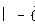

- фамилия, имя, отчество (при наличии); 

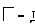

- дата и место рождения; 

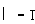

- паспорт (номер, дата выдачи, кем выдан); 

- гражданство; 

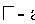

- адрес места жительства (по паспорту, фактический), дата регистрации по месту жительства; 

- СНИЛС; 

- ИНН; 

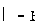

- номер телефона (домашний, сотовый); 

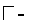

-  семейное  положение;  состав  семьи  (степень  родства,  ближайшие  родственники,  Ф.И.О.  родственников, год их рождения); 

-  образование  (наименование  учебного  заведения,  год  окончания,  документ  об  образовании,  квалификация, специальность), профессия; 

- сведения об аттестации, повышении квалификации; 

- сведения об имеющихся наградах (поощрениях); почетных званиях; 

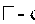

- стаж работы (общий, непрерывный, дающий право на выслугу лет); 

- сведения о воинском учете; 

- знание иностранных языков; 

- социальное положение; сведения о социальных льготах, 

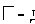

- доходы; 

- содержание заключенного со мной договора;  

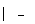

- ___________________________________________________________________________ 

           (иные) 

Продолжение Приложения А 

Условия и запреты на обработку вышеуказанных персональных данных (ч. 9 ст. 10.1 Федерального  закона от 27.07.2006 № 152-ФЗ «О персональных данных») (нужное отметить): 

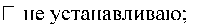

неограниченному кругу лиц; 

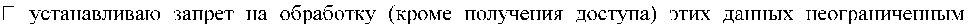

кругом лиц; 

 кругом  лиц: ___________________________________________________________________________________ 

_______________________________________________________________________________________. 

(запрещаемые  действия  по  обработке  -  сбор,  запись,  систематизация,  накопление,  хранение,  уточнение  (обновление,  изменение),  извлечение,  использование,  передача  (распространение,  предоставление),  обезличивание, блокирование). 

Условия передачи персональных данных университетом по сети (с обязательным выбором одного из  следующих значений): 

не указано 

только  по  внутренней  сети  (полученные  персональные  данные  могут  передаваться  университетом, осуществляющим обработку персональных данных, только по его внутренней сети,  обеспечивающей доступ к информации лишь для строго определенных сотрудников) 

с использованием информационно-телекоммуникационных сетей (полученные персональные  данные  могут  передаваться  университетом,  осуществляющим  обработку  персональных  данных,  с  использованием информационно-телекоммуникационных сетей) 

без  передачи  по  сети  (полученные  персональные  данные  не  могут  передаваться  университетом, осуществляющим обработку персональных данных) 

Я ознакомлен(а), что: 

1.  Обработка  моих  персональных  данных/персональных  данных  несовершеннолетнего  обучающегося  в  КНИТУ-КАИ  осуществляется  в  целях,  указанных  в  разделе  4.2  «Политики  в  отношении  обработки  и  защиты  персональных  данных  в  КНИТУ-КАИ»,  и  в  соответствии  с  требованиями Федерального закона № 152-ФЗ от 27.07.2006 «О персональных данных», в порядке и  на условиях, указанных в «Положении по организации обработки персональных данных в КНИТУКАИ»; 

2.  Настоящее согласие может быть отозвано путем направления письменного заявления  в КНИТУ-КАИ. 

Срок  действия  настоящего  согласия  начинается  с  даты  подписания  и  заканчивается  в  соответствии с «Политикой в отношении обработки и защиты персональных данных в КНИТУ-КАИ»  с  достижением  целей  обработки  персональных  данных,  истечения  сроков  их  хранения  или  ликвидации.  

Я утверждаю, что ознакомлен с «Политикой в отношении обработки и защиты персональных  данных в КНИТУ-КАИ» и «Положением по организации обработки персональных данных в КНИТУКАИ». 

Я подтверждаю, что все перечисленные в согласии персональные данные получены КНИТУКАИ лично от меня и являются достоверными. 

Я подтверждаю, что предоставляя такое Согласие, действую своей волей и в своих интересах. 

«_____» ___________20____г.   ______________        ____________________________ 

(подпись)        (расшифровка подписи)  

# Продолжение Приложения А  

СПИСОК 

опубликованных научных и учебно-методических работ   

________________________________________________________________________

(Фамилия, Имя, Отчество(при наличии)  поступающего) 

поступающего на программы аспирантуры специальность подготовки_______________________________________________________ 

(шифр и наименование научной специальности) 

|№   п/п |Наименование работы,   ее вид |Форма  работы |Выходные данные публикации  (Наименование издания, № (том),  страницы, даты публикации (проведения  мероприятия) |Объем в  стр. |Соавторы |
|---|---|---|---|---|---|
|1 |2 |3 |4 |5 |6 |
|а) научные работы | | | | | |
|1 | | | | | |
|2 | | | | | |
|б) авторские свидетельства, патенты, дипломы, лицензии, информационные карты, алгоритмы, проекты | | | | | |
| | | | | | |
|в) учебно-методические работы | | | | | |
| | | | | | |

Поступающий  ____________________________/________________________________/ 

Список верен:

Предполагаемый научный руководитель ___________________________/________________________________/ 

Зав. кафедрой ________  ____________________________/________________________________/ 

Продолжение Приложения А  

СПИСОК 

индивидуальных достижений поступающего, результаты которых учитываются при приеме на программы аспирантуры 

________________________________________________________ 

(Фамилия, Имя, Отчество(при наличии)  поступающего) 

поступающего на программы аспирантуры специальность подготовки ______________________________________________________ 

(шифр и наименование научной специальности) 

|1.Публикация в научном периодическом издании по профилю программы аспирантуры (без дублирования).  | | | | |
|---|---|---|---|---|
|№  п/п |Наименование работы |Дата выхода  публикации в формате  __.__.____ |Наименование издания, № (том), страницы,    в какую базу входит публикация  (Scopus/WoS/ВАК/РИНЦ) |Соавторы (указать ФИО) |
|1 | | | | |
|2 | | | | |
|2.Публикация в материалах конференции/семинара/ форума по профилю программы аспирантуры (без дублирования в п.1 данной таблицы) | | | | |
|№  п/п |Наименование работы, ее вид (научная  статья, доклад, тезисы доклада и т.д.) |Даты проведения  конференции/семинара/  форума в формате  __.__.____ |Полное наименование конференции/семинара/  форума, с указанием уровня мероприятия,   в какую базу входит публикация (Scopus/WoS/  РИНЦ/ -) |Объем в страницах,   Соавторы (указать ФИО) |
|1 | | | | |
|2 | | | | |
|3. Документ, удостоверяющий исключительное право на достигнутый научный (научно-методический, научно-технический, научно-творческий) уровень | | | | |
|№  п/п |Наименование  |Вид (лицензионный  договор/ патент на  изобретение/ патент на  полезную модель/  свидетельство и т.д.) |Выходные данные (номер, дата получения, кем выдан) |Соавторы (указать ФИО) |
|1 | | | | |
|2 | | | | |
|4. Руководство научными исследовательскими проектами (грантами) по профилю программы аспирантуры) | | | | |
|№  п/п |Наименование проекта/гранта (полные данные, с указанием  номера и даты договора) |Вид работы (хоз. договор/ грант/др.) |Срок исполнения по договору | |
|1 | | | | |
|2 | | | | |

Продолжение Приложения А   

|Конкурс научных работ по профилю программы аспирантуры, всероссийская студенческая олимпиада, олимпиада «Я-профессионал» | | | |
|---|---|---|---|
|№  п/п |Полное наименование конкурса/олимпиады с  указанием уровня, даты и места проведения |Диплом победителя/  призера/медалиста с  указанием занятого места  |Выходные данные работы поданной на конкурс (Наименование работы, работы  индивидуальная/коллективная(кол-во исполнителей)) |
|1 | | | |
|5. Продолжение темы выпускной квалификационной работы при поступлении на программы аспирантуры | | | |
|Тема выпускной квалификационной работы предыдущего уровня образования |Тема научно-исследовательской работы при поступлении на программы  аспирантуры | | |
| | | | |
|6. Профессиональная деятельность в соответствии с профилем подготовки | | | |
|№  п/п |Наименование предприятия с указанием организационной формы |Должность |Срок  работы в указанной  должности  |
|1 | | | |
|2 | | | |

Приложение: _____________________________________(документы, подтверждающие индивидуальные достижения)- 

Поступающий  ____________________________/________________________________/ 

Список верен: 

Предполагаемый  

научный руководитель  ____________________________/________________________________/ 

Зав. кафедрой ________  ____________________________/________________________________/ 

|Рег. номер __________   от ___.____._________г. | |
|---|---|

# Приложение Б 

Расписка  

о приеме документов 

Получены от __________________________________________________ следующие  документы: 

|№  п/п |Документ |Количество |Копия/Оригинал |
|---|---|---|---|
| | | | |
| | | | |
| | | | |
| | | | |
| | | | |

Документы принял:   ___________________________    /_____________________________/ 

(подпись)   (ФИО сотрудника принявшего документы) 

ПРОТОКОЛ 

ВСТУПИТЕЛЬНОГО ИСПЫТАНИЯ 

# Приложение В  

экзаменационной комиссия по проведению вступительного испытания  

по ______________________________________________________

федерального государственного бюджетного образовательного учреждения высшего образования  «Казанский национальный исследовательский технический университет им. А.Н. Туполева-КАИ» 

 в составе: 

- председатель комиссии:  

- члены комиссии:  

зам. председателя __________________________; 

__________________________________________; 

__________________________________________; 

__________________________________________; 

- секретарь комиссии _______________________. 

провела  «____»  ___________________  20__г.  вступительное  испытание  с  поступающим  на  программы  подготовки  научных  и  научно-педагогических  кадров  в  аспирантуре  по  научной  специальности __________________________________________________________________________ 

_____________________________________________  

(фамилия, имя, отчество поступающего) 

Заданы вопросы: 

________________________________________________________________________________________________ ________________________________________________________________________________________________ ________________________________________________________________________________________________ ________________________________________________________________________________________________ ________________________________________________________________________________________________ 

Комментарии экзаменаторов: 

________________________________________________________________________________________________ ________________________________________________________________________________________________ _______________________________________________________________________________________ 

Оценка на вступительном испытании:_______(________________________) 

(по 100-балльной шкале, цифрой и прописью) 

Председатель комиссии:______________/______________/ 

Члены комиссии:  _____________/______________/ 

_____________/______________/ 

С результатами вступительного испытания ознакомлен(а) 

______________________________ 

 (Ф.И.О.) 

__________________ 

Подпись

_____________/______________/ 

_____________/______________/ 

_____________/______________/ 

Секретарь: 

_____________/______________/ 

# Приложение Г 

Акт 

о нарушении и о непрохождении поступающим вступительного испытания  

без уважительной причины 

г. Казань  «___» ________________  ______г. 

Мы, нижеподписавшиеся, подтверждаем, что поступающий 

____________________________________________________________________ 

(фамилия, имя, отчество) 

нарушил  во  время  проведения  вступительного  испытания  п.  _________Правил  приема  КНИТУ-КАИ, а именно ___________________________________,а также был удален с места  проведения вступительного испытания*. 

Члены экзаменационной комиссии: 

_____________________________     ________________ 

(фамилия, имя, отчество)  (подпись) 

_____________________________     ________________ 

(фамилия, имя, отчество)  (подпись) 

_____________________________     ________________ 

(фамилия, имя, отчество)  (подпись) 

_____________________________     ________________ 

(фамилия, имя, отчество)  (подпись) 

_____________________________     ________________ 

(фамилия, имя, отчество)  (подпись) 

* Удаление с места проведения вступительного испытания осуществляется только при очном   проведении вступительного испытания   

# Приложение Д 

Председателю Приемной комиссии,  

Ректору КНИТУ-КАИ 

____________________ 

от поступающего ___________________ 

 __________________________________  

фамилия, имя, отчество полностью  

паспорт серии _______ №____________  

ЗАЯВЛЕНИЕ  

Согласен  на  зачисление  на  первый  курс  обучения  в  20___/___  учебном  году  в  институт/факультет  (аббревиатура)  ______________________________  на  специальность_____________________________________________________  

форма обучения (выбрать: очная) ______________________  

на место (выбрать: за счет бюджетных ассигнований федерального бюджета; по договору об  оказании платных образовательных услуг)  __________________________________________________________________  __________________________________________________________________ 

 ____________________________   «____» _______________ 20___ г.  

подпись 

Подтверждаю, что действительные (неотозванные) заявления о согласии на зачисление  на  обучение  по  программам  высшего  образования  –  программам  подготовки  научных  и  научно-педагогических кадров в аспирантуре на места в рамках контрольных цифр приема  не поданы (не будут поданы) в другие организации. 

____________________________   «____» _______________ 20___ г.  

подпись 

Заявление принял:  

_______________    ___________      ___________________ 

должность  подпись   ФИО 

# Приложение Е  

|Рег. номер __________ |Ректору КНИТУ-КАИ   _____________ |
|---|---|

Заявление  

об отзыве согласия на зачисление в  КНИТУ-КАИ 

Я _______________________________________________________________________, 

(фамилия, имя, отчество полностью) 

_____________________________________________________________________________, 

(данные документа удостоверяющего личность) 

руководствуясь  п.  4.9.10  Правил  приема  на  обучение  по  образовательным  программам  высшего образования – программам подготовки научных и научно-педагогических кадров в  аспирантуре  федерального  государственного  бюджетного  образовательного  учреждения  высшего  образования  «Казанский  национальный  исследовательский  технический  университет  им.  А.Н.  Туполева-КАИ»  (КНИТУ-КАИ),  отзываю  данное  мной  согласие  на  зачисление в связи с ______. 

__.__.____ (ДД.ММ.ГГГГ)      __________________  _______________________________________ 

(дата)               (личная подпись)                           (фамилия, имя, отчество полностью)      

# Приложение Ж 

|Рег. номер __________ |Ректору КНИТУ-КАИ   _________________________ |
|---|---|

Заявление  

об отзыве заявления о приеме в КНИТУ-КАИ 

Я _______________________________________________________________________, 

(фамилия, имя, отчество полностью) 

_____________________________________________________________________________, 

(данные документа удостоверяющего личность) 

руководствуясь  п.  4.9.11  Правил  приема  на  обучение  по  образовательным  программам  высшего образования – программам подготовки научных и научно-педагогических кадров в  аспирантуре  федерального  государственного  бюджетного  образовательного  учреждения  высшего  образования  «Казанский  национальный  исследовательский  технический  университет им. А.Н. Туполева-КАИ» (КНИТУ-КАИ), прошу вернуть заявление о приеме,  поданное в КНИТУ-КАИ для поступления на обучение по программе подготовки научных и  научно-педагогических кадров в аспирантуре, специальность подготовки. 

Выше указанные документы прошу вернуть следующим способом: 

 лично заявителю или доверенному лицу 

 путем направления документов через операторов почтовой связи общего пользования по  адресу:_______________________________________________________________________ 

_____________________________________________________________________________ 

__.__.____ (ДД.ММ.ГГГГ)      __________________  _______________________________________ 

(дата)               (личная подпись)                           (фамилия, имя, отчество полностью)      

# Приложение И 

|Рег. номер __________ |Ректору КНИТУ-КАИ   _________________________ |
|---|---|

Заявление  

об отказе от зачисления в  КНИТУ-КАИ 

Я _______________________________________________________________________, 

(фамилия, имя, отчество полностью) 

_____________________________________________________________________________, 

(данные документа удостоверяющего личность) 

руководствуясь  п.  4.9.12  Правил  приема  на  обучение  по  образовательным  программам  высшего образования – программам подготовки научных и научно-педагогических кадров в  аспирантуре  федерального  государственного  бюджетного  образовательного  учреждения  высшего  образования  «Казанский  национальный  исследовательский  технический  университет им. А.Н. Туполева-КАИ» (КНИТУ-КАИ), прошу не зачислять меня в КНИТУКАИ. 

__.__.____ (ДД.ММ.ГГГГ)      __________________  _______________________________________ 

(дата)               (личная подпись)                           (фамилия, имя, отчество полностью)      

# Лист ознакомления 

|№   п/п |Фамилия, Имя,    Отчество |Должность |Дата    ознакомления |Подпись |
|---|---|---|---|---|
| | | | | |
| | | | | |
| | | | | |
| | | | | |
| | | | | |
| | | | | |
| | | | | |
| | | | | |
| | | | | |
| | | | | |
| | | | | |
| | | | | |
| | | | | |
| | | | | |
| | | | | |
| | | | | |
| | | | | |
| | | | | |
| | | | | |

