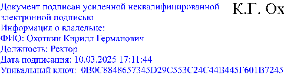

УТВЕРЖДЕНО

решением Ученого совета КНИТУ-КАИ 

Протокол № 1 от 27.02.2023 

К.Г. Охоткин 

Правила приема на обучение по образовательным программам среднего  профессионального образования в КНИТУ-КАИ 

# 1 Назначение и область применения 

1.1  Настоящие  Правила  приема  на  обучение  по  образовательным  программам среднего профессионального образования (далее – Правила приема  СПО)  регламентируют  прием  граждан  Российской  Федерации,  иностранных  граждан, лиц без гражданства, в том числе соотечественников, проживающих  за  рубежом  (далее  –  граждане,  лица,  поступающие)  на  обучение  по  образовательным  программам  среднего  профессионального  образования  по  профессиям, специальностям среднего профессионального образования (далее  –  образовательные  программы)  в  федеральное  государственное  бюджетное  образовательное  учреждение высшего  образования  «Казанский национальный  исследовательский технический университет им. А.Н. Туполева-КАИ» (далее -  КНИТУ-КАИ,  Университет),  за  счет  бюджетных  ассигнований  федерального  бюджета, бюджетов субъектов Российской Федерации, местных бюджетов, по  договорам  об  образовании,  заключаемым  при  приеме  на  обучение  за  счет  средств  физических  и  (или)  юридических  лиц  (далее  -  договор  об  оказании  платных образовательных услуг, договор). 

1.2  Прием  иностранных  граждан  на  обучение  в  КНИТУ-КАИ  осуществляется  за  счет  бюджетных  ассигнований  федерального  бюджета,  бюджетов  субъектов  Российской  Федерации  или  местных  бюджетов  в  соответствии  с  международными  договорами  Российской  Федерации, 

федеральными  законами  или  установленной  Правительством  Российской  Федерации  квотой  на  образование  иностранных  граждан  в  Российской  Федерации, а также по договорам об оказании платных образовательных услуг. 

# 2  Нормативные ссылки 

В настоящих Правилах приема СПО использованы нормативные ссылки  на следующие документы: 

-  Федеральный  закон  от  24.05.1999  №  99-ФЗ  «О  государственной  политике Российской Федерации в отношении соотечественников за рубежом»; 

-  Федеральный  закон  от  29.12.2012  №  273-ФЗ  «Об  образовании  в  Российской Федерации» (далее – Закон об образовании); 

- Приказ Минпросвещения России от 02.09.2020 № 457 «Об утверждении  Порядка  приема  на  обучение  по  образовательным  программам  среднего  профессионального образования»; 

- Постановление Правительства Российской Федерации от 19.10.2023 №  1738  «Об  утверждении  Правил  выявления  детей  и  молодежи,  проявивших  выдающиеся способности, и сопровождения их дальнейшего развития»; 

-  ГОСТ  Р  ИСО  9000-2015  Национальный  стандарт  Российской  Федерации. Системы менеджмента качества. Основные положения и словарь; 

-  ГОСТ  Р  ИСО  9001-2015  Национальный  стандарт  Российской  Федерации. Системы менеджмента качества. Требования; 

-  Устав КНИТУ-КАИ; 

- локальные нормативные акты КНИТУ-КАИ. 

(п.2  дополнен  абзацами  4,6  на  основании  решения  Ученого  совета  (протокол  от  26.02.2024 №3)) 

# 3  Термины, определения и сокращения 

Иностранный гражданин – физическое лицо, не являющееся гражданином  Российской  Федерации  и  имеющее  доказательства  наличия  гражданства  (подданства) иностранного государства. 

Лицо без гражданства – физическое лицо, не являющееся гражданином  Российской  Федерации  и  не  имеющее  доказательств  наличия  гражданства  (подданства) иностранного государства. 

Поступающий – лицо, поступающее на обучение. 

СПО – среднее профессиональное образование. 

# 4 Правила приема СПО в КНИТУ-КАИ 

# 4.1 Общие положения 

4.1.1  Прием  в  КНИТУ-КАИ  лиц  для  обучения  по  образовательным  программам осуществляется по заявлениям лиц, имеющих основное общее или  среднее общее образование, если иное не установлено Законом об образовании. 

4.1.2  Прием  на  обучение  по  образовательным  программам  за  счет  бюджетных  ассигнований  федерального  бюджета,  бюджетов  субъектов  Российской  Федерации  и  местных  бюджетов  (далее  -  бюджетная  форма  обучения)  является  общедоступным,  если  иное  не  предусмотрено  частью  4  статьи 68 Закона об образовании. 

4.1.3  КНИТУ-КАИ  осуществляет  обработку  полученных  в  связи  с  приемом в Университет персональных данных поступающих в соответствии с  требованиями  законодательства  Российской  Федерации  в  области  персональных данных. 

4.1.4  Условиями  приема  на  обучение  по  образовательным  программам  гарантируются  соблюдение  права  на  образование  и  зачисление  из  числа  поступающих,  имеющих  соответствующий  уровень  образования,  наиболее  способных  и  подготовленных  к  освоению  образовательной  программы  соответствующего уровня и соответствующей направленности лиц. 

# 4.2. Организация приема в КНИТУ-КАИ 

4.2.1 Организация приема на обучение по образовательным программам  осуществляется  Приемной  комиссией  КНИТУ-КАИ  (далее  -  Приемная  комиссия). 

4.2.2  Состав,  полномочия  и  порядок  деятельности  Приемной  комиссии  регламентируются положением о ней, утверждаемым ректором Университета. 

4.2.3  Работу  Приемной  комиссии  и  делопроизводство,  а  также  личный  прием  поступающих  и  их  родителей  (законных  представителей)  организует  ответственный секретарь Приемной комиссии, который назначается приказом  ректора Университета или уполномоченного им лица. 

4.2.4  При  приеме  в  КНИТУ-КАИ  обеспечиваются  соблюдение  прав  граждан в области образования, установленных законодательством Российской  Федерации, гласность и открытость работы Приемной комиссии. 

4.2.5  С  целью  подтверждения  достоверности  документов,  представляемых  поступающими,  Приемная  комиссия  вправе  обращаться  в  соответствующие государственные (муниципальные) органы и организации. 

# 4.3 Организация информирования поступающих 

4.3.1  КНИТУ-КАИ  объявляет  прием  на  обучение  по  образовательным  программам  при  наличии  лицензии  на  осуществление  образовательной  деятельности по этим образовательным программам.  

4.3.2  Университет  знакомит  поступающего  и  (или)  его  родителей  (законных  представителей)  со  своим  уставом,  лицензией  на  осуществление  образовательной  деятельности,  свидетельством  о  государственной  аккредитации,  образовательными  программами  и  другими  документами,  регламентирующими  организацию  и  осуществление  образовательной  деятельности, права и обязанности обучающихся. 

4.3.3  В  целях  информирования  о  приеме  на  обучение  КНИТУ-КАИ  размещает  информацию  на  официальном  сайте  в  информационнотелекоммуникационной сети «Интернет» - https://kai.ru/ (далее – официальный  сайт  КНИТУ-КАИ),  иными  способами  с  использованием  информационнотелекоммуникационной  сети  «Интернет»,  а  также  обеспечивает  свободный  доступ  к  информации,  размещенной  на  информационном  стенде  (табло)  Приемной комиссии, расположенной по адресу: г. Казань, ул. Большая Красная, 

д.  55  и  (или)  в  электронной  информационной  системе  (далее  вместе  -  информационный стенд). 

4.3.4  Не  позднее  1  марта  приемная  комиссия  на  официальном  сайте  КНИТУ-КАИ  и  информационном  стенде  до  начала  приема  документов  размещает: 

- правила приема в КНИТУ-КАИ; 

-  условия  приема  на  обучение  по  договорам  об  оказании  платных  образовательных услуг; 

-  перечень  специальностей  (профессий),  по  которым  Университет  объявляет  прием  в  соответствии  с  лицензией  на  осуществление  образовательной  деятельности  (с  указанием  форм  обучения  (очная,  очнозаочная, заочная) (Приложение А); 

- требования к уровню образования, которое необходимо для поступления  (основное общее или среднее общее образование); 

-  информацию  о  необходимости  (отсутствии  необходимости)  прохождения  поступающими  обязательного  предварительного  медицинского  осмотра (обследования);  

-  общее  количество  мест  для  приема  по  каждой  специальности  (профессии), в том числе по различным формам обучения; 

-  количество  мест,  финансируемых  за  счет  бюджетных  ассигнований  федерального бюджета, бюджетов субъектов Российской Федерации, местных  бюджетов  по  каждой  специальности  (профессии),  в  том  числе  по  различным  формам обучения; 

- количество мест по каждой специальности (профессии) по договорам об  оказании платных образовательных услуг, в том числе по различным формам  обучения; 

- информацию о наличии общежития и количестве мест в общежитиях,  выделяемых для иногородних поступающих; 

- образец договора об оказании платных образовательных услуг. 

(п.4.3.4 изменен на основании решения Ученого совета (Протокол от 25.02.2025 № 3))

4.3.5  В  период  приема  документов  Приемная  комиссия  ежедневно  размещает  на  официальном  сайте  КНИТУ-КАИ  и  информационном  стенде  Приемной  комиссии  сведения  о  количестве  поданных  заявлений  по  каждой  специальности (профессии) с указанием форм обучения (очная, очно-заочная,  заочная). 

Приемная  комиссия  Университета  обеспечивает  функционирование  специальных  телефонных  линий  (+7  (843)  231-00-90,  +7  (927)  457-73-53)  и  раздела  на  официальном  сайте  КНИТУ-КАИ  для  ответов  на  обращения,  связанные с приемом в КНИТУ-КАИ. 

(абзац  2  п.4.3.5  изменен  на  основании  решения  Ученого  совета  (протокол  от  26.02.2024 №3)) 

# 4.4 Прием документов от поступающих 

4.4.1 Прием в КНИТУ-КАИ по образовательным программам проводится  на первый курс по личному заявлению граждан. 

Срок  начала  приема  заявления  о  приеме  на  обучение  и  документов,  прилагаемых к заявлению (далее - прием документов), - 20 июня текущего года. 

Срок  завершения  приема  документов  от  поступающих  -  до  15  августа  текущего года. 

Срок завершения приема оригиналов документа об образовании и (или)  документа  об  образовании  и  о  квалификации  или  электронного  дубликата  документа об образовании и (или) документа об образовании и квалификации: 

-  на  бюджетную  форму,  -  16  августа  текущего  года  до  12:00  по  московскому времени; 

-  по  договорам,  -  20  августа  текущего  года  до  17:00  по  московскому  времени. 

Срок  завершения  заключения договоров - 20  августа  текущего  года  до  17:00 по московскому времени. 

Издание приказов о зачислении: 

- на бюджетную форму, - не позднее 21 августа текущего года; 

- по договорам, - не позднее 1 сентября текущего года. 

При  наличии  свободных  мест  в  КНИТУ-КАИ  прием  документов  продлевается до 25 ноября текущего года. 

(п.4.4.1 изменен на основании решения Ученого совета (Протокол от 25.02.2025 № 3)) 

4.4.2 При подаче заявления (на русском языке) о приеме в Университет  поступающий предъявляет следующие документы: 

4.4.2.1 Граждане Российской Федерации: 

-  оригинал  или  копию  документов,  удостоверяющих  его  личность,  гражданство, кроме случаев подачи заявления с использованием функционала  федеральной  государственной  информационной  системы  «Единый  портал  государственных  и  муниципальных  услуг  (функций)  или  региональных  порталов  государственных  и  муниципальных  услуг»  (далее  -  порталы  государственных услуг); 

- оригинал или копию документа об образовании и (или) документа об  образовании  и  о  квалификации,  кроме  случаев  подачи  заявления  с  использованием функционала порталов государственных услуг; 

-  оригинал  или  копию  документа,  подтверждающего  право  преимущественного  или  первоочередного  приема  в  соответствии  с  частью  4  статьи  68  Закона  об  образовании,  кроме  случаев  подачи  заявления  с  использованием функционала порталов государственных услуг; 

-  в  случае  подачи  заявления  с  использованием  функционала  порталов  государственных услуг: копию документа об образовании и (или) документа об  образовании  и  о  квалификации  или  электронный  дубликат  документа  об  образовании и (или) документа об образовании и о квалификации, созданный  уполномоченным  должностным  лицом  многофункционального  центра  предоставления  государственных  и  муниципальных  услуг  и  заверенный  усиленной  квалифицированной  электронной  подписью  уполномоченного  должностного  лица  многофункционального  центра  предоставления  государственных и муниципальных услуг, копию документа, подтверждающего  право  преимущественного  или  первоочередного  приема  в  соответствии  с 

частью  4  статьи  68  Федерального  закона  «Об  образовании  в  Российской  Федерации»,  за  исключением  документов,  которые  могут  быть  получены  с  использованием  единой  системы  межведомственного  электронного  взаимодействия; 

-  4  фотографии,  кроме  случаев  подачи  заявления  с  использованием  функционала порталов государственных услуг. 

(п.4.4.2.1 изменен на основании решения Ученого совета (Протокол от 25.02.2025 № 3)) 

4.4.2.2  Иностранные  граждане,  лица  без  гражданства,  в  том  числе  соотечественники, проживающие за рубежом: 

-  копию  документа,  удостоверяющего  личность  поступающего,  либо  документ,  удостоверяющий  личность  иностранного  гражданина  в  Российской  Федерации; 

-  оригинал  документа  (документов)  иностранного  государства  об  образовании  и  (или)  документа  об  образовании  и  о  квалификации  (далее  -  документ  иностранного  государства  об  образовании),  если  удостоверяемое  указанным  документом  образование  признается  в  Российской  Федерации  на  уровне соответствующего образования в соответствии со статьей 107 Закона об  образовании  (в  случае,  установленном  Законом  об  образовании,  -  также  свидетельство о признании иностранного образования); 

-  оригинал  или  копию  документа,  подтверждающего  право  преимущественного  или  первоочередного  приема  в  соответствии  с  частью  4  статьи 68 Закона об образовании; 

-  заверенный  в  порядке,  установленном  статьей  81  Основ  законодательства Российской Федерации о нотариате от 11 февраля 1993 г. №  4462-1,  перевод  на  русский  язык  документа  иностранного  государства  об  образовании  и  приложения  к  нему  (если  последнее  предусмотрено  законодательством государства, в котором выдан такой документ); 

-  копии  документов  или  иных  доказательств,  подтверждающих  принадлежность  соотечественника,  проживающего  за  рубежом,  к  группам,  предусмотренным пунктом 6 статьи 17 Федерального закона от 24 мая 1999 г. 

№ 99-ФЗ  «О  государственной  политике  Российской  Федерации  в  отношении  соотечественников за рубежом»; 

- 4 фотографии. 

Фамилия,  имя  и  отчество  (последнее  -  при  наличии)  поступающего,  указанные  в  переводах  поданных  документов,  должны  соответствовать  фамилии, имени и отчеству (последнее - при наличии), указанным в документе,  удостоверяющем личность иностранного гражданина в Российской Федерации. 

(абзац  4  п.4.4.2.2  изменен  на  основании  решения  Ученого  совета  (протокол  от  27.05.2024 №6))

4.4.2.3 Поступающие помимо документов, указанных в пунктах 4.4.2.1 и  4.4.2.2  настоящих  Правил  приема  СПО,  вправе  представить  оригинал  или  копию документов, подтверждающих результаты индивидуальных достижений,  а также копию договора о целевом обучении, заверенную заказчиков целевого  обучения, или незаверенную копию указанного договора с предъявлением его  оригинала. 

(п.4.4.2.3  изменен  на  основании  решения  Ученого  совета  (протокол  от  27.05.2024  №6)) 

4.4.2.4 При личном представлении оригиналов документов поступающим  допускается заверение их копий Приемной комиссией КНИТУ-КАИ. 

4.4.3  В  заявлении  поступающим  указываются  следующие  обязательные  сведения: 

- фамилия, имя и отчество (последнее - при наличии); 

- дата рождения; 

-  реквизиты  документа,  удостоверяющего  его  личность,  когда  и  кем  выдан; 

-  страховой  номер  индивидуального  лицевого  счета  в  системе  индивидуального  (персонифицированного)  учета  (номер  страхового  свидетельства обязательного пенсионного страхования) (при наличии); 

- о предыдущем уровне образования и документе об образовании и (или)  документе об образовании и о квалификации, его подтверждающем; 

-  отнесение  к  лицам,  которым  представлено  право  преимущественного  или  первоочередного  приема  в  соответствии  с  частью  4  статьи  68  Закона  об  образовании; 

- специальность(и)/профессия(и), для обучения по которым он планирует  поступать в КНИТУ-КАИ, с указанием условий обучения и формы обучения (в  рамках  контрольных  цифр  приема,  мест  по  договорам  об  оказании  платных  образовательных услуг); 

- нуждаемость в предоставлении общежития. 

В  заявлении также  фиксируется  факт  ознакомления  (в  том  числе  через  информационные  системы  общего  пользования)  с  копиями  лицензии  на  осуществление  образовательной  деятельности,  свидетельства  о  государственной  аккредитации  образовательной  деятельности  по  образовательным  программам  и  приложения  к  ним  или  отсутствия  копии  указанного  свидетельства.  Факт  ознакомления  заверяется  личной  подписью  поступающего. 

Подписью поступающего заверяется также следующее: 

- согласие на обработку полученных в связи с приемом в КНИТУ-КАИ  персональных данных поступающих; 

- факт получения среднего профессионального образования впервые; 

- ознакомление с  уставом КНИТУ-КАИ, с лицензией на осуществление  образовательной  деятельности,  со  свидетельством  о  государственной  аккредитации,  с  образовательными  программами  и  другими  документами,  регламентирующими  организацию  и  осуществление  образовательной  деятельности, права и обязанности обучающихся; 

-  ознакомление  (в  том  числе  через  информационные  системы  общего  пользования)  с  датой  предоставления  оригинала документа  об  образовании  и  (или) документа об образовании и о квалификации. 

В  случае  представления  поступающим  заявления,  содержащего  не  все  сведения,  предусмотренные  настоящим  пунктом,  и  (или)  сведения,  не 

соответствующие  действительности,  КНИТУ-КАИ  возвращает  документы  поступающему. 

(абзац  7  п.4.4.3  изменен  на  основании  решения  Ученого  совета  (протокол  от  27.05.2024 №6))

4.4.4  Поступающие  вправе  направить/представить  в  Университет  заявление  о  приеме,  а  также  необходимые  документы  одним  из  следующих  способов: 

1)  лично  в  КНИТУ-КАИ  или  через  представителя  (при  наличии  доверенности,  оформленной  в  соответствии  с  требованиями  гражданского  законодательства Российской Федерации); 

2)  через  операторов  почтовой  связи  общего  пользования  (далее  -  по  почте) заказным письмом с уведомлением о вручении. 

При  направлении  документов  по  почте  поступающий  к  заявлению  о  приеме  прилагает  копии  документов,  удостоверяющих  его  личность  и  гражданство, документа об образовании и (или) документа об образовании и о  квалификации,  а  также  иных  документов,  предусмотренных  настоящими  Правилами приема СПО; 

3)  в  электронной  форме  в  соответствии  с  Федеральным  законом  от  6  апреля 2011 г. N 63-ФЗ "Об электронной подписи", Федеральным законом от 27  июля  2006  г.  N  149-ФЗ  "Об  информации, информационных  технологиях  и  о  защите  информации",  Федеральным  законом  от  7  июля  2003  г.  N  126-ФЗ  "О  связи"  (документ  на  бумажном  носителе,  преобразованный  в  электронную  форму  путем  сканирования  или  фотографирования  с  обеспечением  машиночитаемого распознавания его реквизитов): 

-  посредством  Личного  кабинета  абитуриента  на  официальном  сайте  КНИТУ-КАИ; 

-  с  использованием  функционала  федеральной  государственной  информационной системы «Единый портал государственных и муниципальных  услуг (функций)»; 

-  с  использованием  функционала  (сервисов)  региональных  порталов  государственных  и  муниципальных  услуг,  являющихся  государственными  информационными  системами  субъектов  Российской  Федерации,  созданными  органами  государственной  власти  субъектов  Российской  Федерации  (при  наличии). 

Университет осуществляет проверку достоверности сведений, указанных  в заявлении о приеме, и соответствия действительности поданных электронных  образов документов. При проведении указанной проверки работники КНИТУКАИ вправе обращаться в соответствующие государственные информационные  системы, государственные (муниципальные) органы и организации. 

Документы,  направленные  в  КНИТУ-КАИ  одним  из  перечисленных  в  настоящем пункте способов, принимаются не позднее сроков, установленных  пунктом 4.4.1 настоящих Правил приема СПО. 

(п.4.4.4. изменен на основании решения Ученого совета (Протокол от 25.02.2025 № 3)) 

4.4.5  Не  допускается  взимание  платы  с  поступающих  при  подаче  документов, указанных в пункте 4.4.2 настоящих Правил приема в СПО. 

4.4.6  На  каждого  поступающего  заводится  личное  дело,  в  котором  хранятся  все  сданные  документы  (копии  документов),  включая  документы,  представленные  с  использованием  функционала  порталов  государственных  услуг. 

(п.4.4.6. изменен на основании решения Ученого совета (Протокол от 25.02.2025 № 3))

4.4.7  Поступающему  при  личном  представлении  документов  выдается  расписка о приеме документов. 

4.4.8  По  письменному  заявлению  поступающий  имеет  право  забрать  оригинал  документа  об  образовании  и  (или)  документа  об  образовании  и  о  квалификации и другие документы, представленные поступающим. Документы  возвращаются КНИТУ-КАИ в течение следующего рабочего дня после подачи  заявления. 

4.4.9  Вступительные  испытания  при  приеме  на  обучение  по  образовательным  программам  среднего  профессионального  образования  в  КНИТУ-КАИ не проводятся. 

# 4.5 Зачисление в КНИТУ-КАИ 

4.5.1 Поступающий представляет оригинал документа об образовании и  (или)  документа  об  образовании  и  о  квалификации,  а  также  документа,  подтверждающего  право  преимущественного  или  первоочередного  приема  в  соответствии  с  частью  4  статьи  68  Закона  об  образовании  (при  наличии)  в  сроки, установленные пунктом 4.4.1 настоящих Правил приема СПО. 

(п.4.5.1 изменен на основании решения Ученого совета (протокол от 27.05.2024 №6))

4.5.1.1.  В  случае  подачи  заявления  с  использованием  функционала  порталов государственных услуг поступающий подтверждает свое согласие на  зачисление  в  КНИТУ-КАИ  посредством  их  функционала  в  сроки,  установленные  п.4.4.1  Правил  приема  СПО  для  представления  оригинала  документа  об  образовании  и  (или)  документа  об  образовании  и  о  квалификации. 

(п.4.5.1.1. изменен на основании решения Ученого совета (Протокол от 25.02.2025 №3))

4.5.2  По  истечении  сроков  представления  оригиналов  документов  об  образовании  и  (или)  документов  об  образовании  и  квалификации  ректором  КНИТУ-КАИ издается приказ о зачислении лиц, рекомендованных приемной  комиссией к зачислению из числа представивших оригиналы соответствующих  документов, а также в случае подачи заявления с использованием функционала  порталов государственных услуг, подтвердивших свое согласие на зачисление в  КНИТУ-КАИ  посредством  их  функционала,  на  основании  электронного  дубликата  документа  об  образовании  и  (или)  документа  об  образовании  и  квалификации.  Приложением  к  приказу  о  зачислении  является  пофамильный  перечень  указанных  лиц.  Приказ  с  приложением  размещается  на  следующий  рабочий день после издания на информационном стенде Приемной комиссии и  на официальном сайте КНИТУ-КАИ. 

В  случае  если  численность  поступающих,  превышает  количество  мест,  финансовое  обеспечение  которых  осуществляется  за  счет  бюджетных  ассигнований  федерального  бюджета,  бюджетов  субъектов  Российской  Федерации  и  местных  бюджетов,  КНИТУ-КАИ  осуществляет  прием  на  обучение  по  образовательным  программам  на  основе  результатов  освоения  поступающими  образовательной  программы  основного  общего  или  среднего  общего образования, указанных в представленных поступающими документах  об  образовании  и  (или)  документах  об  образовании  и  о  квалификации,  результатов  индивидуальных  достижений,  сведения  о  которых  поступающий  вправе представить при приеме. 

Лицам, указанным в пунктах пункте 3 части 5 и пунктах 1 - 13 части 7  статьи  71  Закона  об  образовании,  предоставляется  преимущественное  право  зачисления  в  КНИТУ-КАИ  на  обучение  по  образовательным  программам  среднего профессионального образования при прочих равных условиях.  

Лицам,  указанным  в  части  5.1  статьи  71  Закона  об  образовании,  предоставляется  право  на  зачисление  в  КНИТУ-КАИ  на  обучение  по  образовательным  программам  среднего  профессионального  образования  в  первоочередном порядке вне зависимости от результатов освоения указанными  лицами  образовательной  программы  основного  общего  или  среднего  общего  образования, указанных в представленных документах об образовании и (или)  документах об образовании и о квалификации. 

Результаты  освоения  поступающими  образовательной  программы  основного  общего  или  среднего  общего  образования,  указанные  в  представленных  поступающими  документах  об  образовании  и  (или)  документах  об  образовании  и  о  квалификации,  учитываются  по  общеобразовательным  предметам  в  порядке,  установленном  в  п.  4.5.4  настоящих Правил приема СПО. 

Результаты  индивидуальных  достижений  учитываются  при  равенстве  результатов  освоения  поступающими  образовательной  программы  основного  общего  или  среднего  общего  образования,  указанных  в  представленных 

поступающими документах об образовании и (или) документах об образовании  и о квалификации. Порядок ранжирования списков поступающих на основании  документов  об  образовании  и  (или)  документов  об  образовании  и  о  квалификации указан в п. 4.5.4 настоящих Правил приема СПО. 

(п.4.5.2. изменен на основании решения Ученого совета (Протокол от 25.02.2025 № 3))

4.5.3 При приеме на обучение по образовательным программам КНИТУКАИ учитываются следующие результаты индивидуальных достижений: 

1)  наличие  статуса  победителя  или  призера  в  олимпиадах  и  иных  интеллектуальных и (или) творческих конкурсах, мероприятиях, направленных  на  развитие  интеллектуальных  и  творческих  способностей,  способностей  к  занятиям  физической  культурой  и  спортом,  интереса  к  научной  (научноисследовательской),  инженерно-технической,  изобретательской,  творческой,  физкультурно-спортивной  деятельности,  а  также  на  пропаганду  научных  знаний,  творческих  и  спортивных  достижений,  в  соответствии  с  постановлением Правительства Российской Федерации от 19 октября 2023 г. №  1738  «Об  утверждении  Правил  выявления  детей  и  молодежи,  проявивших  выдающиеся способности, и сопровождения их дальнейшего развития»; 

2) наличие у поступающего статуса победителя или призера чемпионата  по  профессиональному  мастерству  среди  инвалидов  и  лиц  с  ограниченными  возможностями здоровья «Абилимпикс»; 

3) наличие у поступающего статуса победителя или призера отборочного  этапа  или  финала  чемпионата  по  профессиональному  мастерству  «Профессионалы»,  отборочного  этапа  или  финала  чемпионата  высоких  технологий,  национального  открытого  чемпионата  творческих  компетенций  «АртМастерс (Мастера Искусств)»; 

4) наличие у поступающего статуса чемпиона или призера Олимпийских  игр,  Паралимпийских  игр  и  Сурдлимпийских  игр,  чемпиона  мира,  чемпиона  Европы, лица, занявшего первое место на первенстве мира, первенстве Европы  по  видам  спорта,  включенным  в  программы  Олимпийских  игр,  Паралимпийских игр и Сурдлимпийских игр; 

5)  наличие  у  поступающего  статуса  чемпиона  мира,  чемпиона  Европы,  лица, занявшего первое место на первенстве мира, первенстве Европы по видам  спорта, не включенным в программы Олимпийских игр, Паралимпийских игр и  Сурдлимпийских игр; 

6) прохождение военной службы по призыву, а также военной службы по  контракту, военной службы по мобилизации в Вооруженных Силах Российской  Федерации,  пребывание  в  добровольческих  формированиях  в  соответствии  с  контрактом о добровольном содействии в выполнении задач, возложенных на  Вооруженные Силы Российской Федерации или войска национальной гвардии  Российской Федерации, в ходе специальной военной операции на территориях  Украины, Донецкой  Народной  Республики, Луганской  Народной  Республики,  Запорожской области и Херсонской области. 

7)  наличие  у  поступающего  опыта  участия  в  добровольческой  (волонтерской)  деятельности,  подтвержденного  в  единой  информационной  системе в сфере развития добровольчества (волонтерства), указанной в статье  17.5  Федерального  закона  от  11  августа  1995  г.  №  135-ФЗ  «О  благотворительной  деятельности  и  добровольчестве  (волонтерстве)».  Добровольческая (волонтерская) деятельность учитывается в случае отработки  не менее 10 часов, если с даты завершения периода осуществления указанной  деятельности до дня завершения приема документов прошло не более четырех  лет.  

Порядок учета результатов индивидуальных достижений устанавливается  п. 4.5.4 настоящих Правил приема СПО. 

(п.4.5.3. изменен на основании решения Ученого совета (Протокол от 25.02.2025 № 3))

4.5.4 Конкурсные списки ранжируются следующим образом: 

-  по  убыванию  среднего  балла  документов  об  образовании  и  (или)  документов об образовании и о квалификации; 

-  при  равенстве  среднего  балла  в  предыдущем  пункте  сравнивается  количество оценок «отлично», «хорошо», «удовлетворительно» (ранжирование  осуществляется по уменьшению количества оценок); 

-  при  равенстве  по  предшествующим  критериям  осуществляется  ранжирование  по  следующим  профильным  предметам,  взятым  отдельно  в  порядке  приоритетности  и  указанным  в  документе  об  образовании  и  (или)  документе  об  образовании  и  о  квалификации  поступающего.  Соответствие  профильных  предметов  специальностям  среднего  профессионального  образования указано в Приложении А; 

- при равенстве по предшествующим критериям более высокое место в  списке занимают поступающие, имеющие договор о целевом обучении и (или)  результаты  индивидуальных  достижений.  Приоритетность  индивидуальных  достижений, учитываемых при поступлении соответствует п. 4.5.3 настоящих  Правил приема СПО. 

Средний  балл  формируется  без  учета  предметов,  указанных  в  дополнительных  сведениях  документа  об  образовании  и  (или)  документа  об  образовании и о квалификации. 

(п.4.5.4. изменен на основании решения Ученого совета (Протокол от 25.02.2025 № 3))

4.5.5  При  наличии  свободных  мест,  оставшихся  после  зачисления,  зачисление в КНИТУ-КАИ осуществляется до 1 декабря текущего года. 

 (п.4.5.5. изменен на основании решения Ученого совета (Протокол от 25.02.2025 № 3))

4.5.6.  В  случае  зачисления  в  КНИТУ-КАИ  на  основании  электронного  дубликата  документа  об  образовании  и  (или)  документа  об  образовании  и  о  квалификации при подаче заявления с использованием функционала порталов  государственных услуг обучающимся в течение месяца со дня издания приказа  о  его  зачислении  представляется  в  КНИТУ-КАИ  оригинал  документа  об  образовании  и  (или)  документа  об  образовании  и  о  квалификации,  а  также  документа, подтверждающего право преимущественного или первоочередного  приема  в  соответствии  с  частью  4  статьи  68  Закона  об  образовании  и  4  фотографии. 

(п.4.5.6. изменен на основании решения Ученого совета (Протокол от 25.02.2025 № 3)) 

# 5  Заключительные положения 

Настоящие Правила приема СПО, а также изменения и дополнения к ним  утверждаются решением Ученого совета КНИТУ-КАИ. 

# Приложение А 

Перечень специальностей по образовательным программам среднего  профессионального образования  

|Наименование специальности |Код специальности |Профильные предметы* |Форма обучения |
|---|---|---|---|
|Институт авиации, наземного транспорта и энергетики (ИАНТЭ)  | | | |
|Отделение СПО в ИАНТЭ (Технический колледж) | | | |
|Технология машиностроения    (на базе 9 кл.) |15.02.16 |Математика или Алгебра   Физика   Информатика   Химия   Русский язык |Очная |
|Техническое обслуживание и ремонт  двигателей, систем и агрегатов    (на базе 9 кл.) |23.02.07 |Математика или Алгебра   Физика   Информатика   Химия   Русский язык |Очная |
|Эксплуатация беспилотных  авиационных систем   (на базе 9 кл.) |25.02.08 |Математика или Алгебра   Физика   Информатика   Химия   Русский язык |Очная |
|Управление качеством продукции,  процессов и услуг    (на базе 9 кл. и 11 кл.) |27.02.07 |Математика или Алгебра   Физика   Информатика   Химия   Русский язык |Очная |
|Экономика и бухгалтерский учет (по  отраслям)    (на базе 9 кл. и 11 кл) |38.02.01 |Обществознание    Математика или Алгебра   История или История России   Русский язык   Информатика |Очная |
|Институт компьютерных технологий и защиты информации (ИКТЗИ) | | | |
|Отделение СПО в ИКТЗИ (Колледж информационных технологий) | | | |
|Сетевое и системное  администрирование    (на базе 9 кл.) |09.02.06 |Математика или Алгебра   Информатика    Физика   Химия   Русский язык |Очная |
|Информационные системы и  программирование    (на базе 9 кл.) |09.02.07 |Математика или Алгебра   Информатика    Физика   Химия   Русский язык |Очная |
|Интеллектуальные интегрированные  системы    (на базе 9 кл.) |09.02.08 |Математика или Алгебра   Информатика    Физика   Химия   Русский язык |Очная |
|Обеспечение информационной  безопасности автоматизированных  систем   (на базе 9 кл.) |10.02.05 |Математика или Алгебра   Информатика    Физика   Химия   Русский язык |Очная |

* - в порядке убывания приоритета.  

(Приложение  А  изменено  на основании  решения  Ученого  совета  (Протокол от 25.02.2025  №3))

# Лист ознакомления 

|№   п/п |Фамилия, Имя,  Отчество |Должность |Дата  ознакомления |Подпись |
|---|---|---|---|---|
| | | | | |
| | | | | |
| | | | | |
| | | | | |
| | | | | |
| | | | | |
| | | | | |
| | | | | |
| | | | | |
| | | | | |
| | | | | |
| | | | | |
| | | | | |
| | | | | |
| | | | | |
| | | | | |
| | | | | |
| | | | | |

Лист согласования 

|ФИО |Должность |Виза |Дата визирования |
|---|---|---|---|
|Шакирзянов Ринат  Михайлович |Начальник управления |Разработал |03.02.2025 10:44:00 |
|Козлова Алсу  Талгатовна |Директор центра |Согласовано |13.02.2025 08:25:09 |
|Мухаметгалиева  Динара Рустамовна |Начальник  юридического  управления |Согласовано |20.02.2025 14:44:29 |
|Моисеев Роман  Евгеньевич |Проректор по  образовательной  деятельности |Согласовано |20.02.2025 15:35:11 |

